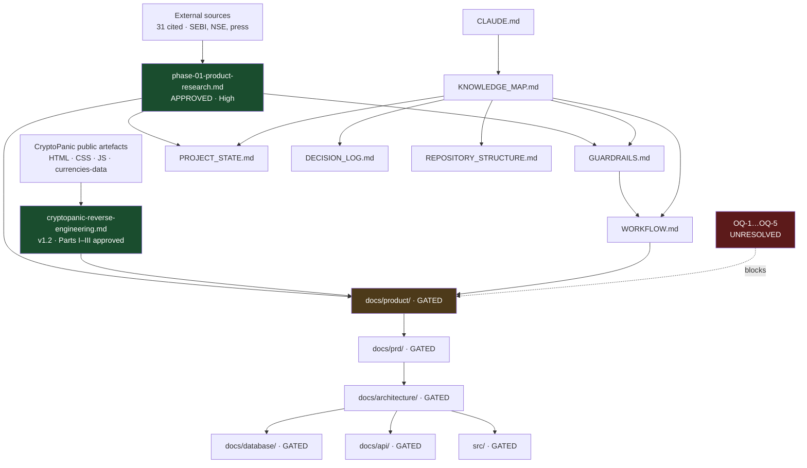

# KNOWLEDGE_MAP.md — Navigation System

**Purpose:** find any fact, once. If two documents claim the same fact, one of them is a defect.

**Confidence scale:** `High` — sourced/verified, safe to build on · `Medium` — reasoned, challengeable · `Low` — assumption, must be tested before load-bearing use.

---

## 1. Document Register

### 1.1 Foundation — `/` (this layer)

| Document | Purpose | Owner | Depends on | Consumers | Source of truth for | Confidence | Status |
| --- | --- | --- | --- | --- | --- | --- | --- |
| [CLAUDE.md](CLAUDE.md) | Entry point; orientation | CTO | All below | Every session | *Nothing* — it only links | High | ✅ |
| [PROJECT_STATE.md](PROJECT_STATE.md) | Live status, blockers, next action | CTO | Research; WORKFLOW | Every session | **Current state** | High | ✅ |
| [KNOWLEDGE_MAP.md](KNOWLEDGE_MAP.md) | This file; navigation | CTO | All | Every session | **Where facts live** | High | ✅ |
| [GUARDRAILS.md](GUARDRAILS.md) | Non-negotiable rules | CTO | Research (E1–E11, R1–R11) | Every session | **Engineering constraints** | High | ✅ |
| [WORKFLOW.md](WORKFLOW.md) | Phase gates, DoD | CTO | — | Every session | **Process** | High | ✅ |
| [DECISION_LOG.md](DECISION_LOG.md) | Permanent decision history | CTO | — | Every session | **Why things are the way they are** | High | ✅ |
| [REPOSITORY_STRUCTURE.md](REPOSITORY_STRUCTURE.md) | File layout | CTO | — | Every session | **Where files belong** | High | ✅ |

### 1.2 Research — `docs/research/` — **APPROVED, IMMUTABLE**

| Document | Purpose | Owner | Depends on | Consumers | Source of truth for | Confidence | Status |
| --- | --- | --- | --- | --- | --- | --- | --- |
| `phase-01-product-research.md` (497 ln) | Market, regulatory, strategic analysis | Founder + CTO | External sources (31 cited) | Product, PRD, Architecture, DB, Security, Roadmap | **Why we are building this, for whom, and what we must not do** | High (cited) / Medium (inferences) | ✅ Approved |
| `cryptopanic-product-reverse-engineering.md` (2,736 ln, **v1.2**) | Reference-product study | CTO | Public CryptoPanic artefacts | Product, PRD, Architecture, Frontend, UX | **How a product of this shape actually behaves** | High (`[VERIFIED]`) / Medium (`[INFERRED]`) / Low (`[ASSUMPTION]`) | ◐ Parts I–III approved; Part IV+ pending |

**⚠ Register accuracy note.** The project brief referred to "CryptoPanic Homepage Reverse Engineering" and "CryptoPanic Currency Page Reverse Engineering" as separate documents, plus "additional research documents." **On disk there are exactly two files.** The CryptoPanic work is one document with three parts. No additional research documents exist. This register reflects disk, not the brief.

### 1.2b Working documents — `docs/` — decision support & review

Not research, not foundation. Historical context once their decision is recorded. **REPOSITORY_STRUCTURE defines no home for these — a real gap, see §5.**

| Document | Purpose | Owner | Depends on | Consumers | Source of truth for | Confidence | Status |
| --- | --- | --- | --- | --- | --- | --- | --- |
| `foundation-v1.0-review.md` | CTO architecture review of Foundation v1.0 | CTO | All foundation docs | Foundation v1.1 work | **The v1.1 roadmap and its priority matrix** | High (measured) / Medium (scaling extrapolations) | ✅ Verdict B, awaiting approval |
| `q1.md` | OQ-1 decision brief | CTO | Research §3, §13 | D-009 | *Nothing* — decision lives in DECISION_LOG D-009. **Retained for the sourced funnel in §3 and the errata in §2.** | High (sourced) | ✅ Resolved → D-009 |
| `q2.md` | OQ-2 decision brief | CTO | Research §6, RE §4.4/§29.2 | *pending* | *Nothing* — pending decision | — | 🔴 Awaiting founder |

### 1.3 Gated — not yet created

| Layer | Path | Gate |
| --- | --- | --- |
| Product | `docs/product/` | OQ-1…OQ-5 resolved |
| PRD | `docs/prd/` | Product approved |
| Architecture | `docs/architecture/` | PRD approved |
| Database | `docs/database/` | Architecture approved |
| API | `docs/api/` | Architecture approved |
| QA | `docs/qa/` | PRD approved |
| Security | `docs/security/` | Architecture approved; **OQ-8 (counsel) before AI layer** |
| Ops | `docs/ops/` | Architecture approved |
| Code | `src/` | Architecture approved |

---

## 2. Fact Ownership — Who Owns What

**Rule:** to state a fact, find its owner here and link. Never restate.

| Fact domain | Sole source of truth | Do not restate in |
| --- | --- | --- |
| Indian market sizing (13.1 cr investors, 26 cr accounts, CAGR, SIP) | Research §3.1 | Anywhere. **Link.** The 13.1cr/26cr distinction is a diligence trap — restating invites drift. |
| F&O segment contraction and loss rates | Research §3.2 | Anywhere |
| SEBI regulatory perimeter; IA Regulations; finfluencer circular | Research §6 | **Anywhere.** Compliance facts must have exactly one home. |
| The two regulatory landmines (sentiment labels, directional voting) | Research §6.2 | Anywhere |
| Duplication / PTI syndication analysis | Research §4.1 | Anywhere |
| Entity resolution hazards (parent/subsidiary, ISIN, temporal validity) | Research §4.2 | Anywhere |
| Competitive landscape (Pulse, Moneycontrol, stockinsights.ai) | Research §7 | Anywhere |
| Engineering considerations E1–E11 | Research §10 | GUARDRAILS **references** these; it does not restate them |
| Risks R1–R11 | Research §12 | Anywhere |
| Open questions OQ-1…OQ-10 | Research §13 | PROJECT_STATE **tracks status**; Research owns the text |
| CryptoPanic layout, typography, colour values | RE study §2, §4, §17 | Anywhere |
| CryptoPanic keyboard model | RE study §4.6 | Anywhere |
| CryptoPanic vote taxonomy (11 types, 4 axes) | RE study §4.4, §29.2 | Anywhere |
| CryptoPanic transport architecture (socket vs poll) | RE study §14.1, §30.7 | Anywhere. **§14.1 is an erratum — cite it, not the superseded §4.7 claim.** |
| CryptoPanic data model (currency schema) | RE study §16 | Anywhere |
| Asset-class-agnostic patterns | RE study §30, §32 | Anywhere |
| Patterns that do **not** transfer from crypto | RE study §31 | **Anywhere. Load-bearing.** §31.2 (24/7 market) is an assumption that will silently break a sessioned market. |
| Current status, blockers, next action | PROJECT_STATE | Anywhere |
| Decisions and rationale | DECISION_LOG | Anywhere |
| Process and gates | WORKFLOW | Anywhere |
| Rules | GUARDRAILS | Anywhere |
| File placement | REPOSITORY_STRUCTURE | Anywhere |

---

## 3. Dependency Graph

---

## 4. Confidence Register — What We Are Least Sure Of

Ranked by *damage if wrong*. Anything used as a load-bearing input must be re-verified first.

| Claim | Source | Confidence | Damage if wrong |
| --- | --- | --- | --- |
| Directional voting / per-security sentiment constitutes unregistered advice | Research §6.2 | **Medium — `[INFERRED]`** | **Severe.** Legal exposure; precedent is a ₹546cr impound. **Not legal advice — OQ-8 counsel required before relying on it.** |
| ~70–85% of a naive Indian feed is duplicate | Research §4.1 | **Medium — `[INFERRED]`** | High. It is the core moat thesis. **Unmeasured — should be validated with a real 24h ingest sample before the PRD depends on it.** |
| ~~Swing/positional segment is 1–2 crore~~ | ~~Research §3.3~~ | **Superseded** | Resolved by `docs/q1.md` §3. Sourced anchor: **4.42 cr NSE active clients** (traded ≥1× in 12m, Jun 2026); non-derivative active base ≈40M accounts ≈**25–30M unique people**. The account:person ratio (~2:1) is still `[INFERRED]` — see `q1.md` §8. |
| RAs & IAs number "~10k+" | Research §3.3 | **WRONG — corrected** | ≈2,500 (988 IAs + ~1,330–1,500 RAs). Ceiling ≈₹15 cr/yr, not ₹60 cr+. **Erratum E-3 pending** (PROJECT_STATE B-4). |
| "Deduplication is the wedge / demo / moat" | Research §4.1, §8 | **Superseded by D-009** | Dedup is an *enabling capability*. The promise is "never miss high-signal, trustworthy news that matters, with minimal effort." **Erratum E-1 pending.** |
| Stream and diff are different IAs; a toggle cannot bridge them | Research §5.2 | **Too binary — corrected** | Sufficient dedup partially collapses the distinction. **Erratum E-2 pending.** |
| Indian retail will not pay (Pulse anchors at ₹0) | Research §7.2 | **Refuted** | Moneycontrol Pro: **1M+ paying subscribers**, top 15 globally (Oct 2024). Retail pays at scale. Caveat: it is a bundle (research + charts + CNBC), so transferability to a news-only offering is `[INFERRED]`. |
| Willingness to pay ₹199–499/mo | Research §11 | **Low — `[INFERRED]`** | High. No Indian ARPU benchmark for news-only subscriptions found. Competitor pricing not located. **Still the weakest link in the consumer thesis.** |
| B2B API is the best business | Research §3.3, §11 | **Low — `[INFERRED]`** | Medium. Drives OQ-5. |
| CryptoPanic's feed polls rather than pushes | RE §14.1 | **Medium — `[INFERRED]`** | Low. Already corrected once. |
| PANDA ticker slot is paid promotion | RE §16.2.4 | **Low — `[ASSUMPTION]`** | Low. Testable by sampling. |
| CryptoPanic pricing / plan mapping | RE Part IV research | **Low** | Low. Strings verified; table mapping is inferred. |
| All CryptoPanic rendered geometry | RE, throughout | **Low — no browser used** | Medium if used for UX specs. See RE §12, §25, §33. |

---

## 5. Known Duplication Risks

Places where the same fact may drift into two homes. Audit these on every document review.

| Risk | Mitigation |
| --- | --- |
| Research OQ text vs PROJECT_STATE blocker table | PROJECT_STATE holds **status + recommendation only**. Full text stays in Research §13. |
| Research E1–E11 vs GUARDRAILS | GUARDRAILS states the **rule**; Research holds the **reasoning**. Guardrails cite the ID. |
| RE §4.7 (superseded) vs §14.1 (erratum) | §4.7 carries a correction banner. **Always cite §14.1.** |
| CLAUDE.md vs everything | CLAUDE.md links only. If a fact appears there, it is a defect. |
| Folder layout in CLAUDE.md vs REPOSITORY_STRUCTURE.md | CLAUDE.md shows an abridged tree for orientation. REPOSITORY_STRUCTURE.md is authoritative. |
