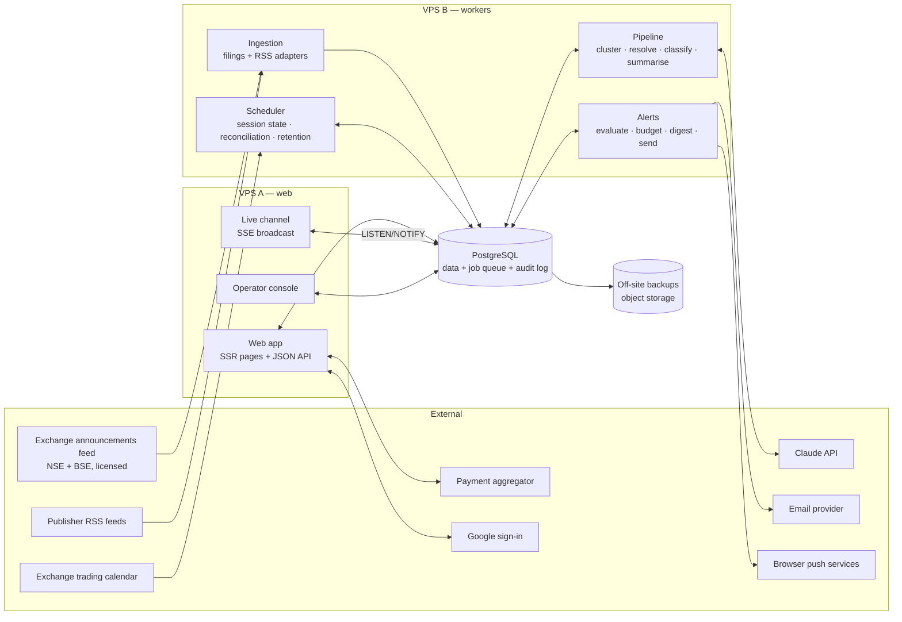

# StockPanic India — System Overview

| | |
| --- | --- |
| **Version** | **1.0 — APPROVED** |
| **Date** | 2026-10-02 |
| **Owner** | Architect / CTO (WORKFLOW §4) |
| **Status** | ✅ **Approved 2026-10-02 — [D-026](../../DECISION_LOG.md).** Changes require a new decision. |
| **Inputs** | PRD-001…007 v1.0 (D-023); founder constraints 2026-10-02: built by founder with AI coding agents, simple VPS/PaaS hosting, infrastructure **< ₹15k/month** (excluding exchange feed and AI usage), AI provider chosen by CTO |
| **ADRs** | [ADR-001](adr/adr-001-isin-canonical-key.md) ISIN key · [ADR-002](adr/adr-002-typescript-modular-monolith.md) stack · [ADR-003](adr/adr-003-hosting-two-vps.md) hosting · [ADR-004](adr/adr-004-postgres-only.md) Postgres for everything · [ADR-005](adr/adr-005-sse-broadcast-transport.md) live transport · [ADR-006](adr/adr-006-claude-ai-layer.md) AI layer |

> Design rule for this whole document: **the fewest moving parts one person and a set of AI agents can run reliably during market hours.** Every component below exists because a PRD requirement needs it; nothing is here for future scale. Numbers marked `[ASSUMPTION]` are sizing guesses to be replaced by measurement.

---

## 1. Shape of the System

One TypeScript codebase deployed as **two processes on two small VPSs**, one **PostgreSQL** database, and a handful of external services.

### 1.1 Components

| # | Component | Runs on | Responsibility |
| --- | --- | --- | --- |
| C1 | **Web app** | VPS A | Server-rendered story, company, profile and stream pages (indexable, PRD-004 AC-8); JSON API for every contract in PRD-001…007; auth and sessions; billing checkout and webhooks. |
| C2 | **Live channel** | VPS A | One Server-Sent Events endpoint broadcasting shared story, session and source-health events to all clients (ADR-005). |
| C3 | **Operator console** | VPS A | Role-gated pages (2FA, PRD-007 US-007.5) for correction queue, grievance queue, takedowns, spam removal, kill switches, abuse reports, τ and taxonomy settings. |
| C4 | **Ingestion** | VPS B | One adapter per source with its own schedule, health record and circuit breaker (PRD-002 US-002.5). Writes **items**. |
| C5 | **Pipeline** | VPS B | Per new item: cluster into a story → resolve instruments → classify event types → (filings) summarise and run safeguards. Emits `story.created` / `story.updated`. |
| C6 | **Alerts** | VPS B | Materiality check per watchlist, one-per-story guarantee, budget and quiet hours, digest assembly, email and push delivery, correction notices (PRD-003). |
| C7 | **Scheduler** | VPS B | Session state from the trading calendar (PRD-001 US-001.7); daily filing reconciliation (PRD-002 US-002.4); retention purges (PRD-005 IP, PRD-006 removed content, PRD-007 deletions); weekly quality-sample extraction. |
| C8 | **PostgreSQL** | VPS B (ADR-003) | System of record, job queue, append-only audit log, pub/sub for the live channel (ADR-004). |
| C9 | **Backups** | Object storage | Nightly base backup + continuous WAL archive, off-box. Restore drill monthly. |

C1 and C3 run as the `web` process; C2 runs as a separate small `live` process on the same host, so long-lived connections stay out of the page server; C4–C7 run as the `worker` process. Same repository, same types, same database access layer (ADR-002).

---

## 2. Data Flow — One Filing, End to End

| Step | Component | What happens | Target (PRD) |
| --- | --- | --- | --- |
| 1 | C4 | Filings adapter polls the exchange feed (or receives push, depending on vendor). New announcement → **item** row, deduplicated on exchange announcement ID. | |
| 2 | C5 | **Classify (rules)**: exchange category/subject → event types (PRD-004 US-004.1 AC-2). | |
| 3 | C5 | **Resolve**: scrip code → ISIN, confidence 1.0 (PRD-002 US-002.8 AC-1). For articles: alias candidates, then one Claude call that both classifies and scores candidates (ai-layer.md §2, entity-resolution.md §4). | |
| 4 | C5 | **Cluster**: NSE/BSE twin check, filing anchoring, candidate stories in the 48 h window; attach or create story (deduplication.md). | |
| 5 | C5 | Commit story; `NOTIFY story_events`. | **≤ 30 s median / ≤ 2 min p95 from exchange publication** (PRD-002 US-002.1 AC-2) |
| 6 | C2 | Live channel relays the event to every connected client; clients filter to their view. | **≤ 5 s p95** to open clients (PRD-001 US-001.2) |
| 7 | C6 | Alert evaluation for users whose watchlist holds the ISIN; deliver or hold for digest. | **push ≤ 60 s / email ≤ 2 min p95** (PRD-003 US-003.6) |
| 8 | C5 | **Summarise** (separate job, never blocks steps 5–7): Claude with citations → five safeguard checks → store or withhold; `story.updated`. | **≤ 2 min p95** (PRD-004 US-004.4) |

Articles follow the same path from step 1 (RSS adapter) with model-based resolution at step 3 and no summary.

---

## 3. Requirement → Component Map

WORKFLOW §4 exit: every PRD requirement maps to a component.

| PRD | Requirement group | Components |
| --- | --- | --- |
| **001** | US-001.1 stream, US-001.3 filters/views, AC-2a/2b paid filters | C1, C8 |
| | US-001.2 live updates, reconnect, gap-free catch-up | C2, C1 (catch-up fetch), C8 (LISTEN/NOTIFY) |
| | US-001.4 unread marker | C1, C8 |
| | US-001.5 keyboard; US-001.8 phone view | C1 (client) |
| | US-001.6 source health | C4 (health records), C7 (staleness evaluation), C2 (`source.health`) |
| | US-001.7 market session | C7, C2 (`session.changed`) |
| | Trending score (AC-7, C-001.2) | C5 (activity counters), C7 (baselines per session type) |
| **002** | US-002.1–002.4 filings first, reconciliation | C4, C5, C7 |
| | US-002.5 RSS ingestion, access basis | C4 |
| | US-002.6–002.7 clustering, operator merge/split | C5, C3 |
| | US-002.8–002.10 tagging, hazards, corporate actions | C5, C8 (temporal instrument tables) |
| | US-002.11 corrections queue | C1 (reports), C3 (review) |
| **003** | US-003.1–003.4 watchlist, CSV import, broker import (flagged) | C1 |
| | US-003.5–003.9 alerts, budget, digest, corrections, history | C6, C7 (digest schedule, budget reset), C1 (settings, history) |
| **004** | US-004.1 event types | C5, C3 (corrections) |
| | US-004.2–004.3 story and company pages | C1 |
| | US-004.4–004.5 summaries and safeguards | C5, C3 (reports, hide/regenerate) |
| **005** | US-005.1–005.4 voting, display, anonymity | C1, C8 (uniqueness constraint) |
| | US-005.5–005.6 eligibility, abuse detection | C1, C7 (abuse reports), C3 |
| | US-005.7 kill switch | C8 (settings row), C1, C2, C3 |
| **006** | US-006.1–006.5, 006.10 comments, profiles, reply dot | C1 |
| | US-006.6 comment kill switch | C8, C1, C3 |
| | US-006.7–006.9, 006.11 reports, grievances, takedowns, spam | C1, C3, C7 (deadline tracking, retention) |
| **007** | US-007.1–007.5 accounts, privacy, export, deletion, operators | C1, C7 (deletion and export jobs) |
| | US-007.6–007.9 tiers, billing, downgrade | C1, payment aggregator, C7 (trial end, budget clamp) |
| **All** | Audit logging (GUARDRAILS §4.8) | C8 append-only `audit_log`, written by C1, C3, C5, C6, C7 |

---

## 4. Market-Session Assumptions

Required explicitly by WORKFLOW §4 DoD and GUARDRAILS §4.11.

| # | Assumption | Design consequence |
| --- | --- | --- |
| M1 | Equity trading 09:15–15:30 IST, pre-open 09:00–09:15, Monday–Friday, from the published NSE/BSE calendar | C7 loads the calendar ahead of each year; session state is data, never hard-coded |
| M2 | Holidays, special sessions (e.g. Muhurat) and market-wide halts occur | Session states `holiday`, `special`, `halted` (PRD-001); Trending baselines keyed by session type |
| M3 | Load is bimodal: bursts at open, close and results windows; near-idle overnight (Research E5) | Worker concurrency scaled by schedule: higher 08:45–16:00 IST and during results season; queue priorities favour filings |
| M4 | Filings arrive outside market hours too (board outcomes late evening are common) | Ingestion runs 24×7; only polling cadence changes (PRD-002 US-002.5 AC-6) |
| M5 | Results season multiplies filing volume `[ASSUMPTION]` 3–5× for several weeks | Sizing (§6) uses results-season peaks, not averages |
| M6 | No deploys or schema migrations **08:45–15:45 IST on trading days** | Release process enforces a deploy freeze; emergency fixes only, with rollback ready |
| M7 | Source "staleness" is judged only in sessions where the source normally publishes (PRD-001 US-001.6 AC-2) | Each adapter declares its expected cadence per session type |

---

## 5. Failure Modes

| # | Failure | Detection | Behaviour | Recovery |
| --- | --- | --- | --- | --- |
| F1 | Exchange feed down or slow | Adapter health; no new filings for 3× cadence in session | Tier-1 stale banner (PRD-001); alerts unaffected for other sources | Auto-retry with backoff; reconciliation (C7) back-fills gaps with original timestamps |
| F2 | An RSS feed breaks or changes format | Malformed XML / no items for 3× cadence | Source marked stale on status page; others continue (adapters isolated) | Operator fixes adapter; no data loss beyond that feed |
| F3 | Claude API errors, slow, or rate-limited | Job failures, latency metrics | Classification falls back to `other` + rules only; summaries withheld (stories still publish); `refusal` stop reasons treated as failed checks (ADR-006 §2 item 5) | Jobs retried from queue; nothing blocks steps 1–7 of §2 |
| F4 | Model output fails safeguards | Safeguard checker | Summary withheld (PRD-004 §5.2) | Operator alert if withhold rate > 20% |
| F5 | PostgreSQL down | Health check | Web serves an error page; workers pause and retry | Restart; worst case restore from backup + WAL (RPO ≤ 5 min `[ASSUMPTION]`) |
| F6 | VPS A down | External uptime check | Site unavailable; ingestion and alerts continue on VPS B | Redeploy `web` onto VPS B (same image) as a degraded fallback |
| F7 | VPS B down | External uptime check | Ingestion, pipeline and alerts stop; site serves existing data; stale banners appear | Restore VPS B from image + DB backup; reconciliation back-fills filings |
| F8 | Live channel drops | Client heartbeat (15 s) | "Reconnecting…" after 10 s (PRD-001) | Client reconnects with `Last-Event-ID`; server replays from the event log, else client re-fetches |
| F9 | Market-open burst | Queue depth | Filings prioritised over articles; summaries deprioritised behind classification | Drains within minutes at sized concurrency (§6) |
| F10 | Email provider outage | Send failures | Push still delivered; emails queued | Retried for 6 h, then digest |
| F11 | Payment webhook lost or late | Reconciliation against provider API every 15 min | User sees "processing"; access granted on confirmation | Idempotent webhook handling (PRD-007 §6) |
| F12 | Bad deploy | Error rate after release | — | One-command rollback to previous image; deploy freeze (M6) limits blast radius |
| F13 | Brigading on votes | Abuse report (C7) | Counts unaffected until operator discounts | Operator discount / kill switch (PRD-005) |
| F14 | Disk fills (logs, WAL) | Disk alerts at 70% / 85% | — | Log rotation; WAL archived off-box |

---

## 6. Scaling Assumptions

| Quantity | Assumption | Basis |
| --- | --- | --- |
| Filings ingested | 2,000–5,000/day; ~3–5× in results season | `[ASSUMPTION]` — to be measured on the procured feed |
| RSS items ingested | 2,000–4,000/day | `[ASSUMPTION]` — depends on feed list (PRD-002) |
| Stories created | ~40–60% of items after clustering | Research §4.1 suggests heavy duplication |
| Concurrent open streams at launch | Up to 10,000 (PRD-001 NFR-001.4) | One Node process holds this many idle SSE connections on a small VPS `[ASSUMPTION]`; load-test before launch |
| Live events | Peak ~10/s at market open | Small payloads, one broadcast per event |
| Database growth | ~5–10 GB/year including audit log | Rows are small; PDFs are linked, not stored |
| Users at launch | Low thousands | Cold-start reality (PRD-005 limits) |

**When this design stops being enough:** sustained > 10k concurrent streams, or pipeline lag beyond targets during results season. Next steps, in order: move Postgres to a managed instance; add a second `web` process behind a load balancer (SSE broadcast already goes through Postgres NOTIFY, so it scales out without new parts); split workers by queue.

---

## 7. Security Notes

Detailed security review is a later phase (WORKFLOW). Constraints the architecture fixes now:

- Secrets (Claude API key, payment keys, email keys) in environment files on the servers with restricted permissions; never in the repository (GUARDRAILS §5.3).
- Operator console requires 2FA and is rate-limited; operator access to personal data is audit-logged (PRD-007 US-007.5).
- Postgres listens only on the private network between the two VPSs.
- Card data never touches our servers (PRD-007 C-007.7); payment webhooks verified by signature.
- Audit log table is append-only: the application role has `INSERT` and `SELECT` only.

---

## 8. Not Yet Decided (carried from D-023)

| Item | Needed by | Owner |
| --- | --- | --- |
| Exchange announcements feed vendor (OQ-6) | Before ingestion build | Founder |
| RSS feed list + per-feed terms checks | Before ingestion build | Founder + CTO |
| Payment aggregator choice | Before billing build | CTO (ADR to follow) |
| Email provider choice | Before alerts build | CTO (ADR to follow) |
| Broker-import feasibility (top 3 brokers) | Before PRD-003 US-003.3 build | CTO |
| Labelled evaluation sets (clustering, tagging, event types, summaries) | Before launch | Founder + CTO |
| ~~AI model tier and cost ceiling~~ | — | ✅ Haiku 4.5, ₹50k/month cap — D-025 |

---

## 9. Limits

| Limit | Detail |
| --- | --- |
| **Volumes unmeasured** | Every throughput figure is an assumption until the exchange feed is procured. |
| **Single region, little redundancy** | Two VPSs in one provider; a provider outage takes the product down. Accepted under the budget. |
| **No load test yet** | The 10k-stream claim (§6) must be load-tested before launch. |
| **No legal review** | Unchanged (D-018). |
