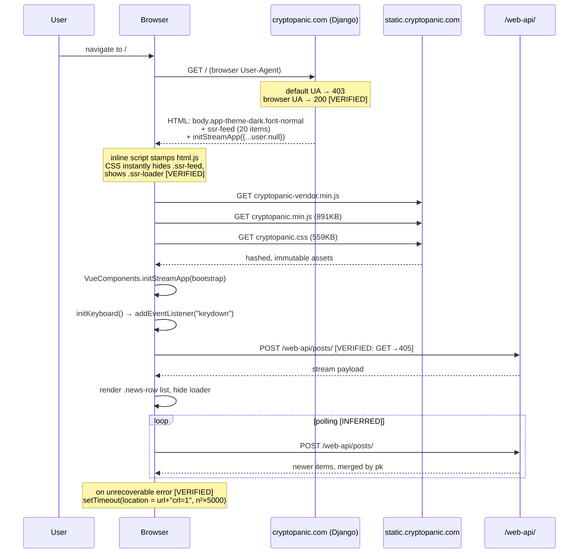
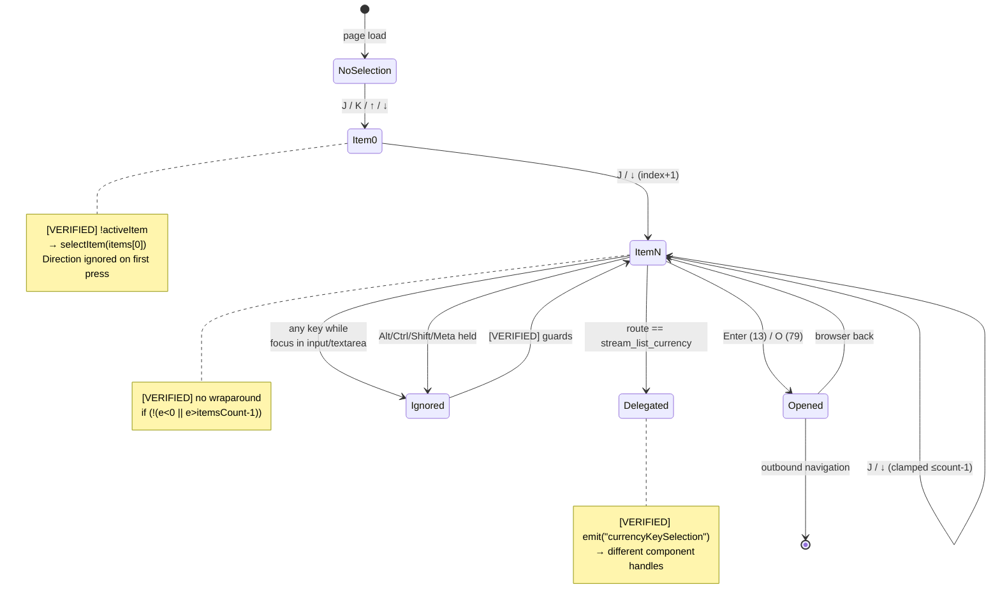
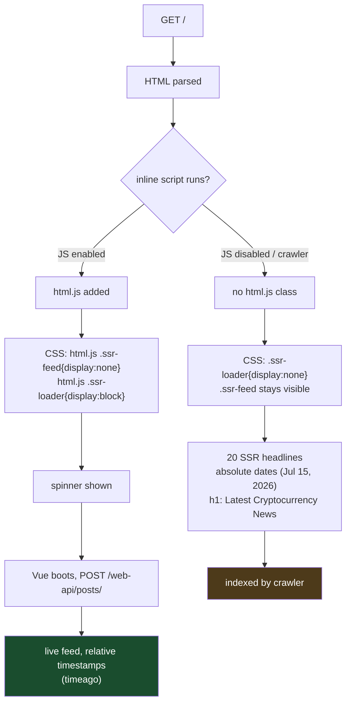
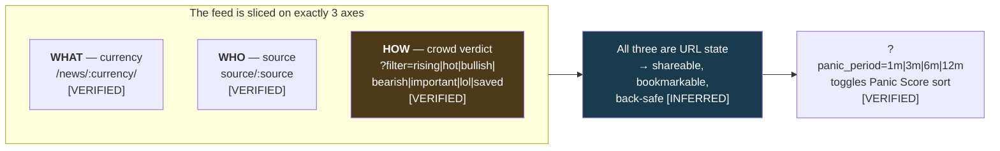
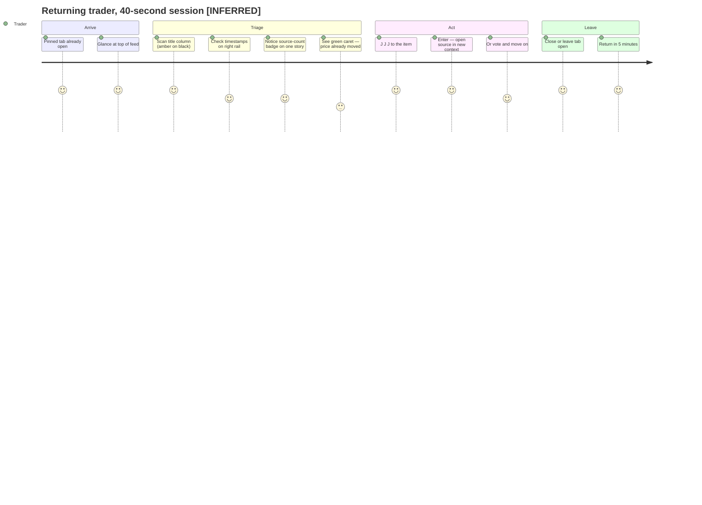
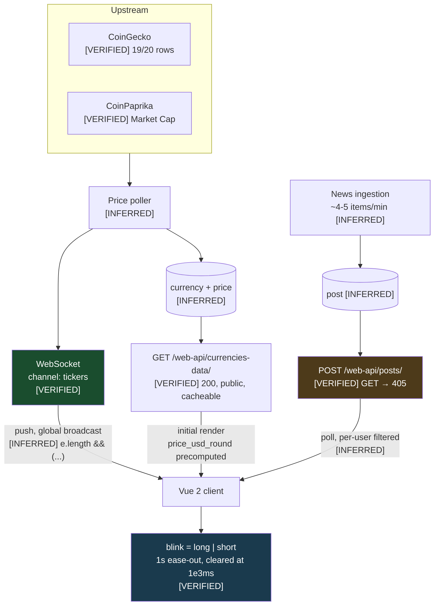
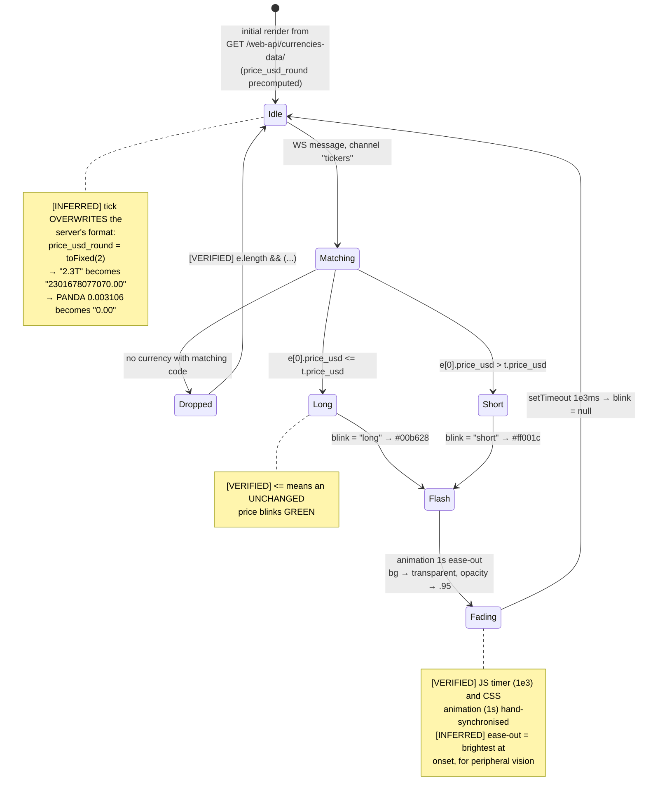

# CryptoPanic — Product Reverse Engineering

**Version 1.0**
**Analyst:** Senior Product Analyst
**Date of observation:** 15 July 2026
**Scope of this instalment:** **Homepage only.** Subsequent screens gated pending review.

---

## 0. Document Control

### 0.1 Objective

To understand CryptoPanic as a product so completely that every visible decision can be explained to another product team without reopening the site. This document asks one question, repeatedly: **why did the CryptoPanic team make this decision?**

It does not propose improvements, redesigns, or alternatives. Where a behaviour looks like a defect, it is recorded as an observation and its *product logic* is examined — not corrected.

### 0.2 Evidence labels

| Label | Standard of proof |
| --- | --- |
| `[VERIFIED]` | Directly observed in material the site publicly serves — rendered HTML, the stylesheet, the client JavaScript bundle, the bootstrap payload, or an HTTP response. Quoted or cited to the artefact. |
| `[INFERRED]` | A conclusion drawn from verified evidence by reasoning. Strong, but not directly observed. |
| `[ASSUMPTION]` | A plausible reading that the evidence does not establish. Flagged so it can be challenged or tested. |
| `[PATTERN]` | **(from v1.2)** The domain-independent product pattern underneath a crypto-specific feature — what the decision *is*, once the asset class is stripped out. Descriptive, never prescriptive. See §27. |

### 0.3 Evidence base — how this document was produced

`[VERIFIED]` All observations derive from artefacts CryptoPanic serves publicly to any browser that requests them. No authentication was used, attempted, or bypassed. Specifically:

| Artefact | How obtained | Size | What it establishes |
| --- | --- | --- | --- |
| `https://cryptopanic.com/` | HTTP GET, 200 | 24,042 B | Page shell, SSR fallback feed, bootstrap payload, body classes |
| `static.cryptopanic.com/static/css/cryptopanic.befe8d30fcf4.css` | HTTP GET, 200 | 558,903 B | Every typography, spacing, and colour value cited here |
| `static.cryptopanic.com/static/js/cryptopanic.min.5fc73219ae0a.js` | HTTP GET, 200 | 891,643 B | Route table, keyboard handler, component names, filter logic |
| `https://cryptopanic.com/news/bitcoin/` | HTTP GET, 200 | 22,619 B | Currency-page SSR pattern |
| `https://cryptopanic.com/web-api/posts/` | HTTP GET → **405** | 0 B | The stream endpoint rejects GET |

**A methodological note that matters.** Two facts shaped this document's reliability:

1. `[VERIFIED]` The site returns **HTTP 403** to a default-user-agent fetcher but **200** to a request bearing an ordinary browser User-Agent. The content is public; the gate is a bot filter, not an authorisation boundary.
2. `[VERIFIED]` CryptoPanic serves a **complete client bootstrap object** in the public homepage HTML — `VueComponents.initStreamApp({...})` — containing its entire client-visible endpoint map, feature flags, and configuration.

Consequence: the endpoint inventory, keyboard bindings, vote taxonomy, and CSS metrics in this document are **read from the product's own shipped source**, not reconstructed from memory or third-party write-ups. Where this document says `[VERIFIED]`, an artefact above can be pointed at.

**Limits of this method, stated plainly.** These are things I could not observe and have therefore not asserted:

- **Rendered pixel geometry.** I have the stylesheet, so I have declared values (`font-size:12px`, `flex-basis:50px`). I did not run a browser, so I have **no computed layout, no screenshots, no measured whitespace**. Any claim about *rendered* spacing beyond a declared CSS value is labelled `[INFERRED]` or `[ASSUMPTION]`.
- **Authenticated states.** The bootstrap shows `"user": null`. Everything about the logged-in homepage is inferred from route names, endpoint names, and CSS class names — never observed.
- **Live feed dynamics.** I captured one HTML snapshot. Polling intervals, insertion animations, and real-time behaviour are inferred from code, not watched.
- **A/B or cohort variants.** One fetch, one variant. If the homepage is experimented on, I saw one arm of it.

---

## 1. The Homepage as a Screen

### 1.1 Screen definition

| Attribute | Analysis |
| --- | --- |
| **Route** | `[VERIFIED]` `/` → Vue route `stream_list_home`. A sibling route `stream_list_dynamic_home` also exists. |
| **Purpose** | `[INFERRED]` To answer one question in the shortest possible time: *"what has happened in crypto since I last looked?"* Every decision below serves that latency. |
| **Primary user** | `[INFERRED]` The returning high-frequency trader. Evidence: 12px default type, `J`/`K` handler bound on mount, dark theme server-rendered as default, relative timestamps. None of these serve a first-time visitor. |
| **Secondary user** | `[INFERRED]` (a) The search-engine crawler — served a distinct SSR feed. (b) The first-time visitor arriving from search, who lands on a working feed with no onboarding gate. |
| **Entry points** | `[VERIFIED]` Direct navigation; organic search (canonical + OG + Twitter card + SSR feed all present); an iOS app handoff (`apple-itunes-app` app-id `1290506871`); social referral (`fb:app_id`, `twitter:site` `@cryptopaniccom`). |
| **Exit points** | `[VERIFIED]` **The outbound story link is the principal exit.** Also: `/news/{currency}/` currency filter, `/news/{pk}/{slug}` detail, `/accounts/login/`, `/accounts/signup/`, `/plus` (pro), `/developers/*`. |
| **Primary CTA** | `[INFERRED]` **Read a headline and leave.** Not signup, not subscribe. The most visually prominent, most numerous, most clickable element on the page is the story title. |
| **Secondary CTA** | `[INFERRED]` Vote on a story (`nc-upvote` cell, always present, `cursor:pointer`, `z-index:3`). Tertiary: filter the feed. |
| **Cognitive load** | `[INFERRED]` **Deliberately near-zero on arrival, deep on demand.** The default view is one uniform list of one repeated row type. No modal, no tour, no onboarding, no gate. |
| **Expected user intent** | `[INFERRED]` "Scan. Find the one thing that matters. Act or leave." Median session is `[ASSUMPTION]` seconds, not minutes. |

### 1.2 The design thesis, stated once

`[INFERRED]` Everything in this document reduces to a single organising principle:

> **The homepage is not a destination. It is a triage surface.**

CryptoPanic does not appear to be optimised for time-on-site, scroll depth, or session length. It is optimised for **the speed at which a user can decide that nothing matters and close the tab** — because a user who trusts that judgement returns six times a day. The product's value is not the reading; it is the *confidence that you didn't miss anything*. Every verified decision below is consistent with this thesis, and several are inexplicable without it.

---

## 2. Document Shell — Decisions Made Before the Feed Renders

### 2.1 The `<body>` class string

`[VERIFIED]`
```html
<body class="app font-normal app-theme-dark site-cryptopanic news-app">
```

Four independent product decisions are encoded in that one attribute, and all four are **server-rendered**, not applied by client JS.

#### 2.1.1 `app-theme-dark` — dark is the default, and it is not negotiable at first paint

`[VERIFIED]` The bootstrap payload confirms `"theme": "dark"`. The stylesheet defines:
```css
.app-theme-dark { color:#c2c4c9; background-color:#000 }
```

**Why this decision:**

`[VERIFIED]` The background is `#000` — **pure black**, not the softened near-black (`#121212`-ish) that most dark themes use.

`[INFERRED]` The choice of *pure* black over soft black is not aesthetic drift; it is contrast budgeting. Against `#000`, the amber headline (`#f5b93e`) and the green/red vote colours reach maximum separation. A `#121212` background would compress that range. The team spent the entire contrast budget on **making feed rows differentiable**, which is the only thing on the page that matters.

`[VERIFIED]` The body text colour is `#c2c4c9` — a mid grey, **not** `#fff`.

`[INFERRED]` This is the single most revealing decision in the stylesheet. On a page whose sole purpose is reading, the team deliberately *dimmed the text*. The reason `[INFERRED]` is that on this page **body text is not the payload — it is the background**. Metadata (source, time, tickers) exists to be skipped over. Dimming it to `#c2c4c9` makes the amber headline pop by comparison. The hierarchy is enforced by *lowering* the floor rather than raising the ceiling, which preserves headroom for the accent colours to signal.

`[INFERRED]` Server-rendering the theme rather than applying it via JS eliminates the white-flash-then-dark transition. For a user who opens the site dozens of times a day, that flash is both physically unpleasant and a perceived-latency signal. Rendering `app-theme-dark` in the initial HTML means the page is *never* light, at any millisecond.

`[VERIFIED]` Four theme classes exist in the stylesheet: `app-theme-light`, `app-theme-dark`, `app-theme-light-fx`, `app-theme-dark-fx`.
`[ASSUMPTION]` The `-fx` suffix denotes a variant with additional visual effects (a "flash"/animation-enabled mode). The stylesheet does not disclose the distinction and I did not verify it.

#### 2.1.2 `font-normal` — the density decision, quantified

`[VERIFIED]` The stylesheet defines exactly three density classes:
```css
.font-normal { font-size:12px }
.font-medium { font-size:15px }
.font-large  { font-size:18px }
```
`[VERIFIED]` The bootstrap exposes them as user-selectable:
```json
"font_options": [
  {"label":"Normal","value":"font-normal"},
  {"label":"Medium","value":"font-medium"},
  {"label":"Large","value":"font-large"}
]
```
`[VERIFIED]` The default, server-rendered for an anonymous user, is `font-normal` — **12px**.

**Why this decision:**

`[INFERRED]` 12px is aggressive. It sits below the ~16px browser default and below almost every content site. Shipping it as the *anonymous default* — before the product knows anything about the visitor — is a declaration of who the product is for. The team is not easing newcomers in; they are **serving the expert first and letting everyone else adjust upward**.

`[INFERRED]` The mechanism is worth naming precisely: `font-size` on `<body>` sets the **rem/em basis for the entire document**. Because the row's own dimensions are declared in `px` (see §4.2) but its internal text scales, switching `font-normal` → `font-large` does not merely enlarge glyphs — it **relayouts the feed's information density**. This is a density control wearing a font-size label.

`[INFERRED]` Why three steps and not a slider? Three named options are a decision, not a configuration. A slider would demand the user optimise; three labels ask them to pick. `[ASSUMPTION]` The labels ("Normal / Medium / Large") are also framed to make 12px sound like the neutral choice rather than the extreme one it is — the naming does persuasive work.

**The trade the team accepted:** 12px is below common accessibility guidance for body text. `[INFERRED]` They accepted a real accessibility cost to buy vertical density, then discharged the obligation with an explicit user-controlled escape hatch (Medium/Large). This is a *conscious* trade — the escape hatch is evidence they knew the cost. See §11.

#### 2.1.3 `news-app` and `site-cryptopanic`

`[VERIFIED]` The bootstrap contains:
```json
"site": {"id":1, "slug":"cryptopanic", "title":"CryptoPanic",
         "market_ids":[0,null], "market_kinds":["crypto","custom","fiat"]}
```

`[INFERRED]` `site.id = 1`, a `slug`, a `theme` field, and `market_kinds` including `"fiat"` and `"custom"` reveal that **the codebase is a multi-tenant news-aggregation platform of which CryptoPanic is tenant #1**. The product is built as an engine, not a site. `[ASSUMPTION]` This anticipates or already serves sibling properties on other asset classes.

`[INFERRED]` `news-app` as a body class implies sibling apps in the same shell. This is corroborated by the route table, which contains `/partnership-hub/` and `module:"news"` parameters passed on stream routes — `module` only needs to exist if there is more than one.

### 2.2 The SSR fallback feed — two products, one URL

`[VERIFIED]` In `<head>`:
```html
<script>document.documentElement.classList.add('js')</script>
<style>.ssr-loader{display:none}
       html.js .ssr-loader{display:block}
       html.js .ssr-feed{display:none}</style>
```
`[VERIFIED]` In `<body>`, a fully server-rendered feed of **20 stories** with real headlines, sources, `<time datetime>` stamps, and currency links — wrapped in `<div class="ssr-feed">` under `<h1 class="ssr-feed__title">Latest Cryptocurrency News</h1>`.

**Why this decision — and it is an elegant one:**

`[INFERRED]` The mechanism is a one-line inline script that stamps `.js` on `<html>` **before the body parses**. Then, purely in CSS:

| Environment | `.ssr-feed` | `.ssr-loader` |
| --- | --- | --- |
| No JS (crawler, JS-off, bundle fails) | **visible** | hidden |
| JS present (every real user) | hidden | **visible** (spinner) |

`[INFERRED]` The reasoning behind this specific implementation:

1. **SEO.** A Vue SPA renders an empty shell to a crawler. CryptoPanic's organic acquisition depends on ranking for crypto news queries. The SSR block gives crawlers 20 real, linked, timestamped, currency-tagged headlines plus an `<h1>` — without server-rendering the actual application.
2. **It is CSS-switched, not JS-switched.** No flash of the fallback, no reconciliation, no hydration mismatch. The swap happens at parse time.
3. **The two feeds are not the same product.** `[VERIFIED]` The SSR feed shows absolute dates (`Jul 15, 2026`); `[VERIFIED]` the app bundle references `timeago` 21 times, i.e. relative timestamps ("3m ago"). **Crawlers get absolute dates; humans get relative ones.** A crawler needs to know *when*; a trader needs to know *how long ago*. Same data, two renderings, chosen per-consumer. This is a genuinely sophisticated piece of product thinking hiding in a stylesheet.
4. `[INFERRED]` It doubles as a degradation path. If the 891KB bundle fails, a no-JS user still sees 20 linked headlines rather than a blank page.

`[VERIFIED]` The `<h1>` text differs by route: `/` → "Latest Cryptocurrency News"; `/news/bitcoin/` → "Bitcoin $BTC Real-time News" (`<title>`: "Bitcoin $BTC Real-time News | CryptoPanic").
`[INFERRED]` The SSR layer is a **templated SEO surface across every currency page** — a per-coin landing page generated from the same feed data. `[INFERRED]` This is likely a significant organic acquisition channel: one page per coin, each ranking for "{coin} news".

### 2.3 Metadata and the brand voice

`[VERIFIED]`
```html
<title>CryptoPanic - News aggregator platform indicating impact on price
       and market for traders and cryptocurrency enthusiasts</title>
<meta property="og:title" content="CryptoPanic - If you're going to panic, panic early.">
```

`[INFERRED]` Two different value propositions for two different contexts, deliberately:

- **`<title>` (search context):** keyword-dense, unromantic, engineered for the query "crypto news aggregator". It names the audience twice ("traders", "cryptocurrency enthusiasts").
- **`og:title` (social share context):** *"If you're going to panic, panic early."* — the actual brand line. It is a joke that encodes the entire product thesis: you cannot stop reacting emotionally to news, so at least be **first**. It reframes the product's core value (latency) as an in-joke about trader psychology.

`[INFERRED]` The team understands that a search snippet and a shared link are read by people in different states of mind, and refuses to compromise on one string for both.

`[VERIFIED]` Other shell decisions:
- `<meta name="viewport" content="width=device-width, initial-scale=1, maximum-scale=1, user-scalable=0">` — **pinch-zoom disabled**. `[INFERRED]` Consistent with treating the layout as an application chrome rather than a document; `[INFERRED]` a further accessibility cost accepted, compounding §2.1.2.
- `<meta name="format-detection" content="telephone=no">` — `[INFERRED]` stops iOS auto-linking numerals in headlines. Crypto headlines are *dense* with numbers ($130M, 95%, $11.3M). Without this, iOS Safari would turn prices into phone links. A small fix that only a team looking closely at their own feed would find.
- `<meta name="theme-color" content="#FF9933">` then a second `<meta name="theme-color" content="#ffffff">`. `[VERIFIED]` Both present. `[INFERRED]` A genuine bug or a legacy leftover — the duplicate tag is contradictory and last-wins behaviour is browser-dependent. `[VERIFIED]` `#FF9933` is the brand accent, appearing in the stylesheet as the active-nav colour (`#f93`) and the `vote-poll_votes` colour.
- `<link rel="mask-icon" color="#d83844">` — `[VERIFIED]` a *red* brand colour, distinct from the orange. `[ASSUMPTION]` Brand palette drift over time.

### 2.4 The analytics stack — what the team measures

`[VERIFIED]` Three tracking systems in the shell:

| System | Evidence | `[INFERRED]` purpose |
| --- | --- | --- |
| **Matomo, self-hosted** | `u="//matomo.cryptopanic.com/"`, `setSiteId('1')`, `trackPageView`, `enableLinkTracking` | Primary product analytics. **Self-hosted, on their own subdomain.** |
| **Facebook Pixel** | `fbq('init','194140584396344')`, `fbq('track','PageView')` | Paid acquisition / retargeting |
| **Google Analytics** | `App.Settings.trackGA = true` … then overridden to `false` further down | `[VERIFIED]` GA is **initialised then disabled** in the same document |

**Why self-hosted Matomo:**

`[INFERRED]` Three reasons, all consistent with the product:
1. **Ad-blocker resilience.** A crypto-trader audience blocks third-party analytics at exceptionally high rates. First-party `matomo.cryptopanic.com` survives filter lists that kill `google-analytics.com`. For this audience, self-hosting is not a privacy stance — it is a *data-completeness* stance.
2. **Privacy positioning.** `[VERIFIED]` The cookie-consent config declares two groups: `cryptopanic` (`is_required: true`, "Used for site functioning properly") and `analytics` (`is_required: false`, "Used for CryptoPanic improvements"). Analytics is genuinely optional and separately declared.
3. `[VERIFIED]` `enableLinkTracking` is explicitly enabled — the team measures **outbound clicks**, which §1.1 identifies as the primary CTA. They instrument the exit, because the exit is the conversion.

`[INFERRED]` The `trackGA = true → false` sequence suggests GA was retired but the flag plumbing remains. `[ASSUMPTION]` A migration to Matomo that was completed at the config layer without removing the dead template block.

`[INFERRED]` The tension worth noting: a self-hosted, consent-gated, privacy-forward analytics posture **coexisting with a Facebook Pixel** that fires `PageView` unconditionally. `[INFERRED]` The privacy posture is real but partial — Matomo is self-hosted for completeness and positioning; the Pixel remains because paid acquisition requires it.

---

## 3. Information Architecture

### 3.1 Navigation tree

`[VERIFIED]` Reconstructed from the Vue router table extracted from the bundle. Route *names* are verbatim; hierarchy is `[INFERRED]` from nesting and path fragments.

```mermaid
graph TD
    ROOT["/  •  stream_list_home"]

    ROOT --> FEED["Feed surfaces"]
    ROOT --> USER["User surfaces"]
    ROOT --> DEV["Developer surfaces"]
    ROOT --> PRO["Monetisation"]
    ROOT --> HUB["Partnership Hub"]
    ROOT --> ADMIN["admin • admin_sources"]

    FEED --> F1["stream_list_home"]
    FEED --> F2["stream_list_dynamic_home"]
    FEED --> F3["/news/:currency/ • stream_list_currency"]
    FEED --> F4["source/:source • stream_list_source"]
    FEED --> F5[":pk(d+)/:slug • stream_post_details"]
    FEED --> F6[":pk(d+)/:slug/edit • stream_post_edit"]
    FEED --> F7["news/about • stream_list_home_about"]
    F3 --> F3a["options • stream_list_currency_options"]
    F3 --> F3b["portfolio • stream_list_currency_portfolio"]
    F3 --> F3c[":currency/:pk/:slug • stream_currency_post_details"]

    USER --> U1["user_profile"]
    USER --> U2["user_portfolio"]
    USER --> U3["user_settings"]
    U1 --> U1a["comments • user_profile_comments"]
    U1 --> U1b["reputation • user_profile_reputation"]
    U1 --> U1c["tips • user_profile_tips"]
    U2 --> U2a["chart • user_portfolio_chart"]
    U3 --> U3a["alerts • user_settings_alerts"]
    U3 --> U3b["sources • user_settings_sources"]
    U3 --> U3c["portfolio • user_settings_portfolio"]
    U3 --> U3d["plus • user_settings_pro"]

    DEV --> D1["developers_api"]
    DEV --> D2["developers_bots"]
    DEV --> D3["developers_widgets"]
    D1 --> D1a["about / plans / keys / dashboard / example / legacy / terms"]
    D2 --> D2a["new / :pk/edit / docs"]
    D3 --> D3a["docs"]

    PRO --> P1["/plus-mode/ • pro_mode"]
    PRO --> P2["go_pro"]
    PRO --> P3["bitcoin • go_pro_bitcoin"]
    PRO --> P4["thank-you • go_pro_thanks"]

    HUB --> H1["exchanges / wallets / vpns / funded-trading"]
    HUB --> H2["earn-and-staking / security / lending-and-borrowing"]
```



**What the route table reveals that the rendered page does not:**

`[VERIFIED]` `go_pro_bitcoin` — a dedicated pro-upgrade route for **Bitcoin specifically**.
`[INFERRED]` BTC-interested traffic is large enough, or converts differently enough, to warrant its own upgrade funnel. This is a segmentation decision visible only in routing.

`[VERIFIED]` `user_profile_reputation`, `user_profile_tips`, `user_profile_comments`, and CSS classes `vote-tip` / `vote-thanks`; bootstrap endpoints `/web-api/user/_/tips-payout` and `/tips-payout-list`.
`[INFERRED]` There is a **contributor economy** — reputation, comments, and real tip payouts. The homepage exposes almost none of this. `[INFERRED]` The feed is the acquisition surface; the community is a retention layer reached later.

`[VERIFIED]` `/partnership-hub/` with seven fixed items (`exchanges`, `wallets`, `vpns`, `funded-trading`, `earn-and-staking`, `security`, `lending-and-borrowing`).
`[INFERRED]` Affiliate revenue, structured as a directory. The categories are exactly the high-CPA crypto verticals. `[INFERRED]` Kept off the homepage — the team is protective of feed real estate.

`[VERIFIED]` A `guides_item_*` / `pro_guides_item_*` route family, including:
`how-to-customize-the-cryptopanic-feed`, `what-is-the-market-sentiment-on-cryptopanic`, `how-to-create-polls-on-cryptopanic`, `how-to-add-coins-to-favorites-on-cryptopanic`, `how-to-add-currencies-to-your-portfolio`, `how-to-develop-and-integrate-cryptopanic-bots`, `how-to-create-news-widgets`, `the-difference-between-the-free-and-pro-plan-on-cryptopanic`, `how-to-use-the-panic-score-on-cryptopanic`, `how-to-set-up-price-alerts-on-cryptopanic`, `how-to-add-custom-news-sources-on-cryptopanic`, `how-to-remove-news-source-from-the-feed`, `how-to-integrate-the-cryptopanic-api`, `how-to-hide-ads-on-cryptopanic`.

`[INFERRED]` This list is a **confession of where the product is not self-evident**. A team writes "how to use the Panic Score" because users asked. Note the split: the `pro_guides_*` set (Panic Score, price alerts, custom sources, removing sources, API, hiding ads) maps precisely onto the paid feature set — these double as **feature marketing**. And `how-to-hide-ads-on-cryptopanic` is, `[INFERRED]`, an upgrade pitch written in the grammar of a help article.

### 3.2 The endpoint map — the product's true feature surface

`[VERIFIED]` The public bootstrap declares ~50 client endpoints. Grouped, with `[INFERRED]` purpose:

| Group | Endpoints `[VERIFIED]` | `[INFERRED]` feature |
| --- | --- | --- |
| **Stream** | `stream_list: /web-api/posts/` | The feed. The product. |
| **Click tracking** | `post_link_click: /news/click/0/`, `feed_post_link_click: /news/feed/click/0/` | **Two distinct outbound-click endpoints** — see below |
| **Currencies** | `currencies`, `currency`, `currency_options`, `currency_search: /web-api/ac/`, `currencies_alerts` | Ticker entity layer + autocomplete + alerts |
| **Voting** | `actions.post_positive: /action/post/0/positive/` | Vote mutation; `0` is an ID placeholder |
| **Portfolio** | `portfolio`, `portfolio_chart`, `get_portfolio_settings`, `update_portfolio_settings` | Holdings + valuation over time |
| **Notifications** | `get_notifications`, `update_notifications`, `update_device` | Push/device registration |
| **Sources** | `settings_sources_list`, `pro_sources`, `submit_custom_source`, `suggest_source_save`, `source_detail`, `source_find_rss` | Source management; **`find-rss` auto-discovers a feed from a URL** |
| **Comments** | `comments_list`, `comments_create` | Discussion |
| **Hub** | `list_hub_entries`, `get_hub_entry`, `create_hub_entry` | `[ASSUMPTION]` user-submitted content ("hub_submit" route exists) |
| **Tips** | `user_tips_payout`, `user_tips_payout_list` | Real value transfer between users |
| **AI** | `user_last_ai_summary: /web-api/user/last_ai_summary` | An AI summary feature, **scoped per-user** |
| **Auth/Security** | `generate_totp_qrcode`, `verify_totp` | **2FA on a news reader** |
| **API keys** | `regenerate_api_key` | Developer self-service |
| **Ads** | `log_ad_impression`, `ad_preview_requested` | Ad instrumentation |
| **Feedback** | `check_for_feedback`, `user_feedback`, `user_requested_feedback`, `..._reject`, `collaboration_request` | Solicited in-product feedback |
| **Misc** | `sign_request: /web-api/sr/`, `membership_details`, `cookie_consent` | `[ASSUMPTION]` `sr` = signed request for a third-party integration |

**Three things this map tells us that the page does not:**

1. **Two click-tracking endpoints.** `[VERIFIED]` `/news/click/0/` and `/news/feed/click/0/` are separate. `[INFERRED]` The team distinguishes *a click from the feed* from *a click from elsewhere* (detail page, currency page, widget). They are measuring **which surface produced the exit** — strong corroboration that outbound click is the north-star event, tracked with surface attribution.

2. **`source_find_rss`.** `[VERIFIED]` `/web-api/source/find-rss`. `[INFERRED]` A user pastes a site URL and the backend discovers its RSS feed. This is a *thoughtful* reduction of the hardest step in "add your own source" — the user does not know what an RSS URL is, and now does not need to.

3. **TOTP 2FA.** `[VERIFIED]` On a product whose core content is public news. `[INFERRED]` The account is not protecting the news — it is protecting the **portfolio, the API keys, and the tip balance**. The presence of 2FA is evidence of how much value has accreted behind the login.

`[VERIFIED]` The `0` in `/action/post/0/positive/`, `/news/click/0/`, `/hub/get/0` is a placeholder the client substitutes.
`[INFERRED]` A shared client-side URL-templating convention.

`[INFERRED]` **The stack is Django.** Evidence: `csrfCookieName: 'csrftoken'`; hashed static filenames in Django's ManifestStaticFilesStorage style (`cryptopanic.befe8d30fcf4.css`); `/web-api/` namespacing; and `pk` as the item identifier in the JS (`e.pk === t`) — `pk` is Django ORM vernacular. `[VERIFIED]` The client is Vue 2 (`VueComponents.initStreamApp`, `_k` keycode helper, `router-link-exact-active`, `beforeDestroy`).

### 3.3 `POST /web-api/posts/` — the stream endpoint rejects GET

`[VERIFIED]` `GET https://cryptopanic.com/web-api/posts/` → **HTTP 405 Method Not Allowed**, zero-length body. The feed is fetched by **POST**.

**Why would a read endpoint be POST-only?** `[INFERRED]`, three non-exclusive readings:

1. **Filter payload complexity.** The feed's state is not one parameter. It is a filter, a panic period, a currency set, a source set, a language set, a search string, and a cursor. `[INFERRED]` That composite exceeds what fits comfortably in a query string, and a POST body models it naturally.
2. **Scraping friction.** A GET endpoint is trivially harvestable. POST-only, combined with `[VERIFIED]` the 403-on-default-User-Agent behaviour and `[VERIFIED]` a CSRF cookie, `[INFERRED]` raises the cost of casual scraping. Given that CryptoPanic **sells** API access, protecting the free web endpoint from becoming a de facto free API is a direct commercial interest.
3. **Cache semantics.** `[INFERRED]` POST is uncacheable by default in intermediaries — appropriate for a per-user, per-filter, real-time stream, and it prevents a CDN from serving a stale feed.

`[INFERRED]` Reading 1 explains the design; reading 2 explains why they never fixed it. The commercial incentive and the technical convenience point the same way.

---

## 4. The Feed — Anatomy of the Product

The feed is the product. Everything else is navigation to it.

### 4.1 Feed philosophy

`[INFERRED]` The feed's governing rule, deducible from its verified geometry: **every row is the same shape, so the eye never re-learns the layout.**

There is no hero item, no featured card, no image thumbnail, no varying row height, no card grid. `[VERIFIED]` The CSS defines one row class (`.news-row`) and a fixed set of cells (`nc-upvote`, `nc-title`, `nc-currency`, `nc-date`, `nc-progress`, `nc-votes`, `nc-comments`, `nc-actions`).

`[INFERRED]` This is a *scanning* optimisation and it is the deepest UX decision in the product. When rows are uniform:
- The eye establishes a **fixed saccade path** — left edge (vote), then a title column at a constant x-offset, then a right-aligned time. After ~3 rows, the user stops *reading the layout* and only reads *content*.
- Vertical scanning becomes possible: the title column is a straight line down the page, so the user reads a *column of headlines*, not a *list of cards*.
- **Nothing is emphasised, so nothing is de-emphasised.** A hero item would imply editorial judgement about what matters. This feed refuses to make that claim.

`[INFERRED]` This last point is the philosophical core. CryptoPanic does not tell you what is important — it shows you *everything*, uniformly, and gives you *tools* (filters, votes, Panic Score) to decide. The uniform row is that neutrality made visible. The product's editorial stance is that it has no editorial stance.

### 4.2 Row anatomy — verified geometry

`[VERIFIED]` from the stylesheet:

```css
.news-row               { border-bottom: 1px solid rgba(48,52,60,.75) }  /* dark theme */
.news-cell.nc-upvote    { flex-basis:50px; padding-right:8px; white-space:nowrap;
                          display:flex; align-items:center; justify-content:center;
                          z-index:3; cursor:pointer }
.news-cell.nc-title     { flex:1; line-height:1.44; font-size:13px }
.news-cell.nc-currency  { font-size:10px }
.news-cell.nc-date      { font-size:10px; white-space:nowrap; flex-basis:50px; opacity:.8 }
.news-cell.nc-progress  { flex:1; display:flex; align-items:center }
```

**The row is a flexbox with fixed rails and a fluid centre:**

```
┌────────┬──────────────────────────────────────────────┬─────────┬────────┐
│ 50px   │                 flex: 1                      │  auto   │  50px  │
│ FIXED  │                 FLUID                        │         │ FIXED  │
├────────┼──────────────────────────────────────────────┼─────────┼────────┤
│        │                                              │         │        │
│  ▲ 12  │  Japan passes key bill recognizing crypto    │ BTC ETH │  3m    │
│        │  as financial product, lowering tax rate     │         │        │
│ upvote │  The Block · ▲2.4%                           │  10px   │  10px  │
│        │                                              │         │  .8α   │
│ 8px pr │  13px / 1.44                                 │         │        │
└────────┴──────────────────────────────────────────────┴─────────┴────────┘
  z:3                                                              nowrap
  cursor:pointer
                    border-bottom: 1px solid rgba(48,52,60,.75)
```

**Reading the numbers:**

| Decision `[VERIFIED]` | `[INFERRED]` reasoning |
| --- | --- |
| **Title 13px on a 12px body** | The title is the *only* element sized **above** the base. It is +1px — barely. The team refused to enlarge the headline meaningfully, relying instead on **colour** (amber `#f5b93e` against `#c2c4c9` grey) to establish hierarchy. Emphasis is bought with hue, not size, because size costs vertical density and hue costs nothing. |
| **Title `line-height:1.44`** | The only generous number in the row. 13px × 1.44 ≈ 18.7px. Headlines wrap to 2–3 lines (`[VERIFIED]` — the SSR feed contains headlines of 200+ characters), and tight leading on wrapped text destroys readability. The team spent their whitespace budget **exclusively on the one element that gets read**. |
| **Date 10px, `opacity:.8`** | Double-suppressed: smaller *and* faded. `[INFERRED]` The timestamp must be *available* but never *compete*. It is checked, not read. |
| **Date `flex-basis:50px` + `white-space:nowrap`** | A **fixed 50px rail**. This is why the timestamp column is perfectly straight down the page. `nowrap` guarantees "12m ago" never wraps and never changes row height. `[INFERRED]` Row-height stability is the point — see §4.7. |
| **Upvote `flex-basis:50px`** | A matching fixed left rail. `[INFERRED]` The vote target is a constant-width column, so the mouse can travel down the left edge hitting vote after vote without horizontal correction. **This is a Fitts's-Law decision:** an infinitely tall 50px column is an easy target. |
| **Upvote `justify-content:center` + `align-items:center`** | The glyph is centred in its 50px box regardless of row height. `[INFERRED]` The click target stays predictable even when a headline wraps to 3 lines. |
| **Upvote `z-index:3`** | `[INFERRED]` The row is very likely wrapped in a full-row link/click surface. The vote cell is lifted **above** it so a vote-click is not captured by the row's navigation. This is the CSS signature of "the whole row is clickable, except this bit." |
| **Currency 10px** | Same suppression as the date. Tickers are *scan targets*, not *reading matter* — the eye filters on them, then discards. |
| **Border `1px solid rgba(48,52,60,.75)`** | Not a solid colour — **75% alpha**. `[INFERRED]` A hairline that separates without drawing. Against `#000`, `rgba(48,52,60,.75)` computes to roughly `#24272d` — barely visible, just enough to bound the row. The team wanted separation, not structure. Compare `.news-row-more { border-bottom-color: #30343c }` — `[VERIFIED]` opaque and brighter, i.e. a *stronger* rule for a different element. |

`[INFERRED]` **The whole row is a study in subtraction.** Exactly one element (the title) is granted size, colour, and leading. Every other element is shrunk to 10px, faded to 0.8, or both. Hierarchy is created not by promoting the headline but by **demoting everything else**.

### 4.3 The title cell — more than a headline

`[VERIFIED]` The title cell contains child elements beyond the text:

```css
.nc-title                          { color:#f5b93e }            /* dark theme */
.nc-title .si-source-count         { background-color:rgba(129,138,145,.8); color:#000 }
.nc-title .si-source-name:hover    { color:#2bbdee }
.nc-title .icon-caret-up-two       { color:#00b628 }
.nc-title .icon-caret-down-two     { color:#ff001c }
```

Four distinct sub-components:

#### 4.3.1 `si-source-name` — attribution, hover-linked

`[VERIFIED]` The source name is inside the title cell and turns cyan (`#2bbdee`) on hover, i.e. it is a link. `[VERIFIED]` The route `source/:source → stream_list_source` exists.
`[INFERRED]` Every source name in the feed is a **one-click filter to that source's stream**. Attribution and navigation are the same affordance.
`[VERIFIED]` The SSR feed shows source names verbatim: `Coinpaper`, `Blockhead`, `Cryptonews`, `Protos.com`, `The Block`, `CoinGecko`, `Catenaa News`, `Coindoo.com`, `Feed - Cryptopolitan.Com`, `The Modern Investor`, and Twitter/X handles rendered as `X - lookonchain`, `X - BSCNews`, `X - CoinMarketCap`, `X - WatcherGuru`, `X - cointelegraph ‏`.

`[INFERRED]` The `X - {handle}` convention is a significant decision. **Tweets are first-class feed items**, not a separate tab — but they are *prefixed*, so the user always knows a claim's epistemic status before reading it. A tweet and a Reuters story occupy identical rows, and the only signal distinguishing them is that two-character prefix. `[INFERRED]` This reflects a real belief about crypto news: the *fastest* information arrives on Twitter, so excluding it would break the product's core promise, but presenting it as equivalent to reported journalism would be dishonest. The prefix is the cheapest possible resolution of that tension.

`[VERIFIED]` `Feed - Cryptopolitan.Com` and the trailing whitespace/ZWSP in `X - cointelegraph ‏` are `[INFERRED]` unnormalised source names leaking from ingestion config — cosmetic artefacts of a source list that has grown over time.

#### 4.3.2 `si-source-count` — the duplicate cluster badge

`[VERIFIED]`
```css
.nc-title .si-source-count { background-color: rgba(129,138,145,.8); color:#000 }
```
`[INFERRED]` A small grey pill inside the title cell carrying a **count of additional sources reporting the same story**. Its existence establishes that CryptoPanic **clusters duplicate stories server-side** and surfaces the cluster size inline.

**Why this decision:** `[INFERRED]`
- Syndicated crypto news duplicates heavily; an unclustered feed would show the same story 8 times.
- The count is not merely hygiene — it is **signal**. "14 sources reported this" is a proxy for magnitude. The team turned a deduplication necessity into an importance indicator, at the cost of one badge.
- `[INFERRED]` Rendering it *inside* `nc-title` rather than as its own cell keeps the row's fixed rails intact — no new column, no layout cost.

#### 4.3.3 `icon-caret-up-two` / `icon-caret-down-two` — price movement in the headline

`[VERIFIED]`
```css
.nc-title .icon-caret-up-two   { color:#00b628 }   /* green */
.nc-title .icon-caret-down-two { color:#ff001c }   /* red */
```
`[INFERRED]` A green/red directional caret rendered **inside the title cell** — price movement for the story's associated currency, adjacent to the headline.

**Why this decision:** `[INFERRED]` This is the literal expression of the product's `<title>` tag — *"indicating **impact on price** and market"*. The team's thesis is that a headline is meaningless without its market reaction. By placing the caret in the title cell, they fuse *what happened* with *what the market did about it* into a single glance. `[INFERRED]` It also silently answers "am I early?" — a green caret already showing means the move has begun; the user is late. That is the "panic early" brand line rendered as a UI element.

`[VERIFIED]` The `-two` suffix implies an `icon-caret-up` (variant one) exists. `[ASSUMPTION]` An icon-set version, not a semantic distinction.

#### 4.3.4 Title colour — amber, not white

`[VERIFIED]` `.nc-title { color:#f5b93e }` (dark) / `#db970c` (light).

`[INFERRED]` The single most identity-defining colour choice in the product. Against `#000` with `#c2c4c9` body text, an amber headline:
- Is the **only warm colour** in the reading path, so it captures the eye without size.
- `[VERIFIED]` `.app-theme-dark a { color:#c2c4c9 }` — ordinary links are grey. So the title is not styled as "a link"; it is styled as **the content**, and everything else recedes to chrome.
- `[INFERRED]` Amber-on-black is the terminal/console idiom. This is a deliberate borrowing of Bloomberg-terminal visual grammar — it signals "professional tool" to the target user before a single word is read.

`[VERIFIED]` Light theme uses `#db970c` — a *darker* amber, for contrast against a light background. Both themes were tuned, not merely inverted.

### 4.4 The vote system — 11 reaction types

`[VERIFIED]` The stylesheet defines a far larger vote taxonomy than any public description of the product suggests. Extracted verbatim:

| Vote class `[VERIFIED]` | Colour `[VERIFIED]` | `[INFERRED]` meaning |
| --- | --- | --- |
| `vote-positive` | `#00b628` green | Bullish |
| `vote-negative` | `#ff001c` red | Bearish |
| `vote-important` | `#e79a00` amber | Important |
| `vote-flag` | `#e79a00` amber | Flag / report |
| `vote-toxic` | `#e010d9` magenta | Toxic |
| `vote-like` | `#12a47b` teal | Like |
| `vote-dislike` | `#e6581a` orange | Dislike |
| `vote-save` | `#0091c2` blue | Save / bookmark |
| `vote-lol` | `#7272f4` purple | LOL |
| `vote-neutral` | `#7e949f` grey | Neutral |
| `vote-comments` | `#3cb4dd` cyan | Comment count |
| `vote-poll_votes` | `#ff9933` brand orange | Poll participation |
| `vote-disagree` | — | Disagree |
| `vote-thanks` | — | Thanks |
| `vote-tip` | — | Tip (value transfer) |

Plus structural classes: `vote-avg`, `vote-cont`, `vote-line`, `vote-more`, `vote-prefix`, `vote-sep`, `vote-stat`, `vote-tool`, `vote-up`, `vote-down`.

**Why this taxonomy:** `[INFERRED]`

The set is not one dimension — it is **four orthogonal ones**, collapsed into one control strip:

1. **Market direction:** positive / negative / neutral → *"what does this mean for price?"*
2. **Editorial salience:** important / lol → *"how much does this matter?"*
3. **Content moderation:** toxic / flag / disagree → *"should this be here at all?"*
4. **Personal utility:** save / like / dislike / tip / thanks → *"what do I want to do with this?"*

`[INFERRED]` This is the crowdsourcing engine, and it is doing *four jobs at a price point that cannot afford an editorial desk*:
- Dimension 1 produces the **Bullish/Bearish filters** (§5.1) — the crowd generates the sentiment layer the product sells.
- Dimension 2 feeds **ranking** — "Important" and "Rising" are user-generated.
- Dimension 3 is **free moderation** — `toxic` and `flag` outsource spam control to readers.
- Dimension 4 drives **retention and the tip economy**.

`[INFERRED]` Every vote is simultaneously a user expressing themselves *and* a labelled training signal. The user believes they are reacting; the product is harvesting ranking data. Both are true, and the alignment is genuine rather than exploitative — the user gets a better feed as a direct result.

`[VERIFIED]` `vote-tip` and the `/web-api/user/_/tips-payout` endpoints confirm **real value transfer**, not merely a symbolic reaction. `[INFERRED]` A tip is the highest-cost signal available and therefore the most reliable quality indicator in the system.

#### 4.4.1 The `.busy` state — optimistic UI, made visible

`[VERIFIED]`
```css
.votes-grid .votes-grid-row > a.busy.active {
  background-image: linear-gradient(45deg, rgba(255,255,255,.8) 25%, transparent 25%,
                    transparent 50%, rgba(255,255,255,.8) 50%, rgba(255,255,255,.8) 75%,
                    transparent 75%, transparent) }
.votes-grid .votes-grid-row > a.busy:not(.active) {
  background-image: linear-gradient(45deg, rgba(14,14,15,.1) 25%, transparent 25%, ...) }
```

`[INFERRED]` This is a **45° barber-pole stripe** overlaid on a vote button while its mutation is in flight. Two variants: one for a vote being *applied* (`.busy.active`) and one for a vote being *withdrawn* (`.busy:not(.active)`).

**Why this decision — this is a jewel of a detail:** `[INFERRED]`

- The button state changes **immediately** on click (`.active` applies), so the UI never waits for the server. This is optimistic updating.
- But the stripe says *"not yet confirmed."* The user gets instant feedback **and** honest state. Most optimistic UIs lie by omission — they show success and silently roll back on failure. CryptoPanic shows *pending*.
- `[INFERRED]` Two busy variants exist because **the direction of the pending change matters**. Un-voting is a distinct operation with a distinct pending state. Building both means someone thought carefully about vote-then-immediately-unvote.
- `[INFERRED]` Why this matters for *this* product: votes are hotkey-fast and often fired in bursts down a feed. A user voting 10 rows in 3 seconds generates 10 concurrent in-flight mutations. Without a per-button pending state, the UI would be lying about most of them at any instant.

`[VERIFIED]` The `.votes-grid` / `.votes-grid-row` container names `[INFERRED]` indicate the full 11-type palette is presented as a **grid** — likely in the detail view or an expanded row — while the feed row shows only the compact `nc-upvote` cell. `[INFERRED]` Progressive disclosure: one vote affordance in the feed, the full taxonomy on demand.

#### 4.4.2 Post-vote row state

`[VERIFIED]`
```css
.vote-up .news-cell.nc-date { color:#009d22 }                    /* green */
.news-cell.nc-date { color:#f20d26 }                             /* red variant */
.vote-up .news-cell.nc-date,
body.app.app-theme-light .news .news-row.vote-down .news-cell.nc-date { opacity:1 }
```

`[INFERRED]` When a user votes, the row's **timestamp** changes colour (green for up, red for down) and its opacity lifts from `.8` to `1`.

**Why the timestamp, of all elements?** `[INFERRED]` A deliberate and clever choice:
- The date cell is otherwise the most-suppressed element in the row. Recolouring it creates a visible mark **without adding any element or changing any dimension** — zero layout cost.
- It sits on the **right rail**, opposite the vote control on the left. The user's click lands left; the confirmation appears right — spanning the row, marking the *whole* row as touched.
- `[INFERRED]` The opacity lift from .8 → 1 makes voted rows *brighter* than unvoted ones. Scrolling back, a user sees which rows they have already processed. **The vote doubles as a read-receipt.** This directly serves the triage thesis (§1.2): the feed remembers what you have already judged.

### 4.5 The `nc-progress` cell — polls in the feed

`[VERIFIED]`
```css
.news-cell.nc-progress { flex:1; display:flex; align-items:center }
.news-row .news-cell.nc-progress .nc-progress-bg { background-color:#202328 }
.news-row .news-cell.nc-progress .nc-progress-bg .nc-progress-bar {
  background-color:#28a5be; color:#000 }
```
`[VERIFIED]` `vote-poll_votes` (brand orange `#ff9933`) and the guide route `how-to-create-polls-on-cryptopanic` exist.

`[INFERRED]` **Polls are a first-class feed item type**, rendered as a horizontal bar (`#28a5be` fill on `#202328` track) occupying `flex:1` — i.e. **the title cell's slot**. A poll row *replaces* the headline with a result bar.

**Why this decision:** `[INFERRED]`
- The poll reuses the row's exact geometry. `flex:1` in the same position as `nc-title` means polls slot into the uniform feed without a new layout. §4.1's uniformity holds even for a fundamentally different content type. **This is the uniform-row philosophy paying a real dividend.**
- `[INFERRED]` Polls are user-generated (per the guide route), giving the community a way to *create* feed content rather than only react to it.
- `[VERIFIED]` `#28a5be` (cyan) is not a vote colour — polls are deliberately outside the bullish/bearish palette. `[INFERRED]` A poll is a question, not a claim, and is coloured to say so.

### 4.6 Keyboard navigation — verified from source

This is the most-cited aspect of the product and the one most often described from memory. Here is the actual shipped implementation, extracted verbatim from `cryptopanic.min.5fc73219ae0a.js` and de-minified:

`[VERIFIED]`
```js
initKeyboard: function () {
  window.addEventListener("keydown", this.onKeyDown, false)
},

onKeyDown: function (t) {
  if (-1 === ["input", "textarea"].indexOf(t.target.nodeName.toLowerCase())
      && !t.altKey && !t.ctrlKey && !t.shiftKey && !t.metaKey
      && [74, 75, 38, 40, 13, 79].indexOf(t.keyCode) > -1) {
    t.preventDefault()
    var e
    if ((13 === t.keyCode || 79 === t.keyCode) && this.activeItem)
      return void this.onItemLinkClick(this.activeItem)
    if (75 === t.keyCode || 38 === t.keyCode) e = "up"
    else if (74 === t.keyCode || 40 === t.keyCode) e = "down"
    if (e) {
      if ("stream_list_currency" === this.$route.name)
        return void event.emit("currencyKeySelection", e)
      this.moveToNextItem(e)
    }
  }
},

moveToNextItem: function (t) {
  if (this.itemsCount) {
    if (!this.activeItem) return this.selectItem(this.items[0])
    var e = this.findItemIndex(this.activeItem.pk) + ("up" === t ? -1 : 1)
    if (!(e < 0 || e > this.itemsCount - 1)) {
      var n = this.items[e]
      this.selectItem(n, true, t)
    }
  }
},

findItemIndex: function (t) {
  return this.stream.findIndex(function (e) { return e.pk === t })
}
```

**The complete verified binding table:**

| Key | keyCode `[VERIFIED]` | Action `[VERIFIED]` |
| --- | --- | --- |
| `J` | 74 | Move down |
| `K` | 75 | Move up |
| `↓` | 40 | Move down |
| `↑` | 38 | Move up |
| `Enter` | 13 | Open active item's link |
| `O` | 79 | Open active item's link |
| `Esc` | 27 | Close modal (`[VERIFIED]` — separate, per-modal `onKeyUp` handlers) |

**Decision-by-decision analysis:**

| Decision `[VERIFIED]` | `[INFERRED]` reasoning |
| --- | --- |
| **`J`/`K` at all** | Inherited from vi → mutt → Gmail → Reddit → Hacker News. The team chose a vocabulary their target user **already knows**, at zero teaching cost. Picking `J`/`K` is a statement about audience: it is legible only to people who have used a keyboard-driven tool before. |
| **`↑`/`↓` aliased to the same actions** | The graceful concession. Experts get `J`/`K`; everyone else gets arrows. No mode, no setting, no discovery required — the novice path works by accident. `[INFERRED]` This is why the product feels approachable despite being expert-first. |
| **`O` aliased to `Enter`** | `O` = "open", from mutt/Gmail. `[INFERRED]` A pure expert affordance: `Enter` is discoverable, `O` is for people who never leave the home row. Supporting both costs one array element. |
| **`["input","textarea"].indexOf(...)` guard** | The single most important line. Without it, typing "javascript" into the search box would fire `J` five times and scroll the feed away. `[INFERRED]` Every global-hotkey product learns this the hard way; this one has the fix shipped. |
| **`!altKey && !ctrlKey && !shiftKey && !metaKey`** | Bare keys only. `Ctrl+J` (browser downloads), `Cmd+K`, `Shift+J` all pass through untouched. `[INFERRED]` The product refuses to steal the browser's or OS's shortcuts — a discipline many web apps abandon. |
| **`preventDefault()` only inside the matched branch** | `[INFERRED]` Default behaviour is suppressed **only** for keys the app actually handles. `↑`/`↓` would otherwise scroll the window while also moving the selection — a double-move. The narrow scope of `preventDefault` is precise. |
| **`if (!this.activeItem) return this.selectItem(this.items[0])`** | The first keypress — regardless of direction — selects **item 0**. Pressing `K` (up) on a fresh page selects the *first* item, not the last. `[INFERRED]` The intent is read as "start", not as a literal direction. It is the correct reading of user intent over literal semantics. |
| **`if (!(e < 0 \|\| e > this.itemsCount - 1))`** | **Clamped. No wraparound.** Pressing `K` at the top does nothing; `J` at the bottom does nothing. `[INFERRED]` Deliberate for a *time-ordered* feed: wrapping from the newest item to the oldest would be spatially incoherent. The list has a real top (now) and a real bottom (older). The boundary is meaningful, so it is enforced. |
| **`if ("stream_list_currency" === this.$route.name) return void event.emit("currencyKeySelection", e)`** | On a currency page, `J`/`K` are **delegated via an event bus** to a different component. `[INFERRED]` The currency page has its own selectable list (a coin list) and the same keys drive it. The keyboard model is **route-aware** — same keys, context-appropriate target. |
| **`findItemIndex` uses `.findIndex(e => e.pk === t)`** | `[INFERRED]` Selection is tracked by **stable primary key**, not array index. This is essential for a live-updating feed: if new items are prepended while an item is selected, an index would silently drift to the wrong story. A `pk` lookup survives insertion. `[INFERRED]` It is O(n) per keypress, but n is a page of items — the team chose correctness over a Map. |
| **The handler exists in the bundle twice** | `[VERIFIED]` Two near-identical copies, one operating on `this.activePost`/`this.stream`, another on `this.activeItem`/`this.items`. `[INFERRED]` Two components (the news stream and another list surface) each implement the pattern independently — duplication rather than a shared mixin. A small, honest piece of technical debt. |

**The decisive finding — `selectItem` pushes a route:**

`[VERIFIED]`
```js
selectItem: function (t) {
  ...
  this.$router.push({ name: this.detailsRoutes[0], ... })
}
```

`[INFERRED]` This is the architectural keystone of the whole interaction model. Pressing `J` does not merely move a highlight in local component state — **it navigates the router**, changing the URL to the item's detail route (`:pk(\d+)/:slug`).

Consequences, all `[INFERRED]`:
- **Every selected item is deep-linkable.** Press `J` five times, copy the URL, send it — the recipient lands on that exact story.
- **Browser Back steps the selection backwards.** The back button is wired into feed navigation for free, because selection *is* history.
- **The detail view and the selection are the same state.** There is no separate "preview pane" concept to keep in sync — selecting an item *is* opening it. This eliminates an entire class of state-synchronisation bug.
- `[ASSUMPTION]` It also means each `J` press pushes a history entry, so Back may need many presses to escape the feed. A real trade, accepted.

`[INFERRED]` **This is why the product feels like an application rather than a website:** the URL is the selection state. Most feeds treat navigation and selection as different things. CryptoPanic collapses them, and the entire keyboard model falls out of that one decision.

### 4.7 Update behaviour

> **⚠ CORRECTED IN v1.1 — see §14 Errata.** This section originally asserted that no WebSocket existed. **A WebSocket does exist.** The claim below has been amended; the correction is recorded in full at §14.1 rather than silently edited away.

`[VERIFIED]` The stream is fetched via `POST /web-api/posts/` (§3.3).
`[VERIFIED]` **A WebSocket exists** and carries a `"tickers"` channel (§17.2). It updates *prices*, not the news feed.
`[INFERRED]` The **news feed** polls; **prices** are pushed. Two transports, chosen per data type (§17.2). `[ASSUMPTION]` Feed poll interval unknown — I did not observe live traffic.

`[INFERRED]` Corroborating evidence for polling over push:
- The endpoint map lists `stream_list` as a plain endpoint alongside ordinary REST calls, with no socket URL.
- `findItemIndex` keying on `pk` (§4.6) is exactly the defence a **poll-and-merge** feed needs — new items prepended, selection preserved by key.
- `[INFERRED]` Polling is dramatically cheaper to operate for a feed where a 5–15s staleness is acceptable, and it degrades gracefully behind hostile networks and corporate proxies.

`[VERIFIED]` A resilience mechanism in the bundle:
```js
window.setTimeout(function () { document.location = t }, n * n * 5e3)
```
with the target URL receiving `crl=1` appended (`e + (-1 === e.indexOf("?") ? "?" : "&") + "crl=1"`).

`[INFERRED]` A **full-page reload with quadratic backoff** — 5s, 20s, 45s, 80s… — where `crl=1` marks the reload as client-initiated (so the server or analytics can distinguish it). `[INFERRED]` This is a last-resort recovery for a long-lived tab whose JS state has become unrecoverable. It reveals a real operating assumption: **this tab stays open all day**, and over hours something will break. Rather than trust the SPA to recover, they reload the document and let the server rebuild state.

`[INFERRED]` A team only writes quadratic-backoff auto-reload after watching users sit on a stale feed. This is scar tissue, and it tells us the median session is measured in **hours of tab-open time**, punctuated by seconds of attention.

### 4.8 Verified feed content — what the rows actually carried

`[VERIFIED]` The 20 SSR rows captured at `2026-07-15T10:19:30`Z and earlier. Their shape:

| Field `[VERIFIED]` | Example |
| --- | --- |
| Headline | "Japan passes key bill recognizing crypto as financial product, lowering tax rate" |
| Link | `/news/33038056/Crypto-News-US-Freezes-130M-in-Iran-Linked-USDT-Wallets` |
| Source | `The Block`, `X - WatcherGuru`, `Feed - Cryptopolitan.Com` |
| Timestamp | `<time datetime="2026-07-15T10:19:30">Jul 15, 2026</time>` |
| Currency tags | `<a href="/news/tether/">USDT</a> <a href="/news/tron/">TRX</a>` |

`[VERIFIED]` The URL pattern is `/news/{pk}/{slug}` where `pk` is a monotonic integer (33037842 … 33038056 across ~45 minutes of feed).

`[INFERRED]` **A rough throughput estimate:** the 20 visible items span `09:33:07` → `10:19:30` — about 46 minutes — while `pk` advances from 33037842 to 33038056, a delta of **214**. If `pk` is a global post sequence, CryptoPanic ingests on the order of **~4–5 items/minute** globally (~6,000/day), of which the homepage surfaced 20. `[ASSUMPTION]` This assumes `pk` is gapless and global; it may be shared across tenants (§2.1.3) or have gaps. Treat as an order-of-magnitude reading only.

`[INFERRED]` If roughly right, the homepage is showing **under 10% of ingested volume in its top-of-feed window** — which reframes the filters (§5) from a convenience into the **primary mechanism by which the product is usable at all**.

#### 4.8.1 An observed entity-resolution artefact

`[VERIFIED]` Directly from the served HTML:

| Headline text | Tagged currency link `[VERIFIED]` |
| --- | --- |
| "**US** and UK have released a 10-point roadmap…" | `<a href="/news/talus/">US</a>` |
| "**US**, Tether freeze $131M in Iran-linked USDT on Tron" | `<a href="/news/talus/">US</a>` |
| "ALERT: **A** LayerZero Executor wallet may have been compromised…" | `<a href="/news/vaulta/">A</a>` |
| "**IN** just 2 weeks, he turned a $10.8M loss into an $8M+ profit" | `<a href="/news/infinit/">IN</a>` |
| "Crypto Short Squeeze Follows Cooler CPI Data" | `<a href="/news/vaulta/">A</a>`, `<a href="/news/talus/">US</a>` |

`[INFERRED]` The ticker-tagging layer is matching **short ticker symbols against ordinary English words**. `US` (the country) resolves to the token *Talus*; `A` (the article) to *Vaulta*; `IN` (the preposition) to *INFINIT*.

`[INFERRED]` The mechanism is a symbol-table lookup over headline tokens **without part-of-speech or context disambiguation**, and with **no minimum ticker length**. Tokens as short as one character (`A`) are matched.

**The product reading — why this exists and persists:** `[INFERRED]`

- This is the **structural cost of the product's core promise**. CryptoPanic ingests thousands of sources at speed and tags each item to currencies automatically. A precision-first tagger would need context modelling, which costs latency and engineering. A recall-first tagger is a lookup.
- `[INFERRED]` The team appears to have chosen **recall over precision**, which is defensible for the use case: a trader filtering `/news/bitcoin/` would rather see one irrelevant story than miss a real one. False positives are visible and cheap; false negatives are invisible and expensive.
- `[INFERRED]` The blast radius is nonetheless real: the *Talus* currency page presumably accumulates every story mentioning "US" — which, in crypto news, is a large fraction of everything. For a long-tail token, the dedicated page becomes noise.
- `[INFERRED]` That it ships in production, visible in the SSR feed (i.e. also served to **crawlers**, so these mistagged associations are indexed), suggests it is either unnoticed or accepted. Given the team's evident care elsewhere (§2.3's `format-detection`, §4.4.1's dual busy states), `[ASSUMPTION]` **accepted** is the likelier reading: the cost is diffuse and the fix is expensive.

`[VERIFIED]` Currency slugs are full names (`/news/tether/`, `/news/tron/`, `/news/talus/`) while the displayed label is the symbol (`USDT`, `TRX`, `US`).
`[INFERRED]` The URL is keyed to a stable entity slug, and the symbol is a display-time projection. Sound modelling — symbols collide and change; slugs do not.

---

## 5. Filters, Sorting, and the Panic Score

### 5.1 The filter taxonomy

`[VERIFIED]` The filter is a **URL query parameter**. From the bundle:
```js
{ to: { name: "stream_list", query: { filter: "rising" },
        params: { feed: "news", module: "news" } } }
```
`[VERIFIED]` Filter values found in the bundle: `rising`, `hot`, `bullish`, `bearish`, `important`, `saved`, `lol`, `toxic`, `new`, `comments`.
`[VERIFIED]` UI label strings present: `"Trending"`, `"Rising"`, `"Bullish"`, `"Bearish"`, `"Important"`, `"LOL"`, `"Following"`, `"Portfolio"`, `"Panic Score"`.

**Why filters are query params, not client state:** `[INFERRED]`
- `?filter=rising` is **shareable, bookmarkable, and back-button-safe**. A user can bookmark "Bullish" as their landing page.
- It composes with the router-as-selection-state model (§4.6). The entire application state — filter, selection, currency — lives in the URL. `[INFERRED]` This is a consistent architectural philosophy, applied without exception.
- `[VERIFIED]` `stream_list_home_about` (`/news/about`) exists — `[INFERRED]` an explainer for the feed itself, further evidence (with `guides_item_1: how-to-customize-the-cryptopanic-feed` and `guides_item_2: what-is-the-market-sentiment-on-cryptopanic`) that **the filter model requires explanation**. The team knows this is the product's learning curve.

**The filter set as a map of user intents:** `[INFERRED]`

| Filter `[VERIFIED]` | `[INFERRED]` user question |
| --- | --- |
| `rising` | "What is gaining attention *right now*?" — velocity |
| `hot` | "What has the most attention?" — magnitude |
| `bullish` / `bearish` | "What does the crowd think this means for price?" — direction |
| `important` | "What actually matters?" — crowd salience |
| `lol` | "Entertain me." — the release valve |
| `saved` | "What did I set aside?" — personal |
| `toxic` | `[ASSUMPTION]` Moderation queue, likely not a public tab |
| `comments` | "Where is the discussion?" |

`[INFERRED]` Note what is absent: there is **no "editor's picks", no "top stories", no algorithmic "For You"**. Every filter is either a **crowd aggregate** or a **personal set**. The product never inserts its own judgement. This is §4.1's neutrality thesis expressed in the IA — and it is a *strategic* choice, not a technical one: a product with no editorial opinion cannot be accused of having a biased one, which matters enormously for a tool whose users trade on its output.

`[VERIFIED]` `rising` is the filter used in the "section heading" link in the bundle.
`[INFERRED]` `rising` is treated as a primary/default surface — velocity beats magnitude. For a product whose brand is "panic early", ranking by *rate of change* rather than *total attention* is the thesis: `hot` tells you what you already missed; `rising` tells you what is happening.

### 5.2 The Panic Score

`[VERIFIED]` A Vue component named `PanicMeterScore`:
```js
{ name: "PanicMeterScore", props: ["panic_score", "panic_period_filter"],
  computed: { color: function () { ... if (0 == this.panic_score) return "#C..." } } }
```
`[VERIFIED]` Bucket boundaries in the bundle: `[[50,60],[60,70],[70,80],[80,90]]`.
`[VERIFIED]` `panic_period` is a query parameter, sibling to `filter` and `search`:
```js
Object.keys(this.activeFilters).forEach(function (n) {
  "filter" !== n && "panic_period" !== n && "search" !== n && "feed" !== n && (e[n] = t.activeFilters[n])
})
```
`[VERIFIED]` Period values found: `"1m"`, `"3m"`, `"6m"`, `"12m"`.
`[VERIFIED]` Sort coupling:
```js
this.activeFilters.panic_period && t.panic_period === e.panic_period || (this.panicScoreSortEnabled = !0)
...
panicMeterEnabled ? (t.panicScoreSortEnabled = !1, t.reloadStream())
                  : (t.activeFilters.panic_period = null,
                     t.$router.push(t.filteredRoute(t.routeName, "panic_period")))
```
`[VERIFIED]` A dedicated guide route: `how-to-use-the-panic-score-on-cryptopanic`, filed under `pro_guides_*`.

**Analysis:** `[INFERRED]`

- The Panic Score is a **0–100 numeric score per currency**, bucketed into colour bands at 10-point intervals from 50 upward. `[INFERRED]` The bands begin at 50 because **below 50 is uninteresting** — the score only starts *saying* something in its upper half. That is a product decision about where signal begins.
- `[VERIFIED]` `color: function () { if (0 == this.panic_score) return "#C..." }` — zero is special-cased to a distinct (grey) colour. `[INFERRED]` "No data" is rendered differently from "low score", rather than both appearing as a cold colour. The product distinguishes *nothing happening* from *nothing known*.
- `[VERIFIED]` `panic_period` ∈ {1m, 3m, 6m, 12m}. `[INFERRED]` "Panic" is measured **relative to a trailing window** — the score answers *"how unusual is this coin's news activity versus its own last N months?"* This is a **z-score-like normalisation**, not an absolute count. It is what makes the metric comparable across a mega-cap and a micro-cap: both are scored against their own baseline.
- `[VERIFIED]` Enabling the panic meter sets `panicScoreSortEnabled = true` and reloads the stream; disabling it nulls `panic_period` and **pushes a route**. `[INFERRED]` The Panic Score is not merely a badge — it is a **sort order**, and it is URL state like everything else.
- `[INFERRED]` Being filed under `pro_guides_*` alongside price alerts and custom sources suggests it is **a paid or paid-adjacent feature** — plausibly the flagship one, since it is the only *proprietary computed signal* in a product otherwise built from crowd votes and raw feeds. It is the one thing a competitor cannot get by ingesting the same RSS.

`[INFERRED]` **The Panic Score is the product's answer to its own thesis.** "If you're going to panic, panic early" requires knowing *when panic is starting*. A trailing-window-normalised activity score is precisely a panic-detection instrument. The brand line, the `<title>` tag ("indicating impact on price"), and this component are the same idea at three altitudes.

---

## 6. States

| State | Evidence | Analysis |
| --- | --- | --- |
| **Loading** | `[VERIFIED]` `<div class="loader loader-sm ssr-loader" style="margin:1rem">`; CSS-switched to visible when `html.js` | `[INFERRED]` A **spinner, not a skeleton**. The team chose an indeterminate indicator over a content-shaped placeholder. `[INFERRED]` Consistent with a variable-height, variable-count feed — a skeleton would have to lie about the shape of content it cannot predict, and lying about layout costs a visible reflow when real data lands. |
| **Loading (inline style)** | `[VERIFIED]` `style="margin: 1rem"` — an inline style on a production element | `[INFERRED]` A pragmatic patch. Minor, but a real signal that the shell template is hand-maintained. |
| **Empty** | `[ASSUMPTION]` Not observed. | The feed is never empty in practice at ~4–5 items/min (§4.8). `[INFERRED]` Empty states likely exist for `saved` and `portfolio` filters, which *are* empty for new users — but I did not observe them. |
| **Error / recovery** | `[VERIFIED]` `setTimeout(function(){document.location=t}, n*n*5e3)` with `crl=1` | `[INFERRED]` Quadratic-backoff full-page reload (§4.7). The error strategy is **reload the document**, not reconcile the state. |
| **Modal dismissal** | `[VERIFIED]` `onKeyUp: function(t){ 27===t.keyCode && this.close() }` — repeated across many components, each with its own `created`/`beforeDestroy` listener pair | `[INFERRED]` Esc-to-close is universal. `[INFERRED]` Implemented per-component with paired add/remove listeners rather than centrally — verbose and duplicated, but leak-free. |
| **Vote pending** | `[VERIFIED]` `.busy` barber-pole, two variants (§4.4.1) | The most refined state in the product. |
| **Vote applied** | `[VERIFIED]` `.vote-up .nc-date { color:#009d22; opacity:1 }` | Doubles as a read-receipt (§4.4.2). |
| **Outdated browser** | `[VERIFIED]` `<!--[if lt IE 10]> You are using an outdated browser… <![endif]-->` | `[INFERRED]` Dead code. IE conditional comments have not been honoured since IE 10. Archaeology — the codebase predates ~2016. |
| **Cookie consent** | `[VERIFIED]` `"show_cookies_consent": true` + two declared groups | Deferred to client render. |

`[VERIFIED]` `"user": null` in the bootstrap for an anonymous visitor.
`[INFERRED]` The client branches its entire authenticated surface on a single bootstrap field — one payload shape serves both anonymous and logged-in users, with the server pre-resolving identity into the HTML. `[INFERRED]` This is why there is no logged-out flash: auth state is known at parse time, exactly like the theme (§2.1.1). **The same architectural instinct — resolve it on the server, render it once — appears in the theme, the font size, and the user object.**

---

## 7. Feature Inventory

Per the required schema. `[V]` = VERIFIED, `[I]` = INFERRED, `[A]` = ASSUMPTION.

### 7.1 The Feed

| Field | Analysis |
| --- | --- |
| **Purpose** | `[I]` Deliver a uniform, time-ordered, scannable stream of all crypto news. |
| **User problem solved** | `[I]` "There are hundreds of sources and I cannot watch them all. Tell me everything, in one place, in the order it happened, without making me read." |
| **Why it exists** | `[I]` It is the product. |
| **Why users use it** | `[I]` Fear of missing the one item that moves a position. |
| **Expected behaviour** | `[I]` Open a pinned tab, glance every few minutes, scan the title column, click out or do nothing. Sessions measured in seconds; tab-open time in hours (§4.7). |
| **Product metrics** | `[I]` Outbound clicks per session (instrumented via **two** endpoints, `[V]`); scan depth; return frequency/day; time-to-first-click; votes per session. |
| **Backend interaction** | `[V]` `POST /web-api/posts/` |
| **DB entities** | `[I]` `post` (pk, title, url, published_at, source_id, cluster_id); `source`; `currency`; `post_currency` (M2M); `vote`. |
| **API endpoints** | `[V]` `stream_list: /web-api/posts/`; `[V]` `post_link_click: /news/click/0/`; `[V]` `feed_post_link_click: /news/feed/click/0/` |
| **Caching** | `[I]` The unfiltered top-of-feed is identical for all anonymous users → highly cacheable for a few seconds. `[I]` But `POST` defeats intermediary caching (§3.3), implying **application-level** caching (e.g. Redis) rather than HTTP caching. `[I]` Per-user filters (`saved`, `portfolio`, `following`) are uncacheable and must be a separate path. |
| **Search** | `[V]` `search` is an `activeFilters` key. `[I]` Full-text over headlines, faceted by currency/source/time. |

### 7.2 Voting

| Field | Analysis |
| --- | --- |
| **Purpose** | `[I]` Harvest crowd labels for sentiment, ranking, and moderation. |
| **User problem solved** | `[I]` Two, simultaneously: the *user's* ("react, and mark this as processed") and the *product's* ("rank and moderate without an editorial desk"). |
| **Why it exists** | `[I]` It is the labour subsidy that makes the Bullish/Bearish/Important/Rising filters possible at all (§4.4). Remove voting and half the IA collapses. |
| **Why users use it** | `[I]` Low cost (one click / one key), immediate feedback (`.active` + timestamp recolour), visible effect on a feed they use, and — for tips/reputation — status. |
| **Expected behaviour** | `[I]` Bursts of rapid votes while scanning; most users never vote (`[A]` — power-law participation, unverified). |
| **Product metrics** | `[I]` Votes/user/day; vote→click correlation; % of posts receiving ≥1 vote; time-to-first-vote on a new post; toxic-flag precision. |
| **Backend interaction** | `[V]` `POST /action/post/{id}/positive/` |
| **DB entities** | `[I]` `vote` (user_id, post_id, kind, created_at) with a uniqueness constraint on (user, post, kind); denormalised counters on `post`. |
| **API endpoints** | `[V]` `actions.post_positive`. `[I]` Sibling routes per vote kind, by URL symmetry. |
| **Caching** | `[I]` Counters must be near-real-time (they drive `rising`) → likely a counter cache with periodic flush. `[I]` The user's *own* votes must be fetched per-request or embedded in the stream payload, since `.active` state renders per-row. |
| **Search** | `[I]` Vote aggregates are **filter facets** (`?filter=bullish`), so counts must be indexed/queryable, not just displayed. |

### 7.3 Currency tagging

| Field | Analysis |
| --- | --- |
| **Purpose** | `[I]` Map each post to the assets it concerns; enable per-coin feeds. |
| **User problem solved** | `[I]` "I hold four coins. Show me only what touches them." |
| **Why it exists** | `[I]` It is the axis the entire product pivots on — currency pages, portfolio feeds, alerts, and the Panic Score all depend on it. |
| **Why users use it** | `[I]` Mostly implicitly, by visiting `/news/bitcoin/` or a portfolio feed. |
| **Expected behaviour** | `[I]` Click a ticker badge to filter; land on a currency page from search. |
| **Product metrics** | `[I]` Currency-page traffic; tags/post; `[I]` mistag reports (if collected — `vote-flag` may serve this). |
| **Backend interaction** | `[V]` `currencies`, `currency`, `currency_search: /web-api/ac/`, `currency_options` |
| **DB entities** | `[I]` `currency` (slug, symbol, name); `post_currency`; `[I]` an alias/symbol table driving the matcher. |
| **API endpoints** | `[V]` `/web-api/currencies-data/`, `/web-api/currency/_/`, `/web-api/ac/` (autocomplete) |
| **Caching** | `[I]` The currency list is near-static → aggressively cacheable. `[I]` `/web-api/ac/` is a typeahead → must be sub-100ms, likely a prefix index in memory. |
| **Search** | `[V]` A dedicated autocomplete endpoint (`ac`) exists — `[I]` prefix matching over symbol + name. |
| **Observed limitation** | `[V]` Matches short tickers against English words (`US`→Talus, `A`→Vaulta, `IN`→INFINIT) — §4.8.1. `[I]` Recall-favouring, context-free lookup. |

### 7.4 Panic Score

| Field | Analysis |
| --- | --- |
| **Purpose** | `[I]` Quantify abnormal news activity per currency, relative to its own trailing baseline. |
| **User problem solved** | `[I]` "Volume alone doesn't tell me if this is unusual *for this coin*." |
| **Why it exists** | `[I]` It is the product's only proprietary computed signal, and the operational form of the brand thesis (§5.2). |
| **Why users use it** | `[I]` To sort by "what is anomalous right now" instead of "what is recent". |
| **Expected behaviour** | `[I]` Enable the meter, pick a window (1m/3m/6m/12m), scan the top. |
| **Product metrics** | `[I]` % of sessions enabling the meter; period distribution; `[I]` conversion to pro from the meter surface (given `pro_guides_*` placement). |
| **Backend interaction** | `[I]` `panic_period` passed in the `POST /web-api/posts/` body; score returned per item/currency. |
| **DB entities** | `[I]` A precomputed `currency_panic_score` (currency_id, period, score, computed_at) — `[I]` too expensive to compute per request. |
| **API endpoints** | `[I]` Folded into `stream_list`; not a separate endpoint in the map. |
| **Caching** | `[I]` **Must** be precomputed and cached per (currency, period). Four periods × N currencies is a small, hot table — trivially cacheable, recomputed on a schedule. |
| **Search** | `[I]` Must be **sortable** (`panicScoreSortEnabled`), so it needs an index on the score column per period. |

### 7.5 Source management

| Field | Analysis |
| --- | --- |
| **Purpose** | `[I]` Let users add sources the product lacks and remove ones they dislike. |
| **User problem solved** | `[I]` "You're missing the one blog I care about" / "This source is noise." |
| **Why it exists** | `[I]` Two jobs: **coverage crowdsourcing** (users find sources the team never would) and **noise control** (a paid feature — `pro_guides_item_5: how-to-remove-news-source-from-the-feed`). |
| **Why users use it** | `[I]` Personalisation; removing a source they consider spam. |
| **Expected behaviour** | `[I]` Rare, high-intent. `[V]` A `submit_source` route and an `admin_sources_submitted` route exist → **submissions are human-moderated**. |
| **Product metrics** | `[I]` Submissions/week; approval rate; sources removed per pro user. |
| **Backend interaction** | `[V]` `submit_custom_source`, `suggest_source_save`, `source_find_rss`, `settings_sources_list`, `pro_sources` |
| **DB entities** | `[I]` `source` (name, url, feed_url, is_approved, weight); `user_source_preference` (user, source, hidden). |
| **API endpoints** | `[V]` `/web-api/submit-custom-source/`, `/web-api/source/find-rss`, `/web-api/pro-sources/` |
| **Caching** | `[I]` The approved source list is near-static and hot on every stream render → cached. Per-user exclusions are not. |
| **Search** | `[V]` `settings_sources_list` `[I]` implies a searchable/filterable source picker. |
| **Notable** | `[V]` `source_find_rss` auto-discovers a feed URL from a site URL — `[I]` removes the single hardest step for a non-technical user (§3.2). |

---

## 8. Interaction & Flow Diagrams

### 8.1 Homepage load sequence



### 8.2 Keyboard interaction state machine



`[VERIFIED]` Every transition and guard above is read from the de-minified handler in §4.6.

### 8.3 The `.ssr-feed` / `.ssr-loader` switch



`[VERIFIED]` All CSS rules and both timestamp formats. `[INFERRED]` The crawler/human split in intent.

### 8.4 Row anatomy — annotated

```
        ┌─ flex-basis:50px ──┐
        │  z-index:3         │  ← lifted above the row-level click surface
        │  cursor:pointer    │
        │  justify:center    │
        ▼                    ▼
    ┌────────┬───────────────────────────────────────────────┬──────────┬────────┐
    │        │  ┌──────────────── nc-title (flex:1) ───────┐ │          │        │
    │   ▲    │  │ 13px / line-height 1.44 / #f5b93e        │ │ nc-      │ nc-    │
    │  120   │  │                                          │ │ currency │ date   │
    │        │  │  Japan passes key bill recognizing       │ │          │        │
    │ nc-    │  │  crypto as financial product             │ │  BTC     │  3m    │
    │ upvote │  │                                          │ │  ETH     │        │
    │        │  │  [The Block]  [+4]  [▲2.4%]              │ │          │ 10px   │
    │        │  │   si-source-   si-   icon-caret-up-two   │ │  10px    │ α:.8   │
    │        │  │   name         source-count  #00b628     │ │          │ nowrap │
    │        │  │   hover:#2bbdee  rgba(129,138,145,.8)    │ │          │ basis: │
    │        │  └──────────────────────────────────────────┘ │          │ 50px   │
    └────────┴───────────────────────────────────────────────┴──────────┴────────┘
    ╰──────────── border-bottom: 1px solid rgba(48,52,60,.75) ────────────────────╯
     FIXED 50px          FLUID flex:1                          auto     FIXED 50px

    On vote:  nc-date → color:#009d22, opacity:.8→1   [VERIFIED]
              (confirmation appears on the OPPOSITE rail from the click)
```

`[VERIFIED]` Every declared value. `[INFERRED]` The composition (which cell contains which child) is reconstructed from CSS descendant selectors — e.g. `.nc-title .si-source-count` proves the badge is *inside* the title cell.

### 8.5 Information architecture — the three axes



`[INFERRED]` There is no fourth axis. No "topics", no "categories", no editorial sections. **What / who / crowd-verdict** is the entire model, and the third axis is generated by users rather than staff.

### 8.6 User journey — the returning trader



`[ASSUMPTION]` Session length and cadence are not observed; they are inferred from the design's affordances (§4.7's auto-reload implies hours of tab-open time).

---

## 9. Why It Works — Synthesis

The brief asks five questions directly. Answering them from the verified evidence:

### 9.1 Why does it feel fast?

`[INFERRED]` Six distinct mechanisms, each verified independently, all pointing the same way:

1. **It is never wrong at first paint.** `[V]` Theme (`app-theme-dark`), density (`font-normal`), and identity (`user:null`) are all **server-rendered into the HTML**. There is no flash, no re-theme, no auth pop-in. The page is correct at the first frame, not the second.
2. **Fixed rails eliminate reflow.** `[V]` `flex-basis:50px` on both the vote and date cells, plus `white-space:nowrap` on the date. Content changes never move the columns. `[I]` A feed that inserts items without shifting its rails *reads* as stable, and stability reads as speed.
3. **Optimistic voting with honest pending state.** `[V]` `.active` applies instantly; `.busy` stripes show the truth (§4.4.1). The user never waits for a round-trip, and never gets lied to.
4. **The URL is the state.** `[V]` `selectItem` → `$router.push`. `[I]` Navigation is a client-side route change, not a page load — but it still gets real URLs and a working back button.
5. **Static assets are immutable.** `[V]` Content-hashed filenames on a dedicated CDN host (`cryptopanic.befe8d30fcf4.css`). `[I]` Cached forever; repeat visits fetch only the 24KB HTML.
6. **The spinner beats a skeleton here.** `[V]` `.ssr-loader` is an indeterminate spinner. `[I]` For a variable-height feed, a skeleton would guess wrong and then visibly reflow when real content lands. A spinner promises nothing and therefore breaks no promise.

`[INFERRED]` The unifying idea: **CryptoPanic is not fast because it does things quickly. It is fast because it never does anything twice.** No re-theme, no re-layout, no re-render, no rollback.

### 9.2 Why does it feel simple?

`[INFERRED]`

1. **One row type.** `[V]` One `.news-row`, one cell set. `[I]` Even polls (§4.5) reuse the geometry. Complexity is *never* expressed as new layout.
2. **Nothing gates the content.** `[V]` `user:null` renders a complete, working feed. No signup wall, no cookie modal blocking, no tour.
3. **Hierarchy by subtraction.** `[I]` (§4.2) Exactly one element is emphasised; everything else is 10px, 80% opacity, or grey. The user's eye has one place to go.
4. **The complexity is elsewhere.** `[V]` The route table (§3.1) reveals a large product — portfolio, reputation, tips, bots, widgets, API, partnership hub, 14 guides. `[I]` **Almost none of it touches the homepage.** The team is disciplined about feed real estate.

`[INFERRED]` The homepage is simple *because* the route table is complicated. Every feature that could have been a homepage widget was given its own route instead.

### 9.3 Why do experienced users like it?

`[INFERRED]`

1. **It speaks their vocabulary.** `[V]` `J`/`K`/`O`/`Enter` — vi/mutt/Gmail. No learning required for the target user; illegible to everyone else. That exclusivity *is* the appeal.
2. **It refuses to steal their keys.** `[V]` `!altKey && !ctrlKey && !shiftKey && !metaKey`. Browser shortcuts survive. `[I]` Power users notice this immediately and resent products that don't.
3. **It doesn't editorialise.** `[I]` (§5.1) No "top stories", no "For You". Every ranking is a crowd aggregate or a personal set. An expert wants tools, not opinions.
4. **12px.** `[V]` The default density is a signal: this product assumes you can handle it.
5. **Amber on black.** `[I]` Terminal grammar. It reads as an instrument.
6. **The URL is honest.** `[V]` Filter, currency, source, selection, panic period — all in the URL. `[I]` Experts bookmark, script, and share URLs. A product whose state is in the URL is a product you can automate — and `[V]` the existence of `developers_bots`, `developers_widgets`, and a paid API says the team wants exactly that.
7. **It admits when it doesn't know.** `[V]` `panic_score == 0` gets a distinct colour from a low score (§5.2). `[I]` Experts trust instruments that distinguish "zero" from "no data".

### 9.4 Why does the density work?

`[INFERRED]` Density usually fails because it produces *noise*. It works here because three things hold simultaneously:

- **Uniformity.** `[V]` One row shape. `[I]` The eye learns the saccade path in ~3 rows, then stops parsing layout entirely.
- **Suppression.** `[V]` 10px + `opacity:.8` on metadata. `[I]` Density only becomes noise when everything competes. Here, only the title competes — with itself, down a straight column.
- **Leading where it counts.** `[V]` `line-height:1.44` on the title alone, everything else tight. `[I]` The whitespace budget is spent entirely on the wrapped headline, which is the only multi-line text on the page.

`[INFERRED]` And it has an escape hatch. `[V]` Three font sizes, user-selectable, persisted. The team pushed density to the edge of usable **and then shipped the exit** — which is evidence that they knew exactly where the edge was.

### 9.5 Why does the information architecture work?

`[INFERRED]` Because it is only three axes (§8.5) — *what* (currency), *who* (source), *how* (crowd verdict) — and all three are URL query state that composes freely. There is no taxonomy to learn, no category tree, no editorial sections. The user does not navigate an information architecture; they **filter one list**. `[I]` That is why there is no navigation to learn: there is only ever one screen.

---

## 10. Contradictions and Archaeology

`[INFERRED]` Honest observations that complicate the picture. A product this old accretes.

| Observation | Evidence | Reading |
| --- | --- | --- |
| **Duplicate `theme-color`** | `[V]` `#FF9933` and `#ffffff`, both present | `[I]` A genuine bug, or an un-removed default. Contradictory, last-wins, browser-dependent. |
| **GA initialised then disabled** | `[V]` `trackGA = true` … `trackGA = false` | `[I]` Incomplete migration to Matomo. |
| **IE<10 conditional comment** | `[V]` `<!--[if lt IE 10]>` | `[I]` Dead since ~2016. Dates the codebase. |
| **Two brand reds/oranges** | `[V]` `mask-icon color="#d83844"` vs `theme-color #FF9933` vs `.nc-title #f5b93e` | `[I]` Palette drift across redesigns. |
| **Keyboard handler duplicated** | `[V]` Two near-identical copies in the bundle | `[I]` Copy-paste rather than a shared mixin. |
| **Inline style in production shell** | `[V]` `<div class="loader ..." style="margin: 1rem">` | `[I]` Hand-patched template. |
| **Unnormalised source names** | `[V]` `Feed - Cryptopolitan.Com`, `X - cointelegraph ‏` (trailing ZWSP) | `[I]` Ingestion config leaking to the UI. |
| **Ticker/word collisions** | `[V]` `US`→Talus, `A`→Vaulta, `IN`→INFINIT (§4.8.1) | `[I]` Recall-over-precision, shipped and indexed. |
| **Vue 2 in 2026** | `[V]` `_k` keycode helper, `beforeDestroy`, `VueComponents.*` | `[I]` Vue 2 reached EOL in Dec 2023. The stack is deliberately frozen. |
| **`keyCode` (deprecated)** | `[V]` `t.keyCode` throughout | `[I]` Deprecated in favour of `event.key`. Still works; nobody touched it. |
| **891KB JS bundle** | `[V]` `size_download: 891643` | `[I]` Large, for a product that prizes speed. `[I]` Mitigated by immutable caching — the cost is paid once. |

`[INFERRED]` **The pattern:** the *product surface* is meticulous (dual busy states, `format-detection`, per-consumer timestamps, the `input`/`textarea` guard) while the *infrastructure* is frozen and dusty (Vue 2, `keyCode`, IE comments, dead GA). This is a team that has stopped investing in the platform and continues investing in the feed. `[ASSUMPTION]` A small team, long-tenured, that knows exactly which details their users feel and ignores the rest with some confidence. The dust is not neglect — it is triage. The same instinct that built the product runs the roadmap.

---

## 11. The Accessibility Position

`[INFERRED]` Stated without recommendation, as an observation of a coherent position.

`[VERIFIED]` Evidence of accessibility *costs accepted*:
- 12px default body text
- `maximum-scale=1, user-scalable=0` — pinch-zoom disabled
- `#c2c4c9` on `#000` for body text; `rgba(...,.8)` opacity on timestamps
- `.app-theme-dark strong { color:#f8f9f9; font-weight:normal }` — **`<strong>` is stripped of its weight** and re-encoded as brightness

`[VERIFIED]` Evidence of accessibility *provisions made*:
- Three user-selectable font sizes, persisted (`update_settings`)
- Light theme fully specified (not an inversion — `#db970c` vs `#f5b93e` are separately tuned)
- `↑`/`↓` aliased to `J`/`K`, so keyboard navigation works without knowing vi
- Semantic `<time datetime="...">` in the SSR feed
- `<a>` elements for votes (`.votes-grid a.vote-positive`) — focusable, not `<div>`s

`[INFERRED]` The `strong { font-weight: normal }` rule is the tell. Bold text creates vertical bulk and ragged texture in a dense list, so the team **redefined emphasis as luminance** (`#f8f9f9` vs `#c2c4c9`) rather than weight. It preserves the *semantic* tag while overriding its *visual* convention — density won over typographic tradition, and they found a way to pay for it in a currency they had (contrast headroom, §2.1.1) rather than one they didn't (vertical space).

`[INFERRED]` The overall position is coherent rather than careless: **default to maximum density for the expert, then provide explicit escapes.** The escapes are real and persisted. The defaults are not accessible by common guidance, and the team appears to have decided that their user chooses density and would rather opt *up* than have the product hedge.

---

## 12. What I Could Not Verify

Stated so the boundary of this document is unambiguous.

| Unknown | Why | How it could be closed |
| --- | --- | --- |
| **Rendered spacing/padding** | I have declared CSS, not computed layout. Row padding, gutters, and vertical rhythm are `[ASSUMPTION]`. | Load in a browser; read computed styles. |
| **Logged-in homepage** | `"user": null`. All authenticated behaviour is inferred from route/endpoint names. | An account. |
| **Polling interval** | One snapshot; no live capture. | DevTools network panel over 60s. |
| **Infinite scroll vs. pagination** | `[V]` `.news-row-more` exists (a "more" element), and `[I]` the stream is cursor-based — but I did not observe the load-more trigger. | Scroll and watch. |
| **The `-fx` themes** | Class names only. | Toggle in settings. |
| **The full votes-grid layout** | `.votes-grid` CSS exists; the markup does not appear in the SSR feed. | Open a detail view. |
| **Homepage header/nav markup** | `[V]` `.sub-header-nav`, `.horizontal-nav`, `.nav-link`, `router-link-exact-active` (`#f93`) exist in CSS — but the header is client-rendered and absent from the SSR HTML. | Render the app. |
| **Ad placement in the feed** | `[V]` `log_ad_impression`, `ad_preview_requested`, `how-to-hide-ads-on-cryptopanic` — ads exist. Their position and density are unobserved. | Render as an anonymous user. |
| **The `hub`** | `[V]` `hub_submit`, `list_hub_entries`, `create_hub_entry`. Purpose is `[A]`. | Visit the route. |
| **AI summary** | `[V]` `/web-api/user/last_ai_summary` — per-user, suggesting a quota. Everything else is `[A]`. | An account. |
| **`sign_request` (`/web-api/sr/`)** | `[V]` Exists. Purpose is `[A]`. | Observe when it fires. |
| **A/B variants** | One fetch. | Multiple fetches, varied sessions. |

`[INFERRED]` The largest gap is the **authenticated homepage**. `[V]` The route table shows `Following`, `Portfolio`, `saved`, alerts, and reputation — a substantial second product behind the login that this document has only mapped from the outside.

---

## 13. Summary — The Ten Decisions That Define the Homepage

1. `[V]` **Dark, 12px, server-rendered.** The product declares its audience in the `<body>` class, before a single pixel paints.
2. `[V]` **One row shape, always.** Even polls conform. Uniformity is the scanning engine.
3. `[I]` **Hierarchy by subtraction.** Only the title gets colour, size, and leading. Everything else is demoted to 10px or 80% opacity.
4. `[V]` **Amber on black.** Terminal grammar, chosen to signal "instrument" before a word is read.
5. `[V]` **Fixed 50px rails, fluid centre.** The vote column and the timestamp column are straight lines down the page. Nothing reflows.
6. `[V]` **The URL is the state** — filter, currency, source, panic period, *and the selected item*. `selectItem` pushes a route.
7. `[V]` **`J`/`K` with `↑`/`↓` aliased.** Expert vocabulary with a novice fallback, guarded against inputs and modifiers.
8. `[V]` **Eleven vote types doing four jobs** — direction, salience, moderation, utility — which is how a product at this price point ranks and moderates without an editorial desk.
9. `[V]` **Two feeds at one URL.** SSR with absolute dates for crawlers; live with relative dates for humans; switched in CSS at parse time.
10. `[I]` **No editorial voice, anywhere.** Every ranking is a crowd aggregate or a personal set. The product's opinion is that it has none.

`[INFERRED]` **The one sentence:** CryptoPanic is a triage instrument that optimises for the speed at which you can conclude *nothing matters* — and it earns six visits a day by being trustworthy about that conclusion.

---

**END OF HOMEPAGE.**

---
---

# PART II — THE CURRENCY PAGE

**Version 1.1** · Route: `/news/:currency/` → `stream_list_currency`
**Observed:** 15 July 2026, same session, same method.

**New evidence obtained for this instalment:**

| Artefact | Method | Result | What it establishes |
| --- | --- | --- | --- |
| `https://cryptopanic.com/news/bitcoin/` | GET, browser UA | 200, 22,619 B | Currency SSR template, per-coin meta |
| `https://cryptopanic.com/web-api/currencies-data/` | GET, browser UA | **200, 19,323 B** | **Live currency schema — a readable JSON API** |
| `https://cryptopanic.com/web-api/currency/bitcoin/` | GET, browser UA | **405** | Currency detail is POST-only, like the stream |
| `cryptopanic-vendor.min.2592ddd00533.js` | GET | 200, 4,393,526 B | WebSocket/EventSource libraries |

`[VERIFIED]` **`/web-api/currencies-data/` accepts GET and returns JSON.** This is the first endpoint in this study that yields structured server data rather than markup. Everything in §16 and §17.1 is read from that response, not inferred from CSS.

---

## 14. Errata to Part I

Discipline requires that corrections be recorded, not quietly patched. Part I contains one materially wrong inference.

### 14.1 CORRECTION — "the feed polls; no WebSocket found"

**What Part I §4.7 said:**
> `[VERIFIED]` The stream is fetched via `POST /web-api/posts/`. No WebSocket or EventSource reference was found in the bundle for the feed.
> `[INFERRED]` The feed **polls**.

**What is actually true:** `[VERIFIED]` A WebSocket exists. Both bundles contain the machinery:

| Bundle | `WebSocket` | `EventSource` | `wss://` |
| --- | --- | --- | --- |
| `cryptopanic.min.js` | 1 | 0 | 0 |
| `cryptopanic-vendor.min.js` | 9 | 8 | **1** |

`[VERIFIED]` And the application wires a socket handler into the currency component:
```js
events: [ ["currenciesUpdated", this.onCurrenciesUpdated],
          ["currencyKeySelection", this.onCurrencyKeySelection],
          ["followCurrency", this.performFollowCurrency],
          ["refreshCurrencies", this.getCurrencies],
          ["onSocketMessage", this.onSocketMessage] ]
```

**Why the error happened, stated honestly:** I searched the *application* bundle for socket references while reasoning about the *feed*, found nothing feed-shaped, and generalised to "no WebSocket." I did not search the 4.4MB vendor bundle. The qualifier "for the feed" in the original sentence was doing more work than the evidence licensed — it read as a scoped finding when it was actually an unchecked assumption.

**The corrected picture** `[VERIFIED]`:

| Data | Transport | Evidence |
| --- | --- | --- |
| **News feed** | `POST /web-api/posts/` — `[INFERRED]` polled | No socket channel handles posts |
| **Prices** | **WebSocket**, channel `"tickers"` | `onSocketMessage(t, e, n)` with `if ("tickers" === n)` |

`[INFERRED]` This is now a *more* interesting finding than the original error concealed. The team runs **two transports and assigns each by data characteristics**:

- **Prices** change continuously, are tiny (a float per coin), must feel live, and are identical for every user → **push**. A poll would either be too slow to feel real or too frequent to afford.
- **News** arrives at ~4–5 items/min (§4.8), is large (headline + metadata + tags + vote counts), and is **per-user filtered** (`saved`, `portfolio`, `following`, language, source exclusions) → **poll**. Pushing a personalised, filtered, ranked feed to every socket would require server-side fan-out of a *different* payload per connection.

`[INFERRED]` The dividing line is **personalisation**, not freshness. Prices are global and can be broadcast to every listener identically; the feed is per-user and cannot. That is a genuinely sound architectural judgement, and it is invisible unless you look at both transports together.

`[INFERRED]` It also explains §4.7's quadratic-backoff page reload: a long-lived socket **will** drop over an all-day session. `document.location = url + "crl=1"` re-establishes everything — socket, session, feed — in one move.

**Amendments to Part I:** §4.7 now carries a correction notice pointing here. §9.1's six speed mechanisms are unaffected. §13's ten decisions are unaffected.

`[ASSUMPTION]` I still have not observed the socket connecting. The `wss://` string is in the vendor bundle; I have not confirmed the endpoint URL, the handshake, or whether the socket carries channels beyond `tickers`.

---

## 15. The Currency Page as a Screen

| Attribute | Analysis |
| --- | --- |
| **Route** | `[VERIFIED]` `/news/:currency/` → `stream_list_currency`. Children: `options` (`stream_list_currency_options`), `portfolio` (`stream_list_currency_portfolio`), and `:currency/:pk/:slug` (`stream_currency_post_details`). |
| **Purpose** | `[INFERRED]` Answer *"what is happening to **this asset**, right now?"* — fusing news, price, and crowd sentiment for a single entity on one surface. |
| **Primary user** | `[INFERRED]` A holder or watcher of that specific coin. `[VERIFIED]` The `follow-icon` and `icon-briefcase` in the currency list confirm the page is built around ownership and watching. |
| **Secondary user** | `[INFERRED]` **The search engine.** `[VERIFIED]` This page has a per-coin `<title>`, `<meta name="description">`, `og:title`, `og:description`, a canonical URL, and a 20-item SSR feed under a per-coin `<h1>`. It is a purpose-built, templated landing page — one per coin. |
| **Tertiary user** | `[INFERRED]` The homepage user who clicked a ticker badge (§4.3) or a `si-source-name` link — arriving with a narrow, pre-formed question. |
| **Entry points** | `[VERIFIED]` Organic search (per-coin SEO); a currency badge in any feed row; the currency sidebar/ticker; `/web-api/ac/` autocomplete; direct URL. |
| **Exit points** | `[VERIFIED]` The outbound story link (same as homepage); post detail (`stream_currency_post_details`); `currency-links` (Website / Twitter / Reddit); `options`; `portfolio`. |
| **Primary CTA** | `[INFERRED]` Still **read a headline and leave** — the feed occupies the page. |
| **Secondary CTA** | `[INFERRED]` **Follow the currency.** `[VERIFIED]` `performFollowCurrency` → `action_follow` toggle. This is the page's conversion event: it converts an anonymous reader into a returning, identified user with a stake. |
| **Cognitive load** | `[INFERRED]` Higher than the homepage — it adds a price header, a percent-window control, a ticker, and a currency list. But the **feed below is byte-identical in structure** to the homepage's. The user re-learns nothing. |
| **Expected intent** | `[INFERRED]` Either *"I hold this — what's the news?"* (returning) or *"I just heard about this — what is it and is it moving?"* (arriving from search). `[INFERRED]` The page serves both because the price header answers the second question and the feed answers the first. |

### 15.1 The SEO template — one page per coin

`[VERIFIED]` For `/news/bitcoin/`:
```html
<title>Bitcoin $BTC Real-time News | CryptoPanic</title>
<meta name="description" content="Bitcoin $BTC aggregated real-time news feed on CryptoPanic">
<meta property="og:title" content="Bitcoin $BTC Real-time News | CryptoPanic">
<meta property="og:description" content="Bitcoin $BTC aggregated real-time news feed on CryptoPanic">
<link rel="canonical" href="https://cryptopanic.com/news/bitcoin/">
<h1 class="ssr-feed__title">Bitcoin $BTC Real-time News</h1>
```
`[VERIFIED]` 20 SSR feed items follow, identical in markup to the homepage's.

**Analysis:** `[INFERRED]`

- The template is `{title} ${CODE} Real-time News` — it packs the **full name** ("Bitcoin") and the **symbol** ("$BTC") into one string, capturing both query forms. The `$` prefix is the crypto-native convention (`$BTC`), matching how people actually search and tweet.
- `[INFERRED]` The `og:title` and `<title>` are **identical here** — unlike the homepage, which split them (§2.3: keyword-dense `<title>` vs. the "panic early" brand line in `og:title`). The homepage gets a personality; the currency page gets consistency. `[INFERRED]` The brand joke works once, on the front door. On 10,000 coin pages it would be noise, and these pages exist to rank, not to charm.
- `[INFERRED]` Combined with §3.2's currency table, this is a **programmatic SEO surface of one page per tracked asset** — every coin gets a landing page, an `<h1>`, a description, and 20 fresh linked headlines, regenerated continuously. `[INFERRED]` For a long-tail token, CryptoPanic's page may be among the few pages carrying *any* recent news about it. This is `[ASSUMPTION]` plausibly the single largest organic acquisition channel in the product.
- `[INFERRED]` This also raises the stakes of the §4.8.1 tagging artefact. If `US`→*Talus* mistags flow into the SSR feed, then the *Talus* landing page is indexed carrying stories about the United States. The recall-over-precision choice has an SEO cost, not merely a UX one.

---

## 16. The Currency Data Model — Read From the Wire

`[VERIFIED]` `GET /web-api/currencies-data/` → `200`, `19,323 B`, `{"status": true, "currencies": [...]}`.

**Twenty objects returned.** `[INFERRED]` This is the **ticker/sidebar payload**, not the full universe — it is the top-ranked set plus two special entries (below).

### 16.1 The verified schema

`[VERIFIED]` Every key present across the response:

| Field | Example (`bitcoin`) | `[INFERRED]` purpose |
| --- | --- | --- |
| `pk` | `1` | Primary key (Django, §3.2) |
| `_type` | `"currency"` | Polymorphic type tag |
| `slug` | `"bitcoin"` | **URL key** — `/news/bitcoin/` |
| `code` | `"BTC"` | **Display symbol** |
| `title` | `"Bitcoin"` | Display name |
| `meta_title` | *"Bitcoin is the first successful internet money…"* | Description prose |
| `kind` | `"crypto"` | Matches bootstrap `market_kinds` (§2.1.3) |
| `rank` | `1` | Market-cap rank |
| `price_usd` | `64623.0` | Canonical price |
| `price_usd_round` | `"64,623"` | **Pre-formatted display string** |
| `price_btc` | `"1.000067673985088"` | Price denominated in BTC |
| `price_eth` | `"34.4153288648488314"` | Price denominated in ETH |
| `price_eur` | `"0."` | Price in EUR — **note the malformed value** |
| `p1h` / `p24` / `p7d` | `-0.0236…` / `3.0019…` / `4.2565…` | % change, three windows |
| `v24` | `"31,682,557,978"` | 24h volume (formatted) |
| `market_cap_usd` | `"1,296,050,491,264"` | Market cap (formatted) |
| `btc_dominance` | `"56.31"` | Only on the Market Cap entry |
| `remote_provider` | `"coingecko"` | **Upstream price source** |
| `remote_id` | `"bitcoin"` | ID *at the provider* |
| `remote_chart_id` | `1` | Chart provider ID |
| `platform` | `null` / `"ETH"` / `"ICP"` / `"BNB"` | Issuing chain for tokens |
| `links` | `[{kind:"Website",url:...}, {kind:"Twitter",…}, {kind:"Reddit",…}]` | External links |
| `sources` | `[]` | `[ASSUMPTION]` per-currency news sources; empty for all 20 |

### 16.2 Six decisions legible in this payload

#### 16.2.1 `remote_provider` — prices are brokered from multiple upstreams

`[VERIFIED]` Two providers in one response: `coingecko` (19 entries) and `coinpaprika` (1 entry — Market Cap).
`[VERIFIED]` Each row carries `remote_id` (the ID *at that provider*) and `remote_chart_id`.

`[INFERRED]` CryptoPanic does not source prices; it **brokers** them, and the mapping (`local pk` ↔ `provider` ↔ `remote_id`) is stored per currency. This is a deliberate abstraction: the provider is a *field*, not a global constant, so a coin can be re-pointed to a different upstream individually.

`[INFERRED]` Why it matters for the product: price data is a commodity with unreliable coverage — no single provider covers every long-tail token, and providers change terms, rate-limit, or die. By making the provider a per-row attribute, the team can (a) mix providers to maximise coverage, (b) migrate one coin at a time, and (c) survive a provider outage without a schema change. `[INFERRED]` That the aggregate "Market Cap" comes from `coinpaprika` while individual coins come from `coingecko` suggests the choice is made **per data type**, picking whichever upstream is best or cheapest for each.

#### 16.2.2 "Market Cap" is modelled as a currency

`[VERIFIED]`
```json
{ "pk": 2994, "code": "MC", "title": "Market Cap", "slug": "market-cap",
  "kind": "custom", "rank": 0, "remote_provider": "coinpaprika",
  "price_usd": "2,301,678,077,070", "price_usd_round": "2.3T",
  "btc_dominance": "56.31", "p1h": -0.07, "p24": 2.48, "p7d": 3.33,
  "meta_title": "Total Market Capitalization based on Price X Circulating Supply." }
```

`[INFERRED]` **This is the most interesting single object in the response.** Total crypto market capitalisation — an *aggregate statistic*, not an asset — is stored as a row in the currency table, with a `pk`, a `slug`, a price, percent changes, and `rank: 0`.

**Why:** `[INFERRED]` Because everything in the product is built to consume a *currency*. The ticker renders currencies. The blink animation blinks currencies. The percent-window toggle switches currency percentages. The chart draws currencies. The socket pushes currency ticks keyed by `code`.

By modelling Market Cap as `kind: "custom"` with `code: "MC"`, the team gets the aggregate rendered in the ticker, updated over the socket, blinking on change, and responding to the 1h/24h/7d toggle — **for zero additional code**. It is polymorphism used to avoid a special case.

`[VERIFIED]` `rank: 0` places it first; every real coin starts at `rank: 1` (BTC).
`[INFERRED]` `rank` doubles as the sort key *and* the pinning mechanism. Market Cap isn't pinned by a flag; it's pinned by occupying rank 0. One field, two jobs.

`[VERIFIED]` `btc_dominance: "56.31"` appears **only** on this entry — a field meaningful solely for the aggregate.
`[INFERRED]` A sparse column tolerated for the sake of the abstraction. The cost of the elegance.

`[VERIFIED]` The bootstrap's `"market_kinds": ["crypto", "custom", "fiat"]` (§2.1.3) is exactly this mechanism generalised — `custom` is the escape hatch for "things that behave like a currency but aren't one."

#### 16.2.3 `price_usd_round` — the server formats for display

`[VERIFIED]` Both `price_usd: 64623.0` (a number) and `price_usd_round: "64,623"` (a string) are sent. For Market Cap: `price_usd: "2,301,678,077,070"` and `price_usd_round: "2.3T"`.

`[INFERRED]` The server ships **both the value and its presentation**. `price_usd_round` is not rounding — it is *human formatting*, including thousands separators and magnitude suffixes (`2.3T`).

**Why:** `[INFERRED]`
- Formatting a price well is genuinely hard and *asset-dependent*: BTC wants `64,623`; DOGE wants `0.074`; PANDA wants `0.003106`. `[VERIFIED]` Compare the served values — `64,623` / `1877.4` / `0.999` / `0.074` / `0.003` — the significant-digit count varies by magnitude. Centralising that logic server-side means one implementation serves the web app, the widgets (`developers_widgets`), the bots (`developers_bots`), and the API consistently.
- `[INFERRED]` It also means the client never has to re-derive a format on every socket tick. The tick path is hot (§17.2) and formatting is comparatively expensive.

`[VERIFIED]` But the socket handler **overrides it**:
```js
e[0].price_usd = t.price_usd.toFixed(5)
e[0].price_usd_round = t.price_usd.toFixed(2)
```
`[INFERRED]` This is a real inconsistency. The server sends `"2.3T"`; a socket tick would replace it with `toFixed(2)` → `"2301678077070.00"`. And `toFixed(2)` on a sub-cent token like PANDA (`0.003106`) yields `"0.00"`.

`[INFERRED]` The live-update path uses **cruder formatting than the initial render**, and for the aggregate and for micro-cap tokens it would produce visibly wrong output. `[ASSUMPTION]` Either the `tickers` channel excludes `MC` and sub-cent coins, or these entries do genuinely degrade on first tick. I could not observe a tick to find out. This is a concrete, testable discrepancy between two code paths that ought to agree.

#### 16.2.4 `rank: 10000` — the sentinel, and an anomaly

`[VERIFIED]` The 20 entries, **in served order**:

| Position | `code` | `rank` | `p7d` |
| --- | --- | --- | --- |
| 1 | `MC` | 0 | +3.33% |
| **2** | **`PANDA`** | **10000** | **+201.29%** |
| 3 | `BTC` | 1 | +4.26% |
| 4 | `ETH` | 2 | +8.21% |
| 5 | `USDT` | 3 | +0.01% |
| … | … | 4–18 | … |
| 20 | `LINK` | 18 | +10.15% |

`[INFERRED]` `rank: 10000` is a **sentinel for "unranked"** — a large integer chosen so unranked entries sort last under an ascending sort. A standard, if inelegant, technique (`null` would complicate `ORDER BY`).

`[INFERRED]` **But PANDA is served in position 2 — ahead of Bitcoin — despite a rank of 10000.** Under a plain rank sort it would be last. It is therefore *not* sorted by rank in the response; something places it second, immediately after the pinned Market Cap entry.

`[VERIFIED]` PANDA (`icpanda-dao`, "A decentralized Panda meme brand built on the Internet Computer", `platform: "ICP"`, price `$0.003106`) is up **+201% over 7 days** and down **−39% over 24h**.

`[INFERRED]` Candidate explanations, none confirmed:
1. **A promoted/sponsored slot.** `[VERIFIED]` The product has ad machinery (`log_ad_impression`, `ad_preview_requested`, `how-to-hide-ads-on-cryptopanic`). A paid ticker placement immediately after the pinned aggregate — the most valuable position in a marquee — would look exactly like this.
2. **A "trending" slot** computed from price velocity or Panic Score (§5.2), where a +201%/7d micro-cap would rank highly.
3. `[ASSUMPTION]` A data artefact — an unranked coin ordered by insertion or `pk`.

`[INFERRED]` Explanation 1 is the most economical: it explains the position (second, after the pin), the rank (unranked — it has no business being there on merit), and the profile (a micro-cap meme token that would benefit enormously from ticker exposure). `[ASSUMPTION]` I cannot confirm it from one response. **Testable:** fetch `/web-api/currencies-data/` repeatedly over days; a rotating position-2 occupant is advertising, a stable one is a fixed placement, and one that tracks 7d performance is a trending slot.

#### 16.2.5 `price_eur: "0."` — a malformed value in production

`[VERIFIED]` For the Market Cap entry: `"price_eur": "0."` — a string, containing a trailing decimal point with no digits.

`[INFERRED]` A formatter that produced `"0."` rather than `"0"`, `"0.00"`, or `null`. Harmless for the aggregate (`[INFERRED]` a EUR market cap of zero is nonsense and likely never rendered), but it reveals that `price_eur` is **string-formatted server-side** by a routine that can emit malformed output for an entry that has no meaningful value in that denomination.

`[INFERRED]` Consistent with §16.2.2's cost: modelling an aggregate as a currency means it inherits *every* currency field, including ones that make no sense for it — and the formatter has no way to know that.

#### 16.2.6 `links` — a fixed external vocabulary

`[VERIFIED]` Across 19 crypto entries: `Website` ×19, `Twitter` ×19, `Reddit` ×16. No other kinds.
`[VERIFIED]` `.currency-links a:not(:last-child):after { content:"|"; font-size:10px; color:#818a91; opacity:.5; margin:0 5px }`

`[INFERRED]` A closed set — Website, Twitter, Reddit — rendered as a pipe-separated inline row. `[INFERRED]` The separator is generated in CSS (`:after` on `:not(:last-child)`), so the markup carries only links and the delimiter is presentation. Standard, but it means the link list is trivially reorderable without touching the separator logic.

`[INFERRED]` The vocabulary itself is dated in an informative way: Website/Twitter/Reddit is the canonical crypto-project triad from roughly 2017. No Discord, no Telegram, no GitHub. `[INFERRED]` More archaeology (§10) — the field was defined when those three *were* the answer, and has not been revisited.

---

## 17. The Price Layer

### 17.1 The currency header — the only place the product shouts

`[VERIFIED]`
```css
.currency-header               { display:flex; padding:1.25rem }
.currency-header .currency-title { margin-right:5px; word-break:break-word;
                                   overflow-wrap:break-word; word-wrap:break-word }
.currency-header .prices       { margin-left:auto; text-align:right; text-decoration:none }
.currency-header .prices .value-usd  { margin-top:-10px; font-size:24px; white-space:nowrap }
.currency-header .prices .value-perc { font-size:13px; margin-right:10px }
.currency-header .prices .value-perc.neg      { color:#ff001c }
.currency-header .prices .value-perc:not(.neg){ color:#00b628 }
.currency-header .prices .value-btc  { font-size:13px }
.currency-header .prices .value-eth  { display:block }
.currency-header .prices .pipe-separator { color:#818a91; opacity:.65; font-size:11px; line-height:1 }
.currency-description          { display:block; margin:10px 0 0; color:#818a91 }
```

**`font-size: 24px` — the largest type in the product.** For scale, every verified size so far:

```
  24px  ████████████████████████  .value-usd        ← the price
  18px  ██████████████████        .font-large       (opt-in body size)
  15px  ███████████████           .font-medium      (opt-in body size)
  13px  █████████████             .nc-title         (headline)
  13px  █████████████             .value-perc / .value-btc
  12px  ████████████              body (DEFAULT)
  11px  ███████████               .currency .name (sidebar), .pipe-separator
  10px  ██████████                .nc-date, .nc-currency, .follow-icon
```

`[INFERRED]` The price is **twice the body size and nearly twice the headline**. On a product that refused to make its own headlines bigger than +1px over body text (§4.2), this is a deliberate and singular exception. The team's hierarchy is now fully legible:

> **Price > headline > everything else.**

`[INFERRED]` This is the `<title>` tag's promise — *"indicating impact on price"* — rendered as typography. The news is why you came; the price is what you actually want to know. The page states that in 24px before you read a word.

**Decision-by-decision:**

| Decision `[VERIFIED]` | `[INFERRED]` reasoning |
| --- | --- |
| `margin-left: auto` on `.prices` | A flexbox idiom pushing the price block hard right, title hard left. The two anchor opposite edges — the eye gets both extremes of the header, nothing in between to distract. |
| `text-align: right` on `.prices` | Right-aligned numerals stack decimal-ish. `[INFERRED]` Combined with `white-space:nowrap`, the price never wraps or shifts as digits change — the same row-stability principle as §4.2's fixed rails, applied to a single element. |
| `margin-top: -10px` on `.value-usd` | **A hand-tuned optical correction.** 24px text carries large intrinsic line-height; −10px pulls it up to align with the title's baseline. `[INFERRED]` Nobody computes this — someone looked at it, saw it sitting too low, and nudged. Evidence of visual craft, and of a codebase where that nudge was cheaper than fixing the line-height cascade. |
| `.value-perc:not(.neg) { color:#00b628 }` | **Green is the default; only negative gets a class.** `[INFERRED]` The markup only ever adds `.neg`. Positive requires no server logic and no class — it is the absence of bad news. A small tell about which state is treated as the norm. |
| `#00b628` / `#ff001c` | `[VERIFIED]` The **exact same** green and red as `vote-positive` / `vote-negative` (§4.4) and the blink keyframes (§17.2). One semantic pair — *good/up/long* vs *bad/down/short* — reused across three unrelated subsystems. A real, enforced colour system. |
| `.value-btc` at 13px, `.value-eth` as `display:block` | `[INFERRED]` The price is also shown denominated in **BTC and ETH**, not just USD — matching the `price_btc` / `price_eth` fields (§16.1). `[INFERRED]` A crypto-native decision: for much of this audience "how many sats" is the meaningful question, and USD is one denomination among three. |
| `.pipe-separator` at 11px, `opacity:.65` | `[INFERRED]` Even the delimiter is suppressed — 11px *and* 65% opacity. §4.2's subtraction principle applied to a single punctuation mark. |
| `word-break: break-word` ×3 on `.currency-title` | `[VERIFIED]` Three redundant properties (`word-break`, `overflow-wrap`, `word-wrap`) — legacy cross-browser belt-and-braces. `[INFERRED]` Defends against absurd token names, which crypto reliably produces. |
| `.currency-description { color:#818a91 }` | `[INFERRED]` The `meta_title` prose (§16.1) rendered in grey — present for SEO and newcomers, visually dismissed for everyone else. |

### 17.2 The ticker socket — push, blink, and trader vocabulary

`[VERIFIED]` De-minified from `cryptopanic.min.js`:
```js
onSocketMessage: function (t, e, n) {
  var i = this
  if ("tickers" === n) {
    JSON.parse(t).forEach(function (t) {
      var e = i.currencies.filter(function (e) { return e.code === t.code })
      e.length && (
        e[0].blink = e[0].price_usd <= t.price_usd ? "long" : "short",
        setTimeout(function () { return e[0].blink = null }, 1e3),
        e[0].price_usd       = t.price_usd.toFixed(5),
        e[0].price_usd_round = t.price_usd.toFixed(2),
        e[0].p1h = t.p1h,
        e[0].p7d = t.p7d,
        e[0].p24 = t.p24
      )
    })
  }
}
```

`[VERIFIED]` The matching CSS:
```css
.blink-long  .value span { animation: blink-long  1s ease-out }
.blink-short .value span { animation: blink-short 1s ease-out }

@keyframes blink-long  { from { background-color:#00b628; opacity:1 }
                         to   { background-color:transparent; opacity:.95 } }
@keyframes blink-short { from { background-color:#ff001c; opacity:1 }
                         to   { background-color:transparent; opacity:.95 } }
```

**Decision-by-decision — this is the most refined mechanism in the product:**

| Decision `[VERIFIED]` | `[INFERRED]` reasoning |
| --- | --- |
| **`"long"` / `"short"`, not "up"/"down"** | **The tell of the whole product.** These are *position* words — a trader is long or short, a price is up or down. The team named a CSS class in **their user's vocabulary rather than the developer's**. Nobody outside the audience would choose these words; nobody inside would notice they're unusual. This is what domain fluency looks like in a variable name. |
| **`price_usd <= t.price_usd ? "long" : "short"`** | An unchanged price blinks **green**. `[INFERRED]` The comparison is `<=`, so equality resolves to "long". `[INFERRED]` Ticks rarely repeat a price exactly, so the bias is near-invisible — but when it fires, the product's thumb is on the bullish side. `[ASSUMPTION]` Likely incidental rather than intentional. |
| **`setTimeout(..., 1e3)` matched to `animation: 1s`** | The JS timer that clears `blink` and the CSS animation that fades it are **both exactly 1000ms**. `[INFERRED]` Deliberately synchronised: the animation completes precisely as the class is removed, so there is no truncated fade and no lingering class. Two independent clocks, hand-aligned. |
| **`ease-out`, not `linear`** | `[INFERRED]` The flash is **brightest at onset** and decays quickly. It fires in peripheral vision while the user reads the feed. `ease-out` maximises the initial signal and minimises the lingering distraction — the correct curve for an alert you are not looking at. |
| **`to { opacity: .95 }`, not `1`** | `[INFERRED]` The blink settles at 95%, not full opacity. A hair below baseline. `[ASSUMPTION]` Either a deliberate micro-recession after the flash, or an off-by-a-hair that nobody can see. |
| **`background-color`, not `color`** | `[INFERRED]` The flash paints the cell *behind* the number, so the digits stay readable throughout. Flashing the text colour would make the price briefly harder to read at exactly the moment it changed. |
| **`.value span` — the innermost element** | `[INFERRED]` The animation targets a `<span>` inside `.value`, not the row. The flash is tightly scoped to the number, so a tick never repaints or reflows the row. |
| **Matching by `code`, not `pk`** | `[VERIFIED]` `filter(e => e.code === t.code)`. `[INFERRED]` Notable, since the feed matches by `pk` (§4.6) precisely because it is stable. The socket payload is evidently keyed by symbol — smaller on the wire, and `[INFERRED]` probably shaped by the upstream provider's format. `[INFERRED]` It relies on `code` being unique across the tracked set, which is a real assumption in an asset class where symbols collide (§4.8.1). |
| **`.filter()` per tick, per coin** | `[INFERRED]` O(n) scan per coin per message, over ~20 items — trivially cheap. Same correctness-over-cleverness posture as `findItemIndex` (§4.6). |
| **`e.length && (...)`** | `[INFERRED]` A tick for an untracked coin is silently dropped. The socket may broadcast more coins than this client displays; the client filters. `[INFERRED]` Consistent with a **single global broadcast channel** — one stream for all users, each client rendering its own subset. That is exactly what makes push affordable here (§14.1). |

`[INFERRED]` The blink is the product's only true animation, and it is doing real work: it makes a change **noticeable without being readable**. A trader scanning headlines catches a green flash at the edge of vision and knows something moved — without shifting focus. It is a peripheral-vision channel, not a decoration. Every parameter above (1s, ease-out, background not foreground, innermost span) serves that single goal.

### 17.3 The ticker marquee

`[VERIFIED]`
```css
.currencies-pane                                   { display:flex }
.currencies-pane                                   { display:none }
.currencies-pane .currencies-container             { position:relative; overflow:hidden;
                                                     overflow-x:auto;
                                                     -webkit-overflow-scrolling:touch }
.currencies-pane .currencies-container::-webkit-scrollbar { display:none }
.currencies-pane .currencies-container .currencies-line   { display:none }
.currencies-pane .currencies-container .currencies-line:hover {
    animation-play-state: paused !important }
.currencies-pane .currencies-container .currencies-line .currency {
    border-right:1px solid rgba(48,52,60,.6); padding:6px 15px }
.currencies-pane .currencies-container .currencies-line .currency:first-child { padding-top:6px }
.currencies-pane .currencies-container .currencies-line .currency.router-link-active {
    background-color: initial !important }
```

**Analysis:**

| Decision `[VERIFIED]` | `[INFERRED]` reasoning |
| --- | --- |
| **`animation-play-state: paused` on `:hover`** | It is a **scrolling marquee that stops when you point at it.** `[INFERRED]` This resolves the marquee's fundamental defect: a moving target cannot be clicked. Hovering freezes it, making every coin a stable target. `[INFERRED]` It is also an implicit intent detector — a mouse over the ticker means "I'm reading this", and the product stops moving. |
| **`::-webkit-scrollbar { display:none }` + `overflow-x:auto`** | `[INFERRED]` Horizontally scrollable, with the scrollbar hidden. Drag/swipe works; the chrome is invisible. `[INFERRED]` A scrollbar under a marquee would be visual noise and would imply the animation is scroll position — which it isn't. |
| **`-webkit-overflow-scrolling: touch`** | `[INFERRED]` Momentum scrolling on iOS. The ticker is expected to be swiped on touch devices. |
| **`border-right` on each `.currency`** | `[INFERRED]` Separators between ticker items — the same hairline-at-60%-alpha idiom as `.news-row`'s `rgba(48,52,60,.75)` (§4.2). Consistent separator language across unrelated components. |
| **`padding: 6px 15px`** | `[INFERRED]` Generous horizontal, tight vertical — a horizontal strip optimised for scanning across, and to keep the pane short so the feed keeps its vertical space. |
| **`.router-link-active { background-color: initial !important }`** | `[VERIFIED]` The active-route highlight is explicitly **cancelled** in the ticker. `[INFERRED]` Vue Router auto-applies `router-link-active` to matching links; on `/news/bitcoin/`, the BTC ticker item would highlight. The team suppressed it — `[INFERRED]` a moving marquee with one item lit up would look like a rendering fault, and the URL and header already say which coin you're on. `!important` says they were overriding their own framework. |
| **`display: none` on both the pane and the line** | `[INFERRED]` Both are hidden by default and revealed by media queries (§18.2). The ticker is not present at small widths. |

### 17.4 The percent window — a preference, kept for a year

`[VERIFIED]`
```js
percentOptions: { "1h": "p1h", "24h": "p24", "7d": "p7d" },
percentOption:  Cookie.get(CURRENCY_PCT_OPT_COOKIE) || "24h"
...
changePercentOptions: function (t) {
  this.percentOption = t
  this.percentKey    = this.percentOptions[this.percentOption]
  Cookie.set(CURRENCY_PCT_OPT_COOKIE, t, { expires: 365 })
}
```

| Decision `[VERIFIED]` | `[INFERRED]` reasoning |
| --- | --- |
| **Three windows: 1h / 24h / 7d** | `[INFERRED]` Three trading horizons — intraday, daily, swing. `[VERIFIED]` They map to `p1h`/`p24`/`p7d` from the API (§16.1), so the server sends **all three on every row** and the toggle is pure client-side projection. **No request is made when you switch.** `[INFERRED]` That is why it feels instant — the data was always there. |
| **Default `"24h"`** | `[INFERRED]` The middle option. Not the most trader-ish (1h), not the most investor-ish (7d). `[INFERRED]` The safe default for a page whose visitors arrive from search knowing nothing. |
| **`expires: 365`** | **One year.** `[INFERRED]` This is a *preference*, and preferences are permanent. Compare below. |
| **A cookie, not a server setting** | `[VERIFIED]` `Cookie.set(...)`, not `update_settings`. `[INFERRED]` It works for anonymous users, needs no account, and survives with zero backend cost. The product remembers you without knowing you. |
| **Same `percentOptions` block duplicated across two components** | `[VERIFIED]` One reads `CURRENCY_PCT_OPT_COOKIE`, the other the literal `"currPctOpt"`. `[INFERRED]` The same constant, once via a symbol and once inline — more copy-paste (§10), and a latent bug if the constant ever changes. |

`[VERIFIED]` Contrast with a different cookie in the same component:
```js
Cookie.set("hidePortfolio", 1, { expires: 7 })
```

`[INFERRED]` **A deliberate two-tier persistence policy, and a genuinely thoughtful one:**

| Cookie | Expiry | Kind | `[INFERRED]` policy |
| --- | --- | --- | --- |
| `CURRENCY_PCT_OPT_COOKIE` | **365 days** | A choice the user made | *Remember this forever. They told us what they want.* |
| `hidePortfolio` | **7 days** | A promo the user dismissed | *Stop asking — for a week. Then ask once more.* |

`[INFERRED]` The team distinguishes **preferences** (permanent) from **dismissals** (decaying). Dismissing the portfolio prompt does not kill it; it snoozes it. `[INFERRED]` This is a considered growth mechanic: 7 days is long enough to not feel nagged, short enough to catch the user whose circumstances changed. `[INFERRED]` And it is *honest* about what a dismissal means — "not now" rather than "never", which is usually what the user actually meant.

---

## 18. The Currency List

### 18.1 Row anatomy

`[VERIFIED]`
```css
.currencies .currencies-scroll  { overflow-y:auto; -webkit-overflow-scrolling:touch; height:0 }
.currencies .currency .name-value { flex:2.36; display:flex; flex-wrap:nowrap }
.currencies .currency .name       { flex:1.5 }
.currencies .currency .name       { flex-basis:100% }
.currencies .currency .name       { font-size:11px }
.currencies .currency .name       { opacity:.55; display:flex; flex:1 }
.currencies .currency .name-value .sign { margin-left:5px }
.currencies .currency .follow-icon { display:none }
.currencies .currency .follow-icon { opacity:0; font-size:10px; position:absolute;
                                     left:0; bottom:0; padding-left:9px; padding-bottom:2px }
.currencies .currency .follow-icon:hover { opacity:.6 }
.currencies .currency .follow-icon,
body.app.app-theme-dark .currencies .currency .icon-briefcase { color:#ffbc34 }
```

| Decision `[VERIFIED]` | `[INFERRED]` reasoning |
| --- | --- |
| **`height: 0` + `overflow-y: auto`** | The classic flexbox scroll idiom: `height:0` lets the flex container grant the pane exactly the leftover space, and `overflow-y:auto` scrolls within it. `[INFERRED]` **This is what makes the currency list an independently scrolling pane** — the list scrolls without moving the feed, and the page itself never scrolls. It is the mechanism behind the product's app-like feel. |
| **`.name { font-size:11px; opacity:.55 }`** | The **most suppressed text in the entire product** — 11px at 55% opacity, below even the feed's 10px/80% metadata (§4.2). `[INFERRED]` The coin *name* is nearly invisible because it is redundant: the user recognises the row by its symbol and price. The name is there for the rare unfamiliar token, and pays almost no visual rent otherwise. |
| **`flex: 2.36`** | `[INFERRED]` An oddly precise, hand-tuned ratio — not `2`, not `2.5`. Someone adjusted until the name/value split looked right against real data. `[INFERRED]` Craft, and a small piece of un-generalised magic. |
| **`.name` declared three times** (`flex:1.5`, `flex-basis:100%`, `flex:1`) | `[VERIFIED]` Contradictory rules resolved by cascade order. `[INFERRED]` Accumulated overrides across redesigns — the last one wins and nobody removed the others. More archaeology (§10). |
| **`.follow-icon { opacity: 0 }` + `position: absolute`** | `[INFERRED]` **Hidden until hover.** Taken out of flow (`absolute`, `left:0; bottom:0`) so it occupies no space and cannot affect row height. `[INFERRED]` Progressive disclosure: the list stays clean, and the follow affordance appears only when the mouse says you're interested in that row. |
| **`.follow-icon:hover { opacity:.6 }`** | `[VERIFIED]` It rises only to **60%** — never full opacity. `[INFERRED]` Even when revealed, it stays quieter than the data. The control never outranks the content. |
| **`.follow-icon` and `.icon-briefcase` share `#ffbc34`** | `[INFERRED]` **Following** and **holding** (briefcase = portfolio) are the same colour — one amber "this one is mine" semantic, two states. `[VERIFIED]` `#ffbc34` (dark) / `#e79a00` (light), separately tuned per theme like `.nc-title` (§4.3.4). |
| **`.sign { margin-left: 5px }`** | `[INFERRED]` The +/− sign is a separate element from the number, so it can be coloured independently (`.neg`, §17.1) without re-parsing the value. |

### 18.2 Responsive behaviour — the first hard evidence

`[VERIFIED]` The application branches on device class in **JavaScript**, not only CSS:
```js
tooltipTrigger: App.isMobileXS() ? "manual" : "hover",
is_mobile:      App.isMobileXS(),
...
App.isMobileXS() || this.events.events.push(["postChanged", this.onPostChanged])
```

`[INFERRED]` Three distinct decisions:

1. **`tooltipTrigger: "manual"` on mobile, `"hover"` on desktop.** `[INFERRED]` Hover does not exist on touch. Rather than ship hover tooltips that either never fire or fire on tap and stick, the team switches the trigger mode. `[INFERRED]` Someone thought about what a hover tooltip *means* on a device with no pointer.

2. **`App.isMobileXS() || events.push(["postChanged", ...])`** — on mobile-XS the component **does not subscribe to `postChanged` at all.** `[INFERRED]` This is the most consequential line. `postChanged` `[INFERRED]` fires when the selected post changes, so the currency pane can react to feed selection — i.e. **the panes are linked on desktop and decoupled on mobile.** `[INFERRED]` On a phone there is no side-by-side view, so cross-pane synchronisation is not merely useless — it is wasted work and a source of bugs. They don't disable the effect; they never wire the listener.

3. `[VERIFIED]` `.currencies-pane { display:none }` and `.currencies-line { display:none }` as base rules. `[INFERRED]` The ticker is **off by default and revealed by breakpoint** — a mobile-first CSS posture in a desktop-first product.

`[INFERRED]` Taken together: this is **not** a responsive layout in the reflow sense. It is a product that **subscribes to different events, renders different panes, and uses different interaction triggers** depending on device class. The desktop build is a linked multi-pane workspace; the mobile build is a feed. `[ASSUMPTION]` I did not observe the mobile rendering — this is read entirely from branch conditions.

---

## 19. Follow — and the Action API Decoded

### 19.1 The URL template mechanism

Part I §3.2 noted that the bootstrap declares exactly **one** action endpoint — `actions.post_positive: "/action/post/0/positive/"` — and flagged the `0` as a placeholder. The mechanism is now fully verified:

`[VERIFIED]`
```js
itemAction: function (t, e, n, i, s) {
  var r = this.config.endpoints.actions.post_positive
            .replace("/post/",   "/" + t + "/")   // t = entity type
            .replace("/positive", "/" + n)        // n = action name
  s = s || null
  return axios.post(this.replaceUrlPK(r, e) + "?active=" + (i || 0), s)
},

replaceUrlPK: function (t, e) {
  return e > 0 ? t.replace("/0", "/" + e) : t
}
```

`[VERIFIED]` A worked example — `itemAction("currency", 1, "follow", 1)`:

```
  "/action/post/0/positive/"           ← the single bootstrapped template
       ↓ .replace("/post/", "/currency/")
  "/action/currency/0/positive/"
       ↓ .replace("/positive", "/follow")
  "/action/currency/0/follow/"
       ↓ replaceUrlPK(_, 1)  →  .replace("/0", "/1")
  "/action/currency/1/follow/"
       ↓ + "?active=" + 1
  POST /action/currency/1/follow/?active=1
```

**Analysis:** `[INFERRED]`

- **One template generates the entire action surface.** This is why the bootstrap lists a single action endpoint despite the product having 11 vote types (§4.4), follow, save, and more. The client performs **string surgery on a sample URL** to derive every sibling.
- `[INFERRED]` The elegance: adding a new action requires **zero client config**. `itemAction("post", pk, "toxic", 1)` works the moment the server route exists.
- `[INFERRED]` The fragility, which is real: it is `String.replace`, not a route builder. `replaceUrlPK` replaces the **first** `/0` — so any entity with `pk` such that the URL contains an earlier `/0` would corrupt. `[VERIFIED]` The `e > 0` guard means `pk` **must be positive**, and `pk: 0` would silently skip substitution and post to `/action/currency/0/follow/`.
- `[INFERRED]` It is a small, clever, slightly dangerous piece of engineering that has evidently worked for years. It survives because `pk` is a positive autoincrement and the URL shape never changes — two assumptions that happen to hold.

### 19.2 The toggle and the server-driven redirect

`[VERIFIED]`
```js
performToolbarAction: function (t, e, n) {
  var i, a, s
  a = "action_" + t                       // e.g. "action_follow"
  i = 0 | !e[a]                           // toggle: coerce !current to 0/1
  itemAction("currency", e.pk, t, i).then(function (t) {
    if (t.data.url) return void (document.location = t.data.url)      // ←←← 
    if (true === t.data.status) {
      s = t.data.active
      var i = {}
      i[a] = s
      e = Object.assign({}, e, i)
      n && n(e)
      event.emit("currencyUpdated", e, "CurrenciesPane")
    }
  }).catch(...)
},

performFollowCurrency: function (t) {
  this.performToolbarAction("follow", t, function (t) {
    this.updateCurrency(t); this.getCurrencies()
  })
}
```

| Decision `[VERIFIED]` | `[INFERRED]` reasoning |
| --- | --- |
| **`if (t.data.url) return void (document.location = t.data.url)`** | **The most commercially significant line found in this study.** Any action response may carry a `url`, and if present the client **hard-navigates** there. `[INFERRED]` This is a **generic server-side interception hook**: an anonymous user clicking Follow gets redirected to `/accounts/login/`; a free user exceeding a limit gets `/plus`. The client does not know about auth or paywalls — it just obeys a URL. `[INFERRED]` Every gate in the product can therefore be moved, added, or removed **server-side, with no client release**. One line buys the entire monetisation and auth-gating surface. |
| **`document.location`, not `$router.push`** | `[INFERRED]` A **full page load**, deliberately — escaping the SPA. Correct for a login or checkout boundary, where the app's state should be torn down and rebuilt rather than carried across. |
| **`a = "action_" + t`** | `[INFERRED]` State fields are conventionally named — `follow` → `action_follow`. The same string-composition instinct as §19.1. Convention over configuration, applied consistently. |
| **`i = 0 \| !e[a]`** | `[INFERRED]` `!undefined` → `true` → `0\|true` → `1`. The bitwise-or coerces boolean to integer for the `?active=` query param. Terse, and it makes "never followed" and "unfollowed" behave identically — both toggle to `1`. |
| **`s = t.data.active` — server returns the new state** | `[INFERRED]` The client does **not** assume its optimistic guess was right; it adopts the server's answer. `[INFERRED]` This is the opposite posture from voting (§4.4.1), which updates optimistically and shows a pending stripe. Follow is **pessimistic**; votes are optimistic. `[INFERRED]` A defensible split: a vote is cheap and repeatable, a follow is a stateful commitment that may be *refused* (auth, quota) — so it waits for confirmation. Two mutation strategies, chosen by consequence. |
| **`Object.assign({}, e, i)`** | `[INFERRED]` Immutable update — a new object rather than a mutation, so Vue 2's reactivity fires reliably. A known Vue 2 pitfall, correctly handled. |
| **`event.emit("currencyUpdated", e, "CurrenciesPane")`** | `[INFERRED]` The second argument names the **originating pane**. `[INFERRED]` Other listeners can ignore their own echo — the signature of a multi-pane UI where the same currency appears in several places at once and must stay in sync without a feedback loop. |
| **`performFollowCurrency` calls both `updateCurrency` *and* `getCurrencies`** | `[VERIFIED]` It patches the local object **and** refetches the whole list. `[INFERRED]` Belt-and-braces: the patch makes the UI respond instantly; the refetch reconciles list *membership* (following a coin may add it to the list). Redundant but correct. |
| **The whole block exists twice** | `[VERIFIED]` Two near-identical `performToolbarAction` / `performFollowCurrency` pairs in different components — one calling `getCurrencies()` after, one not. `[INFERRED]` The third instance of copy-paste in this study (§4.6, §17.4, here). This is the codebase's consistent habit. |

---

## 20. Alerts

`[VERIFIED]` Field names in the bundle:
```
alerts_enabled          alerts_enabled_db
alerts_channel_email    alerts_channel_mobile
alerts_min_votes        alerts_min_votes_validate
```
`[VERIFIED]` Bound to Enter:
```js
domProps: { value: t.alerts_min_votes },
on: { keyup: function (e) { return ... t._k(e.keyCode, "enter", 13, e.key, "Enter") ? null
                                     : t.saveAlerts(e) } }
```
`[VERIFIED]` Endpoints: `currencies_alerts: "/web-api/currencies-alerts/"`, `user_recent_alerts: "/web-api/user/recent-alerts"`. Route: `user_settings_alerts`. CSS: `.currency-alerts-form`. Guide: `how-to-set-up-price-alerts-on-cryptopanic` (filed under `pro_guides_*`).

**Analysis:**

| Field `[VERIFIED]` | `[INFERRED]` reading |
| --- | --- |
| **`alerts_min_votes`** | **The most interesting alert field in the product.** `[INFERRED]` Alerts fire only when a post about this currency crosses a **vote threshold** — i.e. *"notify me when the crowd agrees this matters."* |
| `alerts_channel_email` / `alerts_channel_mobile` | `[INFERRED]` Per-channel toggles, not one global switch. `[VERIFIED]` `update_device` exists → mobile means push. |
| `alerts_enabled` vs **`alerts_enabled_db`** | `[INFERRED]` Two fields for one concept: the **form's current value** and the **last-saved value**. `[INFERRED]` Their divergence is how the UI knows there are unsaved changes. |
| `alerts_min_votes_validate` | `[INFERRED]` Client-side validation state for that input. |
| **Enter-to-save** | `[INFERRED]` The settings form is keyboard-completable — consistent with §4.6's keyboard-first posture, extended to configuration. |

`[INFERRED]` **`alerts_min_votes` is the resolution of a hard product problem.** A per-coin news alert on a volatile asset would fire constantly and be muted within a day. Thresholding on **crowd votes** rather than volume means the alert fires on *significance*, not *activity* — and the significance signal is free, because the crowd is already generating it for the ranking system (§4.4).

`[INFERRED]` This is the vote taxonomy earning its keep a fourth time. Votes rank the feed, filter it, moderate it — and now they **gate notifications**. One crowdsourced signal, four consumers. It is why the voting system is worth its complexity: nothing else in the product would work without it.

`[INFERRED]` The user tunes their own noise floor with a single integer. Sensitive users set 1; disciplined users set 20. `[INFERRED]` The product does not decide what matters (§5.1's no-editorial-voice principle) — it lets the user set the crowd-consensus threshold at which *they* consider something to matter. Even the notification system refuses to have an opinion.

---

## 21. Keyboard — Delegation on This Route

Part I §4.6 verified this branch; here is what it targets.

`[VERIFIED]`
```js
if ("stream_list_currency" === this.$route.name)
  return void h.event.emit("currencyKeySelection", e)
this.moveToNextItem(e)
```
`[VERIFIED]` The currency component subscribes:
```js
["currencyKeySelection", this.onCurrencyKeySelection]
```

`[INFERRED]` On `/news/:currency/`, `J`/`K`/`↑`/`↓` are **taken away from the feed and given to the currency list** via the event bus. The same physical keys drive a different list depending on route.

**Why:** `[INFERRED]`

- On a currency page there are **two navigable lists** — the currency list and the news feed. One keyboard, two candidates. Rather than a focus model (Tab between panes, keys apply to the focused one), the team hard-assigned the keys **by route**.
- `[INFERRED]` The reasoning is intent: if you are on `/news/bitcoin/`, your next likely action is *switch to another coin*, not *scroll these headlines*. The route already declares your context, so it is used to resolve the ambiguity.
- `[INFERRED]` The cost is real and worth naming: on this route, **you cannot `J`/`K` through the news feed at all.** The product's signature interaction is silently disabled on its second-most-important screen. `[ASSUMPTION]` Whether the feed becomes keyboard-navigable after selecting a currency, I could not determine without rendering the app.
- `[INFERRED]` Using an **event bus** rather than a prop or a shared store means the two components need no knowledge of each other. `[INFERRED]` Idiomatic Vue 2, and consistent with `currencyUpdated`'s pane-name argument (§19.2) — this codebase coordinates panes by broadcasting.

`[VERIFIED]` Note that `Enter`/`O` are **not** delegated — the branch returns before reaching them only for up/down. Re-reading the handler: `Enter`/`O` are handled *earlier*, against `this.activeItem`, and return before the route check. `[INFERRED]` So on a currency page, `J`/`K` moves through currencies while `Enter` still opens the active *post*. `[ASSUMPTION]` This may be intentional or an ordering artefact; it is not resolvable without live observation.

---

## 22. Feature Inventory — Currency Page

### 22.1 Currency price header

| Field | Analysis |
| --- | --- |
| **Purpose** | `[I]` Answer "what is this worth and which way is it moving" before any news is read. |
| **User problem solved** | `[I]` "I saw a headline. Did the market already react?" |
| **Why it exists** | `[I]` It is the `<title>` promise — *"indicating impact on price"* — made literal. News without price is half the story. |
| **Why users use it** | `[I]` It is unavoidable: 24px, top-right, the largest element on the page. |
| **Expected behaviour** | `[I]` Read in under a second, then move to the feed. Toggle percent window occasionally (`[V]` persisted 365d). |
| **Product metrics** | `[I]` Percent-option distribution (1h vs 24h vs 7d) — a **direct read on the trader/investor mix** of the audience, free from a cookie. `[I]` Time-on-page before first feed interaction. |
| **Backend** | `[V]` `GET /web-api/currencies-data/` for initial state; `[V]` WebSocket `"tickers"` for updates. |
| **DB entities** | `[I]` `currency(pk, slug, code, title, meta_title, kind, rank, platform, remote_provider, remote_id, remote_chart_id)`; `currency_price(price_usd, price_btc, price_eth, price_eur, p1h, p24, p7d, v24, market_cap_usd)`; `currency_link(currency_id, kind, url)`. |
| **API endpoints** | `[V]` `/web-api/currencies-data/` (GET, public); `[V]` `/web-api/currency/_/` (**POST-only — 405 on GET**); `[V]` `/web-api/currency/_/options/`. |
| **Caching** | `[I]` `currencies-data` is **identical for all anonymous users** and changes on a price cadence → ideal short-TTL cache. `[I]` `price_usd_round` being precomputed (§16.2.3) means the cached payload is render-ready. |
| **Search** | `[V]` `/web-api/ac/` autocomplete over `title` + `code`. |

### 22.2 Ticker (socket-driven)

| Field | Analysis |
| --- | --- |
| **Purpose** | `[I]` Ambient market awareness in peripheral vision while reading news. |
| **User problem solved** | `[I]` "I don't want to check prices; I want to notice when they move." |
| **Why it exists** | `[I]` It converts the page from a document into an instrument. A static page is read; a ticking one is *watched*. |
| **Why users use it** | `[I]` Passively. The blink (§17.2) does the work — it is designed to be caught, not read. |
| **Expected behaviour** | `[I]` Ignored until it flashes. Hovered to pause and read (`[V]` `animation-play-state:paused`). |
| **Product metrics** | `[I]` Ticker hover rate; click-through to currency pages; `[A]` position-2 slot performance if it is an ad (§16.2.4). |
| **Backend** | `[V]` WebSocket, channel `"tickers"`; payload keyed by `code`; carries `price_usd`, `p1h`, `p24`, `p7d`. |
| **DB entities** | `[I]` None at read time — `[I]` a broadcast from a price-poller service, likely never touching the DB on the hot path. |
| **API endpoints** | `[V]` `wss://` (host unconfirmed); `[V]` `refreshCurrencies` → `/web-api/currencies-data/` as fallback/reconcile. |
| **Caching** | `[I]` The socket **is** the cache-invalidation channel. `[I]` `e.length && (...)` (§17.2) implies **one global broadcast**, client-filtered — so there is exactly one message stream regardless of user count. That is what makes push affordable. |
| **Search** | `[I]` None. |

### 22.3 Follow

| Field | Analysis |
| --- | --- |
| **Purpose** | `[I]` Let a user declare interest in a currency; drive personalised feeds and alerts. |
| **User problem solved** | `[I]` "I care about six coins, not six thousand." |
| **Why it exists** | `[I]` It is the **conversion event of the currency page** — the moment an anonymous reader becomes an identified, returning user with accumulated state. `[V]` The redirect hook (§19.2) is how that conversion is enforced. |
| **Why users use it** | `[I]` To make the feed theirs. `[V]` `Following` is a filter (§5.1). |
| **Expected behaviour** | `[I]` Rare, high-intent, sticky. Once followed, rarely unfollowed. |
| **Product metrics** | `[I]` Follows per user; **follow→signup conversion** (measurable precisely because of the redirect hook); follows→retention correlation. |
| **Backend** | `[V]` `POST /action/currency/{pk}/follow/?active=1` — derived by template surgery (§19.1). |
| **DB entities** | `[I]` `user_currency_follow(user_id, currency_id, created_at)` with a unique constraint; `[I]` `action_follow` projected onto the currency object per-user. |
| **API endpoints** | `[V]` Derived from `actions.post_positive`. **Not separately declared.** |
| **Caching** | `[I]` Per-user, so **uncacheable** — and it *contaminates* the currency payload, since `action_follow` is a per-user field on a shared object. `[I]` Likely why `/web-api/currency/_/` is POST-only while `currencies-data` is GET-able: one is personalised, the other is not. **The transport reveals the personalisation boundary.** |
| **Search** | `[I]` None. |

### 22.4 Alerts

| Field | Analysis |
| --- | --- |
| **Purpose** | `[I]` Notify on crowd-validated news for followed currencies. |
| **User problem solved** | `[I]` "Tell me when something *matters*, not when something *happens*." |
| **Why it exists** | `[I]` It is how the product reaches you when the tab is closed — the only retention mechanism that does not require you to already be present. |
| **Why users use it** | `[I]` To stop watching. The alert is what lets you close the tab. |
| **Expected behaviour** | `[I]` Configured once, rarely revisited. `[V]` `alerts_min_votes` is the tuning dial. |
| **Product metrics** | `[I]` **`alerts_min_votes` distribution** — a direct measurement of user noise tolerance. `[I]` Alert→open rate by threshold; mute/disable rate. |
| **Backend** | `[V]` `/web-api/currencies-alerts/`, `/web-api/user/recent-alerts`, `/web-api/notifications/update/`, `/web-api/update-device/`. |
| **DB entities** | `[I]` `currency_alert(user_id, currency_id, min_votes, channel_email, channel_mobile, enabled)`; `device(user_id, push_token)`; `alert_log(user_id, post_id, sent_at)` for dedup. |
| **API endpoints** | `[V]` `currencies_alerts`, `user_recent_alerts`, `update_notifications`, `update_device`. |
| **Caching** | `[I]` Alert *rules* are hot on every post ingest → must be cached in the dispatcher. `[I]` The natural shape is inverted: **post → currencies → subscribed users**, evaluated at vote-threshold crossing rather than at publish. `[I]` This implies alerts fire on a **vote event**, not a publish event — a meaningfully different trigger. |
| **Search** | `[I]` None. |

---

## 23. Diagrams

### 23.1 The dual transport



`[INFERRED]` **The division is personalisation, not freshness** (§14.1). Prices are global → broadcast once to everyone. The feed is per-user filtered → cannot be broadcast, so it is pulled.

### 23.2 The action template — one endpoint becomes all

```
BOOTSTRAP declares exactly ONE action endpoint [VERIFIED]:

    "actions": { "post_positive": "/action/post/0/positive/" }
                                    │      │       │
                    entity type ────┘      │       └──── action name
                                       pk placeholder

itemAction(type, pk, action, active) performs STRING SURGERY [VERIFIED]:

    template   "/action/post/0/positive/"
                        ↓ .replace("/post/", "/"+type+"/")
    type       "/action/currency/0/positive/"
                        ↓ .replace("/positive", "/"+action)
    action     "/action/currency/0/follow/"
                        ↓ replaceUrlPK(url, pk):  pk > 0 ? .replace("/0","/"+pk) : url
    pk         "/action/currency/1/follow/"
                        ↓ + "?active=" + (active|0)
    RESULT     POST /action/currency/1/follow/?active=1

Therefore ALL of these exist without ANY client config [INFERRED]:

    POST /action/post/{pk}/positive/?active=1      ← bullish
    POST /action/post/{pk}/negative/?active=1      ← bearish
    POST /action/post/{pk}/important/?active=1
    POST /action/post/{pk}/toxic/?active=1
    POST /action/post/{pk}/save/?active=1
    POST /action/post/{pk}/lol/?active=1
    POST /action/currency/{pk}/follow/?active=1
    ...  one per (entity, action) pair the server supports

    ⚠ [VERIFIED] replaceUrlPK guards pk > 0 — pk:0 silently skips substitution
    ⚠ [INFERRED] .replace() hits the FIRST "/0" — fragile if the URL shape changes
```

### 23.3 The follow flow and the monetisation hook

```mermaid
sequenceDiagram
    participant U as User
    participant C as Vue client
    participant S as Server

    U->>C: click follow-icon (opacity 0→.6 on hover)
    C->>C: a = "action_follow"; i = 0|!currency.action_follow
    C->>C: itemAction("currency", pk, "follow", i)
    Note over C: template surgery §19.1
    C->>S: POST /action/currency/1/follow/?active=1

    alt anonymous, or limit exceeded [INFERRED]
        S-->>C: { url: "/accounts/login/" }
        C->>C: document.location = url
        Note over C: FULL page load — leaves the SPA<br/>[VERIFIED] if (t.data.url) return void
        C->>U: login / upgrade page
    else authorised
        S-->>C: { status: true, active: true }
        Note over C: PESSIMISTIC — adopts server's<br/>t.data.active, not its own guess<br/>(contrast: votes are optimistic §4.4.1)
        C->>C: Object.assign({}, e, {action_follow: true})
        C->>C: emit("currencyUpdated", e, "CurrenciesPane")
        Note over C: pane name → listeners ignore own echo
        C->>S: getCurrencies() — reconcile list membership
        C->>U: icon lit #ffbc34
    end
```

`[INFERRED]` The `if (t.data.url)` branch is the whole auth-and-paywall surface, in one line, entirely server-controlled.

### 23.4 Price tick → blink



### 23.5 Type scale — the whole product

```
    24px  ████████████████████████  .value-usd            ← PRICE  (currency page)
    18px  ██████████████████        .font-large           (opt-in)
    15px  ███████████████           .font-medium          (opt-in)
    13px  █████████████             .nc-title             ← HEADLINE
    13px  █████████████             .value-perc, .value-btc
    12px  ████████████              body                  ← DEFAULT
    11px  ███████████               .currency .name (α.55), .pipe-separator (α.65)
    10px  ██████████                .nc-date (α.8), .nc-currency, .follow-icon (α0→.6)

    [INFERRED] Exactly TWO elements exceed body size: the price (2×) and the
    headline (+1px). Everything else is at or below 12px, and most of what is
    below is ALSO faded. Hierarchy = size for two things, suppression for all else.
```

---

## 24. Why the Currency Page Works

### 24.1 Why it feels like an instrument, not a page

`[INFERRED]` Five verified mechanisms:

1. **Something is always moving, and it means something.** `[V]` The socket blinks prices green/red on a 1s ease-out. `[I]` A static page is read once; a ticking one is watched. The blink is calibrated for peripheral vision — noticeable, not readable.
2. **Nothing else moves.** `[I]` The blink is the product's only real animation. Because it is the *only* motion, it carries information rather than decoration. `[V]` Even the marquee stops when you hover it.
3. **The price is 2× everything.** `[V]` 24px against a 12px body. `[I]` The page's answer is available before you read.
4. **The panes scroll independently.** `[V]` `height:0` + `overflow-y:auto`. `[I]` The document never scrolls; regions do. That is application behaviour.
5. **Controls hide until wanted.** `[V]` `.follow-icon { opacity:0 }` → `.6` on hover, absolutely positioned so it occupies no space. `[I]` The chrome appears on intent and never at full strength.

### 24.2 Why the added density doesn't cost anything

`[INFERRED]` The currency page adds a header, a ticker, a currency list, and a percent toggle — and stays as scannable as the homepage, because:

- `[V]` **The feed below is structurally identical.** Same `.news-row`, same cells, same rails. The user's saccade path (§4.1) is already trained and transfers intact.
- `[V]` **The new elements are suppressed harder than anything on the homepage.** The sidebar name is 11px at 55% opacity — the most recessive text in the product. The additions occupy space without competing.
- `[V]` **The percent toggle costs no request.** `p1h`/`p24`/`p7d` all arrive in the initial payload; switching is a client-side projection. `[I]` Instant, because the data was never absent.
- `[V]` **One colour pair carries all meaning.** `#00b628`/`#ff001c` for votes, percentages, and blinks alike. `[I]` Nothing new to learn; green is good everywhere.

### 24.3 Why the architecture holds up

`[INFERRED]`

- `[V]` **Two transports, split on personalisation.** Global data is pushed once; per-user data is pulled. `[I]` This is the correct axis, and it is why prices feel live while the feed stays cheap.
- `[V]` **Polymorphism instead of special cases.** Market Cap is a currency (§16.2.2), so it inherits the ticker, the blink, the toggle, and the chart for free.
- `[V]` **Provider is a field, not a constant.** Prices can be brokered per-coin across upstreams (§16.2.1).
- `[V]` **One action template generates every mutation** (§19.1), and any of them can be intercepted server-side with a redirect (§19.2).
- `[V]` **Mutation strategy chosen by consequence.** Votes optimistic with a pending stripe; follows pessimistic, awaiting the server. `[I]` Not an inconsistency — a judgement about which operations can be refused.
- `[V]` **Device class branches events, not just CSS.** `postChanged` is never subscribed on mobile-XS. `[I]` The mobile build is a different product, not a narrower one.

### 24.4 The one sentence

`[INFERRED]` **The currency page is the homepage's feed with a price bolted to the top — and the entire engineering budget went into making that price feel alive**, because a price that ticks is the difference between a news site and a terminal.

---

## 25. What I Could Not Verify — Currency Page

| Unknown | Why | How to close it |
| --- | --- | --- |
| **The `wss://` endpoint** | `[V]` The string is in the vendor bundle; I never saw a connection. Host, path, auth, reconnect policy all unknown. | DevTools → WS panel. |
| **Whether the socket carries more than `tickers`** | `[V]` Only `if ("tickers" === n)` is handled in the currency component. Other components may handle other channels. | Log all socket frames. |
| **Whether `toFixed(2)` really breaks `MC` and sub-cent coins** | §16.2.3 is a **code-path discrepancy**, not an observed defect. The `tickers` channel may exclude them. | Watch a tick for `MC` and `PANDA`. |
| **What PANDA is doing in position 2** | §16.2.4. Ad, trending slot, or artefact — all consistent with one sample. | Poll `currencies-data` over days; watch for rotation. |
| **The full currency universe** | `[V]` `currencies-data` returns exactly 20 — the ticker set. The total tracked count is unknown. | `/web-api/ac/` probing; a sitemap. |
| **Whether the feed is keyboard-navigable on this route** | `[V]` `J`/`K` are delegated to the currency list. Whether focus ever returns to the feed is unresolved. | Render and press `J`. |
| **The rendered layout** | Still no browser. Pane widths, ticker height, and the header's real geometry are `[ASSUMPTION]`. | Load it. |
| **`options` / `portfolio` sub-routes** | `[V]` `stream_list_currency_options`, `stream_list_currency_portfolio` exist. Contents unobserved. | Visit them. |
| **Chart** | `[V]` `remote_chart_id`, `user_portfolio_chart`, `portfolio_chart` endpoint. No chart CSS examined. | Next instalment. |
| **`sources: []`** | `[V]` Empty on all 20. Purpose unconfirmed. | An entry that populates it. |
| **Mobile rendering** | `[V]` Read entirely from `isMobileXS()` branches. Never rendered. | A narrow viewport. |

---

## 26. Currency Page — The Ten Decisions

1. `[V]` **The price is 24px** — 2× body, the largest type in the product. Price outranks headline outranks everything.
2. `[V]` **Prices push, news polls.** Two transports, split on **personalisation** — global data broadcasts, per-user data cannot.
3. `[V]` **`blink = "long" | "short"`** — the CSS class is named in the user's vocabulary, not the developer's.
4. `[V]` **1s ease-out `background-color` on the innermost span**, JS timer hand-matched to the CSS clock. Engineered for peripheral vision.
5. `[V]` **Market Cap is a currency** (`kind:"custom"`, `rank:0`) — polymorphism deployed to avoid a special case, inheriting ticker, blink, toggle, and chart for free.
6. `[V]` **`remote_provider` is per-row** — prices are brokered across upstreams, migratable one coin at a time.
7. `[V]` **One action template generates every mutation**, and `if (t.data.url)` lets the server turn any of them into a login or paywall with no client release.
8. `[V]` **Votes are optimistic; follows are pessimistic.** Mutation strategy chosen by whether the server can refuse.
9. `[V]` **Preferences last 365 days; dismissals last 7.** The product remembers what you chose and re-asks what you declined.
10. `[V]` **`alerts_min_votes`** — notifications gated on crowd consensus, so even the alert system refuses to decide what matters.

---

**END OF CURRENCY PAGE.**

---
---

# PART III — THE PATTERN ABSTRACTION LAYER, AND THE POST DETAIL SCREEN

**Version 1.2** · Route: `:pk(\d+)/:slug` → `stream_post_details`
**Observed:** 15 July 2026, same session, same method.

---

## 27. Method Amendment — The `[PATTERN]` Layer

### 27.1 Why a fourth label

From v1.2 this study carries a standing analytical instruction: **wherever a feature is crypto-specific, analyse the product pattern underneath rather than the domain content.**

This required a new label rather than a new prose habit, because `[PATTERN]` is a **different kind of claim** from the three that precede it:

| Label | Answers | Falsified by |
| --- | --- | --- |
| `[VERIFIED]` | *What does the product do?* | Pointing at the artefact |
| `[INFERRED]` | *Why did they do it?* | A better explanation of the same evidence |
| `[ASSUMPTION]` | *What might be true?* | An observation |
| **`[PATTERN]`** | ***What is this decision, once the asset class is removed?*** | Showing the pattern doesn't survive the abstraction |

`[PATTERN]` is a claim about **generality**. It says: this decision is not about cryptocurrency; cryptocurrency is merely the payload it happened to be built for, and the same structure appears wherever the same forces act — equities, ETFs, indices, commodities, FX, bonds.

### 27.2 The discipline, stated so it can be enforced

Three rules, because this lens has an obvious failure mode — drifting from *analysis* into *design*:

1. **`[PATTERN]` describes; it never prescribes.** "This is an anomaly score normalised to an entity's own baseline, which is asset-class-agnostic" is analysis. "This should be applied to equities using X" is a proposal. Only the first appears here.
2. **`[PATTERN]` never implies a change to CryptoPanic.** Naming a pattern is not criticism of its instantiation. The product is not under review.
3. **`[PATTERN]` must be honest about non-transfer.** The lens is only worth having if it can return *"this one does not generalise."* A framework that abstracts everything successfully is not analysing — it is decorating. §31 is the list of things that genuinely do not survive the abstraction, and it is the most valuable section produced under this lens.

### 27.3 The central finding of applying the lens

`[INFERRED]` Stated up front, because it reframes the two parts already written:

> **Almost nothing in CryptoPanic is about cryptocurrency.**

The product is an **entity-tagged news triage instrument with a crowd-labelling layer and a live quote attached**. "Currency" is the name of a table. Strip the domain and what remains is machinery that would function identically over any set of instruments that (a) have symbols, (b) have prices, (c) generate news, and (d) have people who care what the news means for the price.

`[INFERRED]` The evidence that the team *knew* this is in their own schema. `[VERIFIED]` The bootstrap declares:
```json
"site": { "id": 1, "slug": "cryptopanic", "market_ids": [0, null],
          "market_kinds": ["crypto", "custom", "fiat"] }
```
`[INFERRED]` `market_kinds` includes `fiat` — a **non-crypto asset class, already in the type system**. `[VERIFIED]` `site.id = 1` with a `slug` and a `theme` field. `[INFERRED]` The codebase was built as a **multi-tenant, multi-asset-class news platform of which CryptoPanic is tenant #1** (§2.1.3). The abstraction this document performs is one the architecture already performed. We are recovering an intent, not imposing one.

`[VERIFIED]` And `kind: "custom"` (§16.2.2) is the escape hatch that proves the point — a slot for things that are not assets at all but must behave like them.

---

## 28. The Post Detail Screen

### 28.1 Screen definition

| Attribute | Analysis |
| --- | --- |
| **Route** | `[VERIFIED]` `:pk(\d+)/:slug` → `stream_post_details`. Variants: `stream_currency_post_details` (`:currency/:pk/:slug`), `stream_dynamic_post_details` (`:feed/:pk/:slug`). `[VERIFIED]` Edit routes exist for each. |
| **Purpose** | `[INFERRED]` **A waypoint, not a destination.** It exists to help you decide whether to leave — and to host the crowd layer that the feed row has no space for. |
| **Primary user** | `[INFERRED]` Someone who pressed `J` to an item (§4.6 — selection *is* this route) and is deciding whether to click through. |
| **Secondary user** | `[INFERRED]` **The social crawler.** `[VERIFIED]` `og:type=article`, `twitter:card=summary_large_image`, and a real `og:image` — this page is built to be *shared*. |
| **Tertiary user** | `[INFERRED]` The commenter/voter, for whom this is the only surface with room for the full crowd apparatus. |
| **Entry points** | `[VERIFIED]` `$router.push` from `selectItem` (i.e. **every `J`/`K` press**); feed row click; a shared link; search. |
| **Exit points** | `[VERIFIED]` **"Read full story →"** — the outbound link. Also: back to feed, currency page, source stream, a voter's profile. |
| **Primary CTA** | `[VERIFIED]` **"Read full story →"**. Verbatim from the SSR block, arrow included. |
| **Secondary CTA** | `[INFERRED]` Vote via the full `.votes-grid` (§29.2); comment; tip. |
| **Cognitive load** | `[INFERRED]` **The highest in the product** — and deliberately quarantined here. This is where the 11-type vote grid, nested comments, voter lists, and the tip box live. All of it kept off the feed. |
| **Expected intent** | `[INFERRED]` "Is this worth my click?" — answered in ~2 seconds by the excerpt, or "What does everyone think this means?" — answered by the crowd layer. |

`[INFERRED]` **This screen is the structural counterweight to §9.2's simplicity.** The homepage is simple *because* this page absorbs everything the feed cannot hold. It is the product's complexity sink.

### 28.2 The SSR block — an aggregator's honest self-positioning

`[VERIFIED]` The complete server-rendered content of the detail page, extracted verbatim:

> Japan passes key bill recognizing crypto as financial product, lowering tax rate
> The Block
> Jul 15, 2026 09:47 UTC
> The amendments establish the basis for separate crypto taxation at a rate of approximately 20%, down from the current maximum 55% rate.
> **Read full story →**

`[VERIFIED]` And the head:
```html
<title>Japan passes key bill recognizing crypto as financial product, lowering tax rate</title>
<meta name="description" content="The amendments establish the basis for separate crypto taxation…">
<meta property="og:type"  content="article">
<meta property="og:title" content="Japan passes key bill recognizing crypto as financial product, lowering tax rate">
<meta property="og:image" content="https://www.tbstat.com/wp/uploads/2019/06/japan-flag-building-800x450.jpg">
<meta name="twitter:card"  content="summary_large_image">
<meta name="author"        content="CryptoPanic">
<meta property="og:site_name" content="CryptoPanic">
<link rel="canonical" href="https://cryptopanic.com/news/33037916/Japan-passes-…-tax-rate">
```

**Five decisions, each revealing:**

| Decision `[VERIFIED]` | `[INFERRED]` reasoning |
| --- | --- |
| **`<title>` is the *publisher's* headline, unbranded** | No "\| CryptoPanic" suffix — unlike the homepage (§2.3) and currency pages (§15.1), which both brand. `[INFERRED]` The detail page **surrenders the title to the source**. For a page whose content is someone else's reporting, claiming the headline would be both dishonest and bad for ranking (competing with the original for the same query). |
| **`og:image` hotlinks the publisher's CDN** (`tbstat.com` = The Block) | `[INFERRED]` CryptoPanic **serves the publisher's own image from the publisher's own server**. No copy, no cache, no rehosting. `[INFERRED]` Three benefits at once: zero storage cost, zero bandwidth cost, and a defensible copyright posture — they are embedding, not reproducing. `[INFERRED]` The trade is a hard dependency on the publisher's CDN and a referrer leak; `[VERIFIED]` `<meta name="referrer" content="always">` in the shell means that leak is *deliberate* — the publisher sees CryptoPanic as the referrer and gets attribution in their own analytics. **That is a relationship decision disguised as a meta tag.** |
| **`og:type: article`** | `[VERIFIED]` The homepage declares `og:type: website`. `[INFERRED]` The detail page claims to *be* an article. Combined with `summary_large_image`, a shared link renders as a rich card — the publisher's headline, the publisher's image, CryptoPanic's URL. |
| **`author: CryptoPanic` but the title is The Block's** | `[INFERRED]` A tension the team left unresolved: the page is authored by CryptoPanic, the content is The Block's. `[ASSUMPTION]` `author` is a site-wide shell default (§2.3 shows it on the homepage too) rather than a per-page claim. |
| **Timestamp: `Jul 15, 2026 09:47 UTC`** | **The third timestamp format in the product.** See below. |

#### 28.2.1 Three timestamp formats — one per consumer

`[VERIFIED]` The same `published_at` value renders three different ways:

| Surface | Format | Evidence |
| --- | --- | --- |
| **Live feed (app)** | Relative — "3m" | `timeago` ×21 in the bundle |
| **SSR feed (crawler)** | `Jul 15, 2026` — date only | `<time datetime="2026-07-15T10:19:30">Jul 15, 2026</time>` |
| **Detail SSR** | `Jul 15, 2026 09:47 UTC` — date + time + zone | Verbatim from the SSR block |

`[INFERRED]` Each is correct for its reader, and the differences are not accidental:

- **Feed → relative.** A trader needs *elapsed time* ("is this stale?"). "3m" answers instantly; a timestamp requires arithmetic.
- **SSR feed → date only.** A crawler needs *recency for ranking*. Minute precision is noise, and a date-only string is stable across recrawls of a page whose content shifts.
- **Detail → absolute + **explicit UTC**.** `[INFERRED]` This is the tell. On the page where a user might **cite, screenshot, or argue about** a story, the product gives an unambiguous, timezone-qualified instant. `[INFERRED]` "3m ago" is useless in a screenshot; "09:47 UTC" is evidence. And UTC specifically — not the viewer's local zone — because in a 24/7 global market, `[INFERRED]` UTC is the only shared clock, and any localised rendering would make two users' screenshots disagree.

> **`[PATTERN]` — Timestamp format as a function of reader intent.**
> The pattern: **one canonical instant, rendered differently per consumer, where the format encodes what that consumer needs to *do* with the time.** Scanning needs elapsed time; indexing needs stable recency; citation needs an unambiguous absolute instant with an explicit zone.
> This is entirely asset-class-independent — it follows from *reader intent*, not from what is being timed. Any news surface over equities, commodities, or indices faces the identical three readers.
> `[INFERRED]` One domain force does bear on it: **the choice of UTC over local time** is downstream of a market that never closes and has no home timezone. `[PATTERN]` The general rule underneath is *"quote in the market's reference clock"* — which resolves to UTC for a 24/7 global market, and would resolve to the venue's local session clock for an asset class whose trading day has a location and an open and a close. The pattern is "there is a canonical clock"; which clock it is, is a property of the market. See §31.2.

### 28.3 "Read full story →" — the aggregator's honest CTA

`[VERIFIED]` The primary CTA is the string `Read full story →`, arrow included, rendered in the SSR block.

`[INFERRED]` Every word is load-bearing:
- **"Read"** — not "View", not "Open". It names the user's actual next act.
- **"full"** — an admission. What you are looking at is *partial*. It frames the excerpt as a sample, not a substitute.
- **"story"** — the publisher's unit, not the aggregator's ("post", "item", "article").
- **"→"** — `[INFERRED]` the arrow signals *departure*. Not a chevron (expand), not a plus (more). An arrow means you are leaving.

`[INFERRED]` The CTA **advertises the exit**. This is the §1.2 triage thesis at its most explicit: the product's job is to hand you off, quickly, to someone else's page — and to be so reliably good at that handoff that you come back.

> **`[PATTERN]` — The aggregator's exit contract.**
> The pattern: **an aggregator that competes with its sources loses; an aggregator that routes to its sources compounds.** The observable commitments are (a) surrender the headline (unbranded `<title>`), (b) show a real excerpt rather than a teaser, (c) embed rather than rehost the source's image, (d) leak the referrer so the source sees the traffic, and (e) make the outbound link the loudest control on the page.
> `[INFERRED]` The force underneath is a **supply-side dependency**: an aggregator's inventory is produced by parties who could block it. Routing traffic to them converts a parasitic relationship into a symbiotic one, and the meta tags are where that bargain is written down.
> This has nothing to do with crypto. It is structural to aggregation over *any* domain where a third party produces the content — equities coverage, commodities reporting, or anything else. `[INFERRED]` The specifics of the bargain would differ where sources are paywalled or syndicated rather than open-web, but the contract — *route, don't capture* — is the same.

---

## 29. The Crowd Layer

### 29.1 Where it lives, and why it lives here

`[INFERRED]` Part I §4.4 verified an 11-type vote taxonomy from CSS but noted that the feed row exposes only a single compact `nc-upvote` cell. The detail page is where the rest surfaces. The distribution is a deliberate **progressive-disclosure gradient**:

```
  FEED ROW            →   DETAIL PAGE
  ─────────────────────────────────────────────────────
  1 vote affordance   →   .votes-grid (full taxonomy)
  vote COUNT          →   "Show voters" (WHO voted)
  —                   →   nested comment tree
  —                   →   tip box
  —                   →   subscribe to thread
  ─────────────────────────────────────────────────────
  [INFERRED] The feed shows the crowd's CONCLUSION.
             The detail page shows the crowd's REASONING.
```

`[INFERRED]` This is why §9.2's "it feels simple" survives an 11-type vote system, nested threads, and a payments rail: **none of it is on the surface that gets scanned.** The complexity is real and it is one route away.

### 29.2 The votes-grid

`[VERIFIED]`
```css
.votes-grid .votes-grid-row              { display:flex }
.votes-grid .votes-grid-row .icon        { margin-right:4px; position:relative; top:2px;
                                           opacity:.8; font-size:10px }
.votes-grid .votes-grid-row .icon.icon-caret-down-two { font-size:17px; line-height:10px; top:1px }
.votes-grid .votes-grid-row .icon.icon-down           { top:2px; font-size:13px; margin-right:2px }
.votes-grid .votes-grid-row .icon.icon-thumbs-up      { top:1px }
.votes-grid .votes-grid-row .icon.icon-thumbs-down    { top:3px }
.votes-grid a.vote-important.active { background-color:rgba(255,188,52,.4); color:#c2c4c9 }
.vote-disagree { border-color:rgba(230,88,26,.5); color:rgba(230,88,26,.8);
                 background-color:rgba(230,88,26,.2) }
```

| Decision `[VERIFIED]` | `[INFERRED]` reasoning |
| --- | --- |
| **Per-glyph optical corrections** — `top:1px` / `top:2px` / `top:3px`, and `icon-caret-down-two` at `font-size:17px; line-height:10px` | **Hand-tuned vertical alignment, glyph by glyph.** Icon fonts have inconsistent internal baselines; each icon sits differently in its em box. Someone nudged each one individually until the row looked level. `[INFERRED]` `line-height:10px` on a `17px` glyph is a deliberate crush — forcing an oversized caret into a 10px slot so it optically matches its 10px siblings. This is the same species of craft as §17.1's `margin-top:-10px`. |
| **`.active` uses a 40%-alpha fill of the vote's own hue** | `[VERIFIED]` Every active state is `rgba(<hue>, .4)`. `[INFERRED]` A uniform formula, applied across all 11 types: the button's identity colour, at 40%, behind the label. One rule, eleven buttons, no per-button design. |
| **`.active` colour differs per theme** — `color:#0e0e0f` (light) vs `#c2c4c9` (dark) | `[INFERRED]` The label colour flips for contrast against the tinted fill. Both themes tuned separately, consistent with §4.3.4 and §18.1. |
| **`vote-disagree` has a border, others don't** | `[VERIFIED]` It carries `border-color`, `color`, *and* `background-color` — a fully outlined chip. `[INFERRED]` It renders in a different context from the grid (`[ASSUMPTION]` on a comment, as a reply prefix — see `voteReplyPrefix` in §29.4), where it must stand alone rather than sit in a row of siblings. |
| **`opacity: .8` on every icon** | `[INFERRED]` §4.2's subtraction principle again — even inside the product's densest control cluster, the glyphs are dimmed relative to their labels. |

> **`[PATTERN]` — Multi-axis crowd labelling on a single control.**
> Part I §4.4 established that the 11 types collapse **four orthogonal dimensions** into one strip: *market direction* (positive/negative/neutral), *editorial salience* (important/lol), *moderation* (toxic/flag/disagree), and *personal utility* (save/like/dislike/tip/thanks). §20 added a fifth consumer: alerts gate on vote counts.
> The pattern: **one low-cost user gesture, harvested simultaneously as an opinion, a ranking signal, a moderation signal, and a personalisation signal.** The economics are the point — `[INFERRED]` at a ~$9/mo price (§2.2) there is no editorial desk, so ranking and moderation must be crowd-produced or absent.
> **Only one of the four axes is asset-class-flavoured, and only in its vocabulary.** *Direction* is expressed here as bullish/bearish, but the underlying axis is *"what does this news imply for the price of the tagged instrument?"* — a question that exists identically for an equity, an ETF, an index, or a commodity. `[INFERRED]` The other three axes (salience, moderation, utility) contain no asset-class content whatsoever; they are properties of *news and communities*, not of markets.
> `[INFERRED]` The genuinely transferable insight is the **economic** one, not the taxonomic one: crowd labelling is what lets a product rank and moderate a high-volume feed without staff, and that constraint binds identically regardless of what is being tagged.

### 29.3 "Show voters" — the crowd is auditable

`[VERIFIED]`
```js
doShowVoters: function () {
  this.showVoters = !this.showVoters
  this.$nextTick(function () { t.hideInlineMenu() })
}
```
`[VERIFIED]` The template:
```js
t.comment.votes ? n("div", { staticClass:"list-item text-nowrap", on:{ click: t.doShowVoters } },
  [ t.showVoters ? t._e() : n("span",[t._v("Show")]),
    t.showVoters ? n("span",[t._v("Hide")]) : t._e(),
    t._v("\n voters \n") ]) : t._e()
```

`[INFERRED]` A **"Show voters" / "Hide voters"** toggle, rendered only when `votes` is non-zero (`t.comment.votes ? … : t._e()` — `_e()` is Vue's empty-node), revealing **who** voted.

| Decision `[VERIFIED]` | `[INFERRED]` reasoning |
| --- | --- |
| **Voter identities are public** | `[INFERRED]` The most consequential product decision on this page. A vote is not an anonymous tally contribution — it is **attributable**. |
| **Rendered only when `votes` > 0** | `[INFERRED]` No "0 voters" affordance. Controls that would reveal nothing are not drawn — consistent with §18.1's hidden follow-icon. |
| **`$nextTick(() => hideInlineMenu())`** | `[INFERRED]` Waits for the DOM to settle, then closes the menu that launched it. A small correctness detail in a Vue reactivity cycle. |
| **"Show" / "Hide" as the label, not an icon** | `[INFERRED]` A disclosure control labelled in words in a product that elsewhere prefers glyphs. `[INFERRED]` The action is unusual enough to need naming. |

`[INFERRED]` **Why make voters public?** Three forces, all pointing the same way:
1. **Accountability dampens manipulation.** A vote you must sign is a vote you might not cast. It raises the cost of coordinated brigading — the primary attack on any crowd-ranked market feed.
2. **It makes reputation legible.** `[VERIFIED]` `user_profile_reputation` and `user_profile_tips` routes exist. If votes are attributable, a voter's record is a track record — and `[INFERRED]` in a market context, *who* called something bullish is often more informative than *how many* did.
3. **It converts a tally into a social object.** `[INFERRED]` Seeing a name you recognise on a vote is a reason to open the profile, which is a reason to return.

> **`[PATTERN]` — Attributable crowd signal.**
> The pattern: **make the crowd's inputs auditable, not just aggregable.** A tally answers *how many*; an attributed vote answers *who*, which is a strictly stronger signal and a materially harder one to fake.
> `[INFERRED]` The force is adversarial, and it intensifies with the **financial stakes of the tag**. Any crowd-sentiment layer over a tradeable instrument is a manipulation target, because moving the perceived sentiment on an asset has monetary value to whoever holds a position in it. That force is identical for an equity, a commodity, or an index — `[INFERRED]` arguably stronger where the instrument is more liquid and the position sizes larger.
> The pattern is domain-independent: *wherever a crowd signal has monetary consequence, attribution is a defence.* Nothing about it depends on the asset being a cryptocurrency.

### 29.4 Comments — a nested, subscribable, illustrated tree

`[VERIFIED]` The complete comment model, from field access in the bundle:
```
comment.pk          comment.body        comment.user
comment.created_at  comment.deleted_at  comment.depth
comment.children    comment.images      comment.votes
comment.is_author   comment.subscribed
```
`[VERIFIED]` Component state:
```js
showReplyForm:!1, showFlagged:!1, commentUpdated:null, showInlineMenu:null,
subscribedBusy:null, showSentimentIcons:!1, showVoters:null, tempActiveVote:null,
imagesToDelete:[], voteReplyPrefix:null, voteReplyPrefixClass:null
```
`[VERIFIED]` An image gallery:
```js
swipeImages: function () {
  if (!this.comment.images) return []
  var t = []
  this.comment.images.forEach(function (e) { var n = "lg", i … })
}
```
`[VERIFIED]` Endpoints: `comments_list: "/comments/_/0/"`, `comments_create: "/comments/_/0/create"`. Route: `user_profile_comments`, `user_profile_comments_details`.

| Field `[VERIFIED]` | `[INFERRED]` reading |
| --- | --- |
| **`children` + `depth`** | A **nested tree**, with depth materialised on the row. `[INFERRED]` `depth` is stored, not computed at render — so it can be indented without walking ancestors, and `[INFERRED]` likely capped server-side to bound nesting. |
| **`deleted_at`** | **Soft delete.** `[INFERRED]` A deleted comment's *row* survives — necessary, because hard-deleting a parent would orphan its `children`. `[INFERRED]` This is why threaded systems universally soft-delete: the tree outranks the node. |
| **`subscribed` + `subscribedBusy`** | Per-thread subscription, with its own in-flight flag. `[INFERRED]` The `*Busy` convention mirrors `.busy` on votes (§4.4.1) — this codebase consistently models pending state per-control. |
| **`is_author`** | `[INFERRED]` Marks the post's submitter, so their comment can be badged. `[INFERRED]` Origin-of-content is treated as a credibility signal, same instinct as §4.3.1's `X -` source prefix. |
| **`images` + `swipeImages`** | Comments carry **images**, with a swipeable `lg` gallery. `[INFERRED]` A significant investment for a news aggregator — `[INFERRED]` because market argument is conducted in charts. A comment thread about price without images would be crippled. |
| **`imagesToDelete: []`** | `[INFERRED]` Deletions are **staged client-side** and committed on save, rather than fired immediately. An edit-session model. |
| **`showFlagged`** | `[INFERRED]` Flagged comments are **hidden but revealable** — not removed. Consistent with `deleted_at`: this system prefers concealment to destruction. |
| **`voteReplyPrefix` / `voteReplyPrefixClass` / `tempActiveVote`** | `[INFERRED]` **Voting on a comment can seed a reply** — e.g. pressing *disagree* pre-fills the reply with a disagree chip (`[VERIFIED]` `.vote-disagree`'s standalone outlined styling, §29.2, fits exactly this). `[INFERRED]` It converts a one-click reaction into the opening move of an argument: the cheap gesture becomes an on-ramp to the expensive one. |
| **`showSentimentIcons`** | `[INFERRED]` Sentiment icons on comments are **opt-in/toggled**, not always drawn. |

> **`[PATTERN]` — The reaction-to-argument on-ramp.**
> The pattern: **a one-click reaction that can escalate into structured discourse, carrying its own context forward.** `voteReplyPrefix` means the cheap act (disagree) pre-frames the expensive act (explain why), so the marginal cost of contributing an argument is paid down by the click the user already made.
> `[INFERRED]` The underlying force is participation economics: the number of people who will *click* vastly exceeds those who will *write*, so the design question is how to convert between them. This is a property of **online communities**, not of markets — it holds identically for any commented feed. No asset-class content whatsoever.
>
> **`[PATTERN]` — Charts as a first-class comment primitive.**
> `[INFERRED]` The image gallery is the one comment feature with a market-shaped cause: **argument about price is conducted visually**. Any asset class whose participants reason about time series — equities, indices, commodities, FX — produces the same requirement, because the claim "this is a breakout" is not expressible in prose. `[INFERRED]` The force is the *time-series nature of the instrument*, not the instrument's identity. It would transfer to any of them and would **not** transfer to a news domain without a price series.

### 29.5 Tips — the one place the domain is load-bearing

`[VERIFIED]` The tip flow:
```js
tipAuthor: function (t) { this.showTipBox = !this.showTipBox },
getTipInvoice: function (t, e) { this.tipInvoiceError = null; this.stopCheckInterval() … }
```
`[VERIFIED]` State: `showTipBox`, `tipInvoiceBusy`, `tipInvoice`, `tipInvoiceIsPaid`, `tipInvoiceItem`, `tipInvoiceError`, `tipInvoiceAmount`, and `comment.tipped`.
`[VERIFIED]` The settlement check:
```js
getModelItem("payments/lightning/status", this.tipInvoice.invoice.uuid).then(function (e) {
  if (true === e.data.is_paid) {
    t.tipInvoice = null
    t.tipInvoiceIsPaid = e.data.tipped_amount
    t.stopCheckInterval()
    t.tipInvoiceItem.tipped = e.data.item_tipped_amount
  }
})
```
`[VERIFIED]` The generic getter it rides on:
```js
getModelItem: function (t, e) { return axios.get("/web-api/" + t + "/" + e + "/") }
```
`[VERIFIED]` Payment-rail vocabulary in the bundle: `Invoice` ×50, `payout` ×21, `lightning` ×6, `Lightning` ×5, `satoshi` ×4, `Satoshi` ×1, `SATOSHI` ×1.
`[VERIFIED]` The payout ledger:
```js
n("td",[t._v(new Date(1e3*e.created_at).toLocaleDateString())]),
n("td",[t._v(t._s(e.amount))]),
n("td",[t._v(t._s(e.status))]),
n("td",[n("a",{ attrs:{ href:"https://tronscan.org/#/transaction/"+e.transaction_id,
                        target:"_blank" }},[t._v(t._s(e.transaction_id))])])
```

**The verified architecture — and it is asymmetric:**

| Direction | Rail `[VERIFIED]` | `[INFERRED]` why |
| --- | --- | --- |
| **Tips IN** | **Bitcoin Lightning** — `payments/lightning/status`, invoice UUIDs, `satoshi` denomination | `[INFERRED]` Micropayments. Lightning settles sub-cent amounts in ~a second at negligible fee. No card rail can process a 20¢ tip economically — the interchange alone exceeds it. |
| **Payouts OUT** | **TRON** — `tronscan.org/#/transaction/{id}` | `[INFERRED]` Withdrawals are batched, larger, and want a *stable* unit. `[ASSUMPTION]` TRON is the standard low-fee USDT (TRC-20) rail — plausible, but the token is not visible in the bundle. |

| Decision `[VERIFIED]` | `[INFERRED]` reasoning |
| --- | --- |
| **Invoice + polling, not a callback** | `[INFERRED]` `stopCheckInterval` implies the client **polls** `payments/lightning/status` until `is_paid`. A Lightning invoice is settled out-of-band (in the user's wallet), so the web app has no event to receive — it must ask. |
| **`tipInvoiceIsPaid = e.data.tipped_amount`** | `[INFERRED]` The flag field is overloaded with the **amount** — truthiness doubles as data. Terse, and it means "paid" and "how much" arrive in one assignment. |
| **Two amounts returned:** `tipped_amount` and `item_tipped_amount` | `[INFERRED]` *This* tip, and the item's **running total**. One response updates both the confirmation and the aggregate — the comment's lifetime tip count updates without a refetch. |
| **`getModelItem("payments/lightning/status", uuid)`** | `[INFERRED]` The **third** string-composition pattern in this codebase (§19.1 `itemAction`, §17.4 cookie constants). `/web-api/{path}/{id}/` is a generic model getter, and the payments subsystem is addressed through it like any other model. `[INFERRED]` Payments got no special client plumbing — a deliberate flattening. |
| **`transaction_id` links to a public block explorer** | `[INFERRED]` The payout ledger is **externally auditable**. The product does not ask to be trusted about whether it paid you; it hands you a link to a third party who will confirm it. `[INFERRED]` That is a trust architecture, not a convenience. |
| **`new Date(1e3 * e.created_at)`** | `[VERIFIED]` Unix seconds → JS milliseconds. `[INFERRED]` The payments subsystem speaks **epoch seconds**, while the feed uses ISO-8601 (`<time datetime="2026-07-15T10:19:30">`). Two time conventions in one product — `[INFERRED]` the payments code was written against a different upstream. |
| **`.toLocaleDateString()`** | `[INFERRED]` The payout ledger renders in the **user's local timezone** — the opposite of §28.2.1's deliberate UTC. `[INFERRED]` Correct: a payout is a personal financial record, not a market event. Market time is UTC; *your* money is in your timezone. |

> **`[PATTERN]` — Costly signalling as a quality metric.**
> The pattern: **let users spend something scarce to endorse content, because a signal that costs money cannot be manufactured for free.** A vote costs a click; a tip costs money. `[INFERRED]` The tip is therefore the highest-fidelity quality signal in the entire product — precisely because it is expensive.
> `[INFERRED]` The force is Sybil resistance: any free signal can be farmed by an actor with an incentive, and §29.3 established that crowd signals over tradeable instruments have monetary incentives attached. A costly signal is the general defence.
>
> **`[PATTERN]` — External auditability of internal ledgers.**
> `[INFERRED]` Linking each payout to a public block explorer means the platform's claim ("we paid you") is verifiable **without trusting the platform**. The general pattern is *settle on a rail whose record you do not control*. `[INFERRED]` The equivalent outside crypto is a bank reference number or a payment-processor receipt ID — weaker, because the record is private and the verifier is not independent, but the same instinct.
>
> **⚠ `[PATTERN]` — THIS ONE DOES NOT TRANSFER. See §31.1.**
> The *pattern* (costly signalling) is universal. The **instantiation depends on properties that only this domain has**: an audience that already holds wallets, and a settlement rail that makes a 20¢ transfer economically sensible. `[INFERRED]` Strip crypto and the pattern survives as an abstraction while the mechanism collapses — there is no general-purpose micropayment rail for an audience that does not already transact in it. This is the clearest case in the study of a pattern whose **enabling conditions are domain-specific even though its logic is not**, and §27.2's third rule requires saying so.

---

## 30. Retrofit — The `[PATTERN]` Layer Over Parts I & II

Applying the lens to what was already documented. `[V]` = verified in Parts I–II; the `[PATTERN]` reading is new.

### 30.1 The instrument registry (§16.1)

`[V]` The `currency` object: `pk`, `slug`, `code`, `title`, `meta_title`, `kind`, `rank`, `platform`, `remote_provider`, `remote_id`, `remote_chart_id`, `links[]`, prices, `p1h`/`p24`/`p7d`, `v24`, `market_cap_usd`.

> **`[PATTERN]` — The canonical instrument registry.**
> Strip the domain and the shape is generic: a **stable internal key** (`pk`) distinct from a **display symbol** (`code`) distinct from a **URL identity** (`slug`) distinct from a **human name** (`title`); an **upstream provider mapping** (`remote_provider` + `remote_id`); a **rank** for ordering; a **parent/venue** (`platform`); and **canonical external references** (`links[]`).
> `[INFERRED]` Every field answers a force present in **any** asset class:
> - *Symbols are unstable and collide* → so the symbol cannot be the key. `[V]` §4.8.1 shows why (`US`→Talus).
> - *Names are not URLs* → so slug is separate and stable.
> - *No single data vendor covers everything* → so provider is a per-row field (§16.2.1).
> - *Instruments have parents* → `platform` here means issuing chain; the general field is **"the venue or issuer this instrument exists under."**
> `[INFERRED]` The `platform` field is the most interesting generalisation. Crypto tokens are issued *on* a chain (`ETH`, `ICP`, `BNB`). The abstract relation is **instrument → issuing/listing context**, which every asset class has in some form — a listing venue, an issuer, a parent entity, a delivery point. `[INFERRED]` The field exists because *the same nominal asset can exist in multiple contexts and must not be conflated* — a force that is, if anything, stronger outside crypto, where cross-listing and multi-venue trading are routine.
> **Nothing in this schema is crypto-specific except the values.**

### 30.2 Market Cap as a currency (§16.2.2)

`[V]` `{pk:2994, code:"MC", title:"Market Cap", kind:"custom", rank:0, price_usd:"2,301,678,077,070", price_usd_round:"2.3T", btc_dominance:"56.31", p1h/p24/p7d}`

> **`[PATTERN]` — The aggregate-as-instrument.**
> The pattern: **model a non-tradeable aggregate as a first-class instrument so it inherits the entire rendering pipeline for free.** `[INFERRED]` Because Market Cap has a `pk`, a `code`, and price fields, it flows through the ticker, the blink animation, the 1h/24h/7d toggle, and the chart with **zero special-case code** (§24.3).
> `[INFERRED]` The general force: **every market has levels that behave like prices but are not instruments.** An index level, a sector aggregate, a breadth measure, a total — each has a value, a percentage change, and a chart, and none is buyable. The universal choice is *special-case them* or *make them polymorphic*. CryptoPanic chose polymorphism, and `kind: "custom"` is the seam.
> `[V]` The cost is visible and worth stating: sparse columns (`btc_dominance` appears on exactly one row) and formatter bugs (`price_eur: "0."` §16.2.5, `toFixed(2)` mangling `"2.3T"` §16.2.3). `[INFERRED]` **The aggregate inherits every field, including the ones that are meaningless for it** — that is the structural price of the elegance, and it is domain-independent.
> `[INFERRED]` `rank: 0` as a pinning mechanism (sort key doubling as pin) is likewise generic.

### 30.3 Multi-denomination quoting (§17.1)

`[V]` `price_usd`, `price_btc`, `price_eth`, `price_eur`; `.value-btc { font-size:13px }`, `.value-eth { display:block }`.

> **`[PATTERN]` — The unit of account is a user preference, not a constant.**
> `[INFERRED]` The pattern: **an instrument's value is quoted in multiple numéraires simultaneously, because different users hold different mental base currencies.** The product does not assume USD is *the* answer; it ships three and lets the reader pick.
> `[INFERRED]` The general force is that **a price is a ratio, and the denominator is a choice.** This is live in any asset class with cross-border or cross-listed participants — an instrument quoted in its local currency and a reference currency; a commodity per-unit and per-contract; anything held by investors whose home currency differs from the listing currency.
> `[INFERRED]` **The domain shows through in *which* numéraires are chosen, not in the fact of choosing.** BTC and ETH as denominators is crypto-native — this audience genuinely reasons in "how many sats". `[PATTERN]` The abstraction is *"quote in the numéraire your audience thinks in, and accept that there is more than one."* Which ones those are is a fact about the audience, not about the pattern. See §31.3.

### 30.4 The blink (§17.2)

`[V]` `blink = price_usd <= t.price_usd ? "long" : "short"`; 1s `ease-out`; `background-color` on the innermost span; JS timer matched to CSS clock.

> **`[PATTERN]` — The peripheral-change channel.**
> The pattern: **communicate that a watched value moved, to a user who is looking at something else.** Every parameter serves that and only that — `ease-out` (brightest at onset, for peripheral vision), `background-color` not `color` (digits stay readable through the flash), innermost span (no reflow), 1s (long enough to catch, short enough not to nag).
> `[INFERRED]` The force: **a continuously-updating number that the user watches ambiently rather than reads.** That is a property of *live quotes*, universal to any asset class with a streaming price — equities, futures, FX, indices.
> `[V]` The vocabulary — `long`/`short` — is the *audience's*, not the asset's. `[INFERRED]` "Long" and "short" are position words used by traders in **every** asset class; they are not crypto terms at all. `[INFERRED]` This is the reverse of what the lens usually finds: a detail that *looks* domain-flavoured is actually the most transferable naming decision in the product, because it encodes **trader identity** rather than **asset identity**.

### 30.5 The Panic Score (§5.2)

`[V]` `PanicMeterScore`, `props: ["panic_score", "panic_period_filter"]`, buckets `[[50,60],[60,70],[70,80],[80,90]]`, `panic_period ∈ {1m, 3m, 6m, 12m}`, `panicScoreSortEnabled`, zero special-cased to a distinct colour.

> **`[PATTERN]` — Baseline-normalised anomaly detection. The most transferable idea in the product.**
> `[INFERRED]` The pattern: **score an entity's current activity against *its own* trailing history, not against other entities.** That normalisation is what makes a mega-cap and a micro-cap comparable on one scale — both are measured against their own baseline, so "unusual" means the same thing for both.
> `[INFERRED]` The forces are universal and have nothing to do with crypto:
> - *Raw volume favours the largest entity.* The biggest instrument always has the most news; an unnormalised score is a popularity ranking wearing an anomaly-score costume.
> - *What matters is deviation from normal.* Ten stories about a quiet instrument is an event. Ten stories about the largest instrument is Tuesday.
> - *"Normal" is entity-specific and time-windowed*, hence `panic_period`.
> `[V]` The design details are equally generic: **bands start at 50** (`[INFERRED]` below the midpoint the score isn't saying anything, so it isn't coloured); **zero is special-cased** (`[INFERRED]` *no data* ≠ *low score*); **it is a sort order, not a badge** (`panicScoreSortEnabled`).
> `[INFERRED]` The only domain-shaped parameter is the **window set** {1m, 3m, 6m, 12m}, which encodes how fast this market's baseline drifts. `[PATTERN]` The abstraction is *"normalise against a trailing window sized to how quickly your market's normal changes"* — the windows are a tuning constant, not part of the pattern. See §31.2.
> `[INFERRED]` Name aside, "panic" is branding. The mechanism is a z-score-like activity anomaly detector, and it would function unchanged over any entity that generates news at a measurable rate.

### 30.6 Symbol collisions (§4.8.1)

`[V]` `US`→Talus, `A`→Vaulta, `IN`→INFINIT — tagged in production, present in the SSR feed, therefore indexed.

> **`[PATTERN]` — Symbol namespaces collide with natural language, and precision/recall is a product choice.**
> `[INFERRED]` The pattern: **short tickers are also words, so context-free symbol matching over prose produces false positives — and the tuning of that tradeoff is a product decision, not a technical one.** CryptoPanic evidently chose **recall over precision** (§4.8.1): a trader filtering one instrument would rather see one irrelevant story than miss a real one. False positives are visible and cheap; false negatives are invisible and expensive.
> `[INFERRED]` This is **not remotely crypto-specific — it is worse elsewhere.** Any symbol namespace with one- and two-character tickers collides with common words. `[INFERRED]` And several forces present in other asset classes are *absent* here, which would make the same naive matcher fail harder: **parent/subsidiary structures** (a group name matching several distinct listed entities), **corporate actions** rewriting symbol→entity mappings over time (so a mapping needs temporal validity, which a flat symbol table has no way to express), and **the same nominal entity listed on multiple venues**.
> `[INFERRED]` The generalisable observation is structural: **`slug` is the entity's identity and `code` is a display projection** (§16.1). CryptoPanic already models that correctly. The tagging artefact arises not from the schema but from matching against `code` — the unstable projection — rather than resolving to the entity. `[INFERRED]` The pattern worth naming is *the key/label distinction exists in the data model and can still be bypassed by the code that reads it*.

### 30.7 The two-transport split (§14.1)

`[V]` Prices → WebSocket (`tickers`); feed → `POST /web-api/posts/` (polled).

> **`[PATTERN]` — Transport chosen by personalisation, not by freshness.**
> `[INFERRED]` The pattern, and the reason it is the most portable architectural finding in this study: **broadcast what is identical for everyone; poll what differs per user.** Prices are global, tiny, and shared → one socket message serves every connected client (`[V]` `e.length && (...)` — clients filter a global stream, §17.2). The feed is per-user filtered → it cannot be broadcast without fanning out a distinct payload per connection.
> `[INFERRED]` The naive rule ("real-time data needs a socket") gets this wrong and pushes teams to socket the feed, which is both expensive and unnecessary. The correct axis is **shared vs. personalised**.
> `[INFERRED]` Nothing here is asset-class-dependent. Any product combining a **shared live quote stream** with a **personalised content feed** faces the identical split. `[INFERRED]` The one domain input is *cadence*: how often prices tick, and whether they tick at all outside a session (§31.2).

### 30.8 The action template and the redirect hook (§19.1–19.2)

`[V]` One bootstrapped endpoint string-surgered into every mutation; `if (t.data.url) return void (document.location = t.data.url)`.

> **`[PATTERN]` — Server-controlled gating on a generic mutation channel.**
> `[INFERRED]` The pattern: **route every user mutation through one uniform channel, and let the server convert any of them into a redirect.** The client knows nothing about authentication, quotas, or paywalls — it obeys a URL. Every gate is therefore server-movable with no client release.
> `[INFERRED]` Entirely domain-independent. It is a **monetisation and auth architecture**, not a market feature. The forces — anonymous users must be able to *try* an action before being asked to sign up, and gates must move without a deploy — exist in any product with a free tier.
> `[V]` The paired finding (§19.2) is equally generic: **mutation strategy chosen by consequence.** Votes are optimistic with a pending stripe (cheap, repeatable, unrefusable); follows are pessimistic, adopting `t.data.active` (stateful, refusable). `[INFERRED]` The rule underneath — *optimistic if it cannot be refused; pessimistic if it can* — has no domain content at all.

### 30.9 The two-tier cookie policy (§17.4)

`[V]` Percent-window preference: `expires: 365`. `hidePortfolio` dismissal: `expires: 7`.

> **`[PATTERN]` — Preferences are permanent; dismissals decay.**
> `[INFERRED]` The pattern: **distinguish what a user *chose* from what a user *declined*, and persist them on different clocks.** A choice is an instruction — honour it indefinitely. A dismissal is "not now" — snooze it, then ask once more.
> `[INFERRED]` Zero domain content. It is a growth-and-respect mechanic that would read identically in any product.

### 30.10 Programmatic per-entity landing pages (§15.1)

`[V]` `/news/bitcoin/` → `<title>Bitcoin $BTC Real-time News | CryptoPanic</title>`, per-entity `<h1>`, description, canonical, 20 SSR items.

> **`[PATTERN]` — One indexable landing page per entity, generated from the feed.**
> `[INFERRED]` The pattern: **a tagged corpus mechanically yields a landing page per tag, and for long-tail entities that page may be among the few carrying any recent news at all.** The acquisition value is highest exactly where editorial coverage is thinnest.
> `[V]` The template packs **both** the name and the symbol (`Bitcoin $BTC`) into one string, capturing both query forms. `[INFERRED]` Generic: users search for entities by name *and* by symbol, in every asset class.
> `[INFERRED]` The dependency is worth stating: this pattern's value is **downstream of tagging precision** (§30.6). Mistags flow into the SSR feed and get indexed, so a recall-favouring tagger puts wrong stories on entity landing pages permanently. `[INFERRED]` The two patterns are coupled — programmatic SEO amplifies whatever the tagger decides, correct or not.

---

## 31. Where the Abstraction Fails

§27.2's third rule: the lens must be able to return *"this does not generalise."* Four cases where it does.

### 31.1 The micropayment rail — mechanism collapses, pattern survives

`[V]` Tips settle over Bitcoin Lightning; payouts over TRON; denomination in satoshis.

`[INFERRED]` **The pattern (costly signalling) is universal. The mechanism is not, and it is not a matter of engineering effort.** Two enabling conditions are properties of this domain and nothing else:

1. **The audience already holds wallets.** A crypto-news reader has a Lightning wallet or can get one in minutes. The tip's friction is near-zero *because of who the audience is*.
2. **A sub-cent transfer is economically sensible.** `[INFERRED]` Lightning settles a 20¢ tip for a negligible fee in about a second. **No card rail can do this** — interchange alone exceeds the transfer. This is not a limitation anyone can engineer around; it is the fee structure of the payments industry.

`[INFERRED]` For an audience without a native settlement rail, "costly signalling" has to be paid for in a different currency — reputation, scarce allocations, standing. Those are *different mechanisms implementing the same pattern*, with materially different properties (non-transferable, non-withdrawable, no external auditability §29.5). `[INFERRED]` The tip's most interesting property — **`tronscan.org` making the platform's ledger verifiable without trusting the platform** — has no non-crypto equivalent at all. A bank reference number is a private record verified by an interested party.

`[INFERRED]` This is the study's clearest example of **a pattern whose enabling conditions are domain-specific even though its logic is not.**

### 31.2 The 24/7 market — a temporal assumption baked into unrelated features

`[INFERRED]` Crypto never closes. That single fact silently underwrites decisions across the whole product, none of which look temporal:

| Decision `[V]` | `[INFERRED]` dependency on continuous trading |
| --- | --- |
| **Auto-reload with quadratic backoff** (§4.7) | Assumes a tab open for **hours or days**. In a market with a session, the tab closes at the bell. |
| **Timestamps in UTC** (§28.2.1) | A market with no home has no local clock. `[PATTERN]` The rule is *"quote in the market's reference clock"*; a sessioned market's reference clock is the venue's, not UTC. |
| **`panic_period` ∈ {1m, 3m, 6m, 12m}** (§5.2) | Windows sized to how fast *this* baseline drifts. `[INFERRED]` A market with sessions has a natural periodicity — the session, the day — that these windows do not contain. |
| **Relative timestamps** ("3m") (§4.8) | `[INFERRED]` "3m ago" is unambiguous only when the market was open 3 minutes ago. Across a closed session, elapsed time stops corresponding to market time — news 14 hours old may be *unreacted-to*, which "14h" fails to convey. |
| **`rising` as the primary filter** (§5.1) | `[INFERRED]` Velocity-over-magnitude assumes a continuously-running clock against which velocity is measured. |
| **The ticker blink** (§17.2) | `[INFERRED]` A price that only moves during a session leaves the blink inert for most of the day — the ambient channel goes quiet, and "quiet" would then mean *closed*, not *calm*. |

`[INFERRED]` **This is the deepest non-transferable finding in the study.** It is not a feature; it is an **ambient assumption** that no single line of code states. Each item above is individually generic — the *pattern* transfers — but each is **parameterised on a market rhythm that CryptoPanic never has to think about because its rhythm is "always."** A domain with sessions, holidays, halts, pre/post-market, and settlement cycles introduces a temporal dimension this product has no concept of, and it would surface in a dozen places that look unrelated to time.

### 31.3 BTC/ETH as numéraires (§17.1, §30.3)

`[V]` `price_btc`, `price_eth` shipped on every row and rendered in the header.

`[INFERRED]` The pattern (§30.3 — the unit of account is a preference) transfers. **The specific choice does not, and it is not arbitrary.** Quoting an asset in BTC is meaningful because BTC functions as this market's reserve asset — participants genuinely hold it as their base and evaluate everything against it.

`[INFERRED]` The general form is *"quote in the numéraire your audience thinks in."* The answer is a fact about the audience and their market's structure, not a design choice — and no other asset class has an equivalent internal reserve asset that participants price *everything else* against. Cross-currency quoting elsewhere is about **jurisdiction** (home vs. listing currency), not about a market-internal base. `[INFERRED]` These are different forces producing superficially similar fields.

### 31.4 The absence of a regulatory layer

`[INFERRED]` Stated as an observation, not a criticism, and noted because it is conspicuous under this lens.

`[V]` The product carries: crowd bullish/bearish labels on tradeable instruments, a "Panic Score" sort, promoted ticker placement (`[A]` §16.2.4), user-created polls, monetary tips flowing to authors whose content ranks, and a partnership hub of high-CPA affiliate verticals (§3.1).

`[V]` Nowhere in the shell, the stylesheet, the bootstrap, or the route table is there a disclaimer component, a compliance string, a jurisdiction gate, or a suitability notice. `[V]` The only legal-adjacent routes are `developers_api_keys_terms` and the cookie-consent config.

`[INFERRED]` This is coherent for the domain: the product presents itself as a neutral aggregator (§5.1 — no editorial voice), the crowd generates the sentiment rather than the platform, and the market it serves has historically had a light regulatory perimeter around exactly this kind of surface.

`[INFERRED]` **The observation under the lens:** several of this product's most central patterns — crowd directional sentiment on instruments (§29.2), attributable-but-public voting (§29.3), paid promotion adjacent to price data (§16.2.4), and tips flowing to authors of ranked content (§29.5) — are **patterns whose *product* logic is asset-class-independent but whose *permissibility* is not.** `[INFERRED]` The absence of any compliance surface is not an oversight; it is a fact about the domain this product was built for. `[INFERRED]` It is the one place where the crypto context is load-bearing not in the *mechanism* but in the *freedom to have built it this way at all*.

---

## 32. Synthesis — What CryptoPanic Is, With the Domain Removed

`[INFERRED]`

> **An entity-tagged news triage instrument, ranked and moderated by a crowd whose labels are harvested from a single low-cost gesture, with a live shared quote stream attached — where the entity registry, the anomaly score, the crowd layer, the transport split, and the gating architecture are all asset-class-agnostic, and only the settlement rail, the market's rhythm, the reserve-asset numéraire, and the regulatory latitude are genuinely crypto-shaped.**

### 32.1 The transfer ledger

| Layer | Transfers? | Evidence |
| --- | --- | --- |
| **Entity registry** (key/symbol/slug/provider/rank/parent) | ✅ Fully | §30.1 — `market_kinds` already contains `fiat` |
| **Aggregate-as-instrument** | ✅ Fully | §30.2 — every market has non-tradeable levels |
| **Anomaly score vs. own baseline** | ✅ Fully | §30.5 — the most transferable idea in the product |
| **Crowd labelling economics** (4 axes, 5 consumers, 1 gesture) | ✅ Fully | §29.2 — the price point forbids an editorial desk, universally |
| **Attributable crowd signal** | ✅ Fully | §29.3 — stakes create manipulation, everywhere |
| **Transport split on personalisation** | ✅ Fully | §30.7 — shared vs. per-user, not fast vs. slow |
| **Action template + redirect gating** | ✅ Fully | §30.8 — a monetisation architecture, not a market one |
| **Optimistic vs. pessimistic by refusability** | ✅ Fully | §30.8 |
| **Preferences permanent / dismissals decaying** | ✅ Fully | §30.9 |
| **Per-entity programmatic landing pages** | ✅ Fully | §30.10 — coupled to tagging precision |
| **Aggregator exit contract** (route, don't capture) | ✅ Fully | §28.3 |
| **Timestamp format per reader intent** | ✅ Fully | §28.2.1 — *which* clock is domain-set |
| **Peripheral-change channel** (the blink) | ✅ Fully | §30.4 — `long`/`short` is trader vocabulary, not crypto vocabulary |
| **Reaction→argument on-ramp** | ✅ Fully | §29.4 — community economics |
| **Charts as comment primitives** | ✅ Fully | §29.4 — needs a time series, not a coin |
| **Symbol/word collision + recall-over-precision** | ✅ Fully | §30.6 — **harder** elsewhere |
| **Multi-denomination quoting** | ⚠️ Pattern only | §31.3 — *which* numéraires is audience-set |
| **Costly signalling via micropayments** | ⚠️ Pattern only | §31.1 — **the rail has no general equivalent** |
| **Continuous-market temporal assumptions** | ❌ Does not | §31.2 — **an unstated ambient assumption** |
| **Regulatory latitude** | ❌ Does not | §31.4 — not a mechanism; a freedom |

`[INFERRED]` **Sixteen of twenty transfer cleanly.** The product is far less about cryptocurrency than its name, its content, and its vocabulary suggest — which is exactly what `market_kinds: ["crypto", "custom", "fiat"]` and `site.id = 1` were quietly saying all along (§27.3).

---

## 33. What I Could Not Verify — Post Detail

| Unknown | Why | How to close it |
| --- | --- | --- |
| **The rendered votes-grid** | `[V]` CSS and 11 vote classes; markup never observed. Row count, ordering, grouping unknown. | Render a detail page. |
| **Which vote types appear where** | `[V]` `vote-disagree` is styled standalone (comments?), others in the grid. The mapping is `[A]`. | Render. |
| **The voter list contents** | `[V]` The toggle exists. What it shows — names? avatars? vote types? — unobserved. | Click it. |
| **Comment nesting depth cap** | `[V]` `depth` is a stored field. Any cap is `[I]`. | Deep thread. |
| **Tip amounts / denomination in the UI** | `[V]` `satoshi` ×4 in the bundle, `tipInvoiceAmount` exists. Presets and UI unobserved. | Open the tip box. |
| **The TRON token** | `[V]` `tronscan.org` links. `[A]` USDT-TRC20 — **not confirmed**. | A payout record. |
| **The Lightning poll interval** | `[V]` `stopCheckInterval` implies polling. Interval unknown. | Watch a tip. |
| **`nc-progress` polls on detail** | `[V]` CSS + `vote-poll_votes` + a guide route. Never rendered. | Find a poll. |
| **Whether `og:image` always hotlinks** | One sample (The Block → `tbstat.com`). `[A]` that it generalises. | Sample many. |
| **The `hub`** | `[V]` `hub_submit`, `create_hub_entry`. Purpose still `[A]` after three parts. | Visit the route. |
| **The AI summary** | `[V]` `/web-api/user/last_ai_summary` — per-user, implying a quota. Everything else `[A]`. | An account. |

---

## 34. Post Detail — The Ten Decisions

1. `[V]` **It is a waypoint.** The primary CTA is **"Read full story →"** — the product advertises its own exit.
2. `[V]` **The `<title>` is unbranded** — the publisher's headline, surrendered. The homepage and currency pages both brand; this one refuses.
3. `[V]` **`og:image` hotlinks the publisher's CDN**, and `referrer: always` means the publisher sees the traffic. The bargain is written in meta tags.
4. `[V]` **The third timestamp format** — `Jul 15, 2026 09:47 UTC`. Absolute and zone-qualified, because this is the page you screenshot.
5. `[V]` **It is the complexity sink.** The 11-type grid, nested comments, voter lists, and payments all live here — which is *why* the feed feels simple.
6. `[V]` **Voters are public.** A tally becomes attributable, which is a defence against manipulation and the substrate for reputation.
7. `[V]` **Comments are a soft-deleted, depth-materialised tree with image galleries** — because market argument is conducted in charts.
8. `[V]` **A reaction seeds an argument** — `voteReplyPrefix` converts a click into the opening move of a reply.
9. `[V]` **Tips in over Lightning, payouts out over TRON** — an asymmetric rail: micropayments in, batched stable value out.
10. `[V]` **The payout ledger links to a public block explorer** — the platform's claim that it paid you is verifiable without trusting the platform.

---

**END OF POST DETAIL.** Awaiting review.

**Suggested next screen:** the **Developer / API surface** (`developers_api` → `about`, `plans`, `keys`, `dashboard`, `example`, `legacy`, `terms`; plus `developers_bots` and `developers_widgets`). `[V]` It is fully public and unauthenticated, so it is observable to the same standard as the homepage — and `[INFERRED]` it is the only surface where the product states its own commercial terms in its own words, which makes it the clearest available window onto how the team values what they have built.
